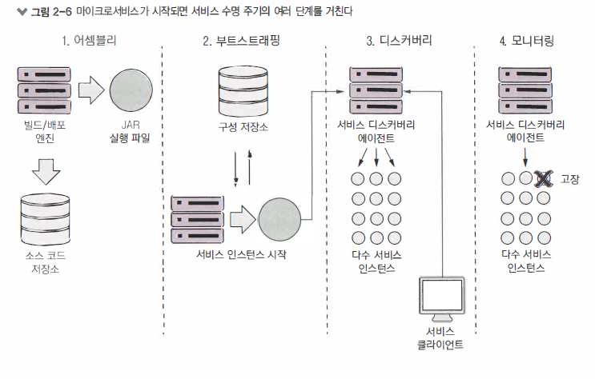
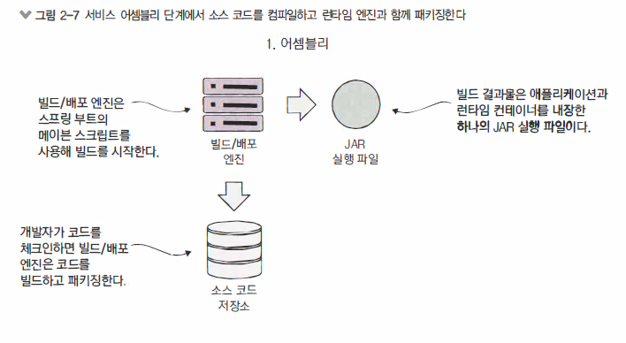
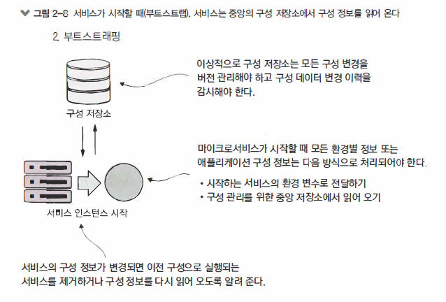
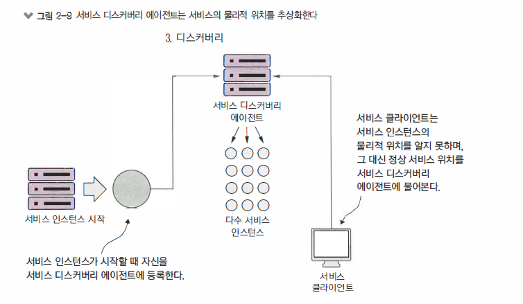
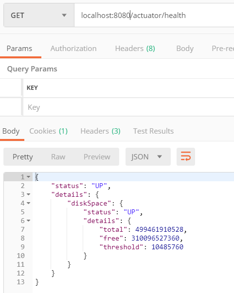

\#MSA #springboot

# SpringBoot

> 스프링 부트로 마이크로 서비스 구축

- 아키텍트의 이야기 - 마이크로서비스 아키텍처 설계
- 마이크로 서비스를 사용하지 않아야 할 때
- 개발자 이야기 - 스프링 부트와 자바로 마이크로서비스 생성
- 데브옵스 이야기 - 혹독한 런타임 구축
- 모든 관점에서 
- 요약


> 전통적인 (Waterfall) 문제

- 강한 경합 
- 누설
- 모놀리식


> MSA 접근법

- 제한 
  - 하나의 책임 집합 / 좁은 범위
- 느슨한 결합
- 추상화
  - 자신의 데이터 구조와 데이터 소스를 완전히 소유
  - 소유한 데이터는 해당 서비스만 수정 가능
  - 데이터를 보관하는데 DB에서 해당 서비스만 접근할 수 있도록 통제
- 독립적


> 클라우드 특징

- 사용자층이 다양하며 대규모
- 상당한 작동시간이 요구
- 볼륨이 균일하지 않음


> 역할의 관점

- 아키텍트
- 소프트웨어 개발자
- 데브옵스 엔지니어


## 아키텍트의 이야기 - MSA 아키텍처 설계

> 아키텍트의 세가지 중요점

- 비즈니스 문제의 분해
- 서비스 세분화의 확정
- 서비스 인터페이스의 정의


- 나쁜 MSA 징후
  - 책임이 너무 많은 서비스
  - 많은 테이블의 데이터를 관리하는 서비스
  - 과다한 테스트 케이스
  - 한 문제 영역 부분에 속한 MSA가 토끼처럼 번식한다
  - MSA가 지나치게 상호 의존적
  - MSA가 단순한 CRUD(Create Read Update Delete)의 집합


- 서비스 인터페이스
  - REST 철학을 수용
  - URI를 사용해 의도를 저달
  - 요청과 응답에 JSON 사용
  - HTTP 상태코드로 결과를 전달


- MSA를 사용하지 않아야 할때
  - 분산 시스템 구축의 복잡성
  - 가상 서버/컨테이너의 스프롤 (server sprawl)
  - 애플리케이션 유형
  - 데이터 변환과 일관성


- REST 이해
  - 서비스 호출 프로토콜로 HTTP 사용
  - 서비스 행동 양식을 HTTP 표준 동사에 매핑
  - 서비스끼리 교환하는 모든 데이터의 직렬화 형식으로 JSON 사용
  - HTTP 상태 코드를 사용해서 서비스 호출 상태 전달


- MSA + JSON
  - SOAP에 비해 가벼움
  - 가독성 높음
  - 자바스크립트에서 사용하는 기본 직렬화 프로토콜


- 엔드포인트이름
  - 서비스가 제공하는 리소스를 알 수 있는 명확한 URI 이름을 사용
  - 리소스간 관계를 알 수 있는 URI 사용
  - URI 버전체계를 일찍 구축


## 데브옵스 이야기 - 혹독한 런타임 구축

> 4가지 원칙

- MSA는 자체 완비형이며 독립적 배포가 가능해야 한다.
  - 단일 소프트웨어 산출물을 사용해 여러 서비스 인스턴스를 시작하거나 제거 할 수 있도록 해야함
- MSA 는 구성가능해야 한다. 
  - 서비스 인스턴스가 시작될 때 구성에 필요한 데이터를 중앙에서 읽어들여 환경변수로 전달된 구성 정보 받음
- MSA 인스턴스는 클라이언트가 위치를 알지 못하게 투명해야 한다.
  - 클라이언트는 서비스의 정확한 위치를 알고 있어서는 안됨 
  - 물리적 위치를 몰라도 애플리케이션이 알 수 있도록 서비스 디스커버리 에이전트와 통신
- MSA는 자신의 상태를 전달해야 한다.
  - 클라우드 아키텍처에서 중요한 부분
  - 인스턴스는 고장날 수 있고 클라이언트는 잘못된 서비스 인스턴스 라우팅을 피해야한다


### 수명주기

- `서비스 어셈블리`
  - 동일한 서비스 코드와 런타임을 정확히 같은 방식으로 배포하기 위해 반복성과 일관성을 보장하는 서비스 패키징과 배포방식
- `서비스 부트스트래핑`
  - 사람이 개입하지 않고 모든 환경에 마이크로 서비스 인스턴스를 신속하게 시작하고 배포하기 위해 애플리케이션 환경별 구성 코드를 런타임 코드와 분리하는 방법
- `서비스 등록 및 디스커버리`
  - 새로운 MSA 인스턴스가 배포될때 다른 애플리케이션 클라이언트가 발견할 수 있게 만드는 방법
- `서비스 모니터링`
  - 마이크로 서비스 환경에서 매우 높은 가용성을 요구하기에 동일 서비스를 여러 인스턴스로 실행함
  - 데스옵스 관점에서 MSA 인스턴스를 모니터링하고 MSA 고장을 회피하는 라우팅과 비정상 서비스 인스턴스를 제거하는지 확인




#### 서비스 어셈블리 

> 마이크로서비스의 패키징과 배포

데브옵스 관점에서 볼 때 MSA 아키텍처의 핵심 개념중 하나는 애플리케이션 환경 변화에 대응하여 MSA의 여러 인스턴스를 신속하게 배포하는 것

MSA는 필요한 의존성을 모두 담아 단일 산출물로 패키징하고 설치될 수 있어야 합니다

이 산출물이 JDK가 설치된 서버에 배포할 수 있어야 합니다

이러한 의존성에는 MSA를 호스팅하는 런타임 엔진도 포함됩니다.



```
mvn clean package && java - jar target/licensing-service-0.0.1-SNAPSHOT.jar
```


#### 서비스 부트스트래핑 

> 마이크로서비스 구성관리



- 데이터는 정기적으로 엑세스되지만 드물게 변경되므로 읽기 지연 시간이 짧아야
- 데이터 저장소는 가용성이 좋아야 하며 읽기용 데이터 서비스에 근접 
- 구성 데이터 저장소는 애플리케이션 단일 장애 지점이 될 수 있으므로 완전 중단 어려움


#### 서비스 등록과 디스커버리 

> 클라이언트가 마이크로서비스와 통신하는 방법

- 서비스 디스커버리 에이전트는 클라이언트에 서비스 위치를 안내하는 교통 경찰 역할



#### 마이크로서비스 상태전달

- 클라우드 기반 마이크로 서비스 애클리케이션에서는 종종 어떤 서비스의 많은 인스턴스가 실행될 수 있고 
  언젠가 그 서비스 인스턴스 중 하나가 고장 날 수도 있습니다.
- 서비스 디스커버리 에이전트는 등록된 각 서비스 상태를 모니터링 하며 그리고 클라이언트가 고장난 서비스를 호출하지 않도록 
  자신의 라우팅 테이블에서 문제가 된 서비스 인스턴스르 제거


> pom.xml

```xml
<!-- Spring Boot : Starter Actuator -->
<dependency>
    <groupId>org.springframework.boot</groupId>
    <artifactId>spring-boot-starter-actuator</artifactId>
</dependency>
```





## 모든관점에서


## 요약

- MSA 성공을 위해 아키텍트 / 소프트웨어 개발자 / 데브옵스 관점을 통합
- MSA는 강력한 아키텍처 패러다임이지만 혜택과 장단점 존재 / 모든 APP이 MSA APP일 필요는 없음
- 아키텍트 관점에서 MSA는 작고 자체 완비형이며 분산된 것
  MSA 는 좁은 범위와 소규모 데이터를 관리
- 개발자 관점에서 REST 설계 방식과 서비스의 데이터 송수신을 위한 JSON을 사용 
- 데브옵스 관점에서 MSA를 패키징 배포 모니터링 하는 방법은 매우 중요
- 스프링 부트를 사용하면 서비스를 하나의 JAR 실행 파일로 전달 가능 
- 스프링 부트 프레임워크에 포함된 스프링 엑추에이터는 서비스 런타임 정보와 함께 서비스의 운영 상태 정보도 제공


