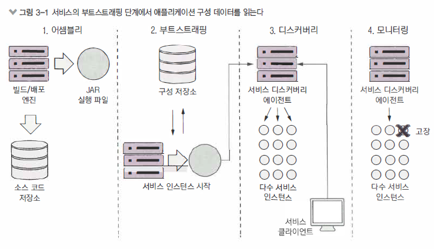
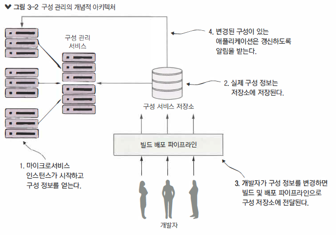
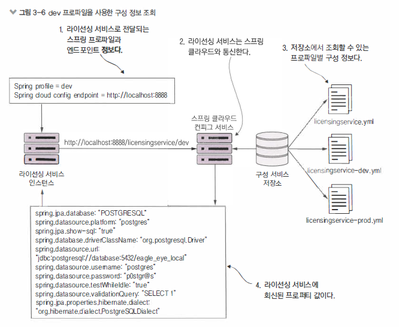

\#MSA #config


## Spring Cloud Config

> 목차

- 스프링 클라우드 컨피그 서버로 구성 관리
  - 구성(그리고 복잡성) 관리
  - 스프링 클라우드 컨피그 서버 구축
  - 스프링 클라우드 컨피그와 스프링 부트 클라이언트 통합
  - 중요한 구성 정보 보호

  

> 등장배경

모든 Application은 설정이 필요합니다. DB주소와 접속정보는 어떤지 등등

 Framework의 발전에 따라 코드와 설정이 분리되는 새로운 패러다임이 제시됩니다. application.peroperties 와 같은

따라서 환경별배포(local, dev, stage, pre, live... 등등)가 가능하게 됐습니다.

하지만 요즘은 수십 수백대의 서버를 관리하기 때문에 빌드 및 배포하는 과정이 상당히 번거로울 수 있습니다. 

`config server`를 이용하면 이를 해결할 수 있습니다.


> MSA 전체 프로세스




> MSA Config-Server 프로세스 자세히




## 구성관리

- 개발자는 애플리케이션(코드)에서 구성정보를 분리 해야 한다
  - 배포되는 실제 코드에서 애플리케이션 구성을 완전하게 분리
  - 서버 및 애플리케이션을 빌드하고 배포 환경에 따라 절대 바뀌지 않는 불변 이미지를 빌드
  - 서버를 시작할 때 환경 변수나 애플리케이션의  MSA가 읽어 올 수 있는 중앙 저장소를 이용해 애플리케이션 구정 정보 주입


- **구성관리를 위한 네가지원칙**
  - `분리`
    - 실제 물리적인 서비스의 배포와 서비스 구성 정보를 완전히 분리
    - v애플리케이션 구성 정보를 서비스 인스턴스와 함께 배포하면 안됨
    - 시작하는 서비스에 환경 변수로 전달하거나 중앙 저장소에서 읽어와 구성 정보를 전달
  - `추상화`
    - 서비스 인터페이스 뒷 단에 있는 구성 데이터의 접근 방식을 추상화
    - 서비스 저장소에 직접 액세스하는 코드를 작성하기(즉, JDBC를 사용해 DB에서 데이터 읽기)보다 
      애플리케이션 REST 기반의 JSON 서비스를 사용해 구성 데이터를 조회
  - `중앙집중화`
    - 클라우드 기반의 애플리케이션에 말 그대로 수백 개의 서비스 존재할 수 있음으로 구성 정보를 보관하는 저장소 개수는 최소로
    - 애플리케이션의 구성 정보를 가능한 소수 저장소에 집중화
  - `견고성`
    - 애플리케이션 구성정보를 배포된 서비스와 완전히 분리
    - 중앙집중화함으로 어떤 솔루션을 사용해도 고가용성과 다중성을 구현


> 추가적으로 구성관리를 제대로 못하면 탐지하기 어려운 버그와 예상하지 못한 장애를 만들 수 있어
>
> 애플리케이션 구성 데이터를 추적하고 버전을 제어하는 것도 중요


## 구성관리 아키텍처

- `어셈블리`
- `부트스트래핑`
  - MSA 인스턴스가 시작하면 엔드포인트를 호출해서 동작중인 환경별 구성 정보를 읽어옴
  - 구성관리 서비스에 연결할 정보(접속용 자격증명, 서비스 엔드포인트 .. 등등) MSA가 시작할때 전달
  - 실제 구성정보는 저장소에 상주
  - 구성 데이터를 보관할 수 있는 구정 저장소 구현 방식은 다양
  - 소스 관리되는 파일이나 RDBMS, 키-값 데이터 저장소 같은 구현 방식을 택할 수 있음
  - 실제로 애플리케이션 배포 방식과 독립적으로 애플리케이션의 구성 데이터를 관리
  - 대게 빌드 및 배포 파이프라인으로 구성 관리를 변경
  - 변경된 구성은 버전 정보 태그를 달아 다른 환경에 배포될 수 있게 한다
  - 구성관리가 변경되면 애플리케이션 구성데이터를 사용하는 서비스는 변경 통보를 받고 보유한 애플리케이션 데이터 사본을 갱신
- `디스커버리`
- `모니터링`


### 구현선택

- `Etcd`
  - 설명
    - Go언어로 작성된 오픈소스 프로젝트로 서비스 검색과 키-값 관리에 사용되며, 
      분산 컴퓨팅 모델용 Rath 프로토콜을 사용
  - 특징
    - 초고속이며 확장가능하다
    - 분산가능
    - 명령줄위주 
    - 사용과설치가쉽다
- `유레카(Eureka)`
  - 설명
    - 넥플릭스가 만들었으며, 수 많은 실전 테스트를 거쳤다
    - 서비스 검색과 키-값 관리에 사용
  - 특징
    - 분산 키-값 저장소
    - 유연하지만 설정하는데 공수가 든다
    - 동적 클라이언트 갱신 기능 제공
- `콘설(Consul)`
  - 설명
    - 하시코프가 만들었다. Etcd 및 유레카와 유사한 기능을 제공하나 분산 컴퓨팅 모델에 다른 알고리즘 사용
  - 특성
    - 빠르다
    - DNS와 직접 통합해 네이티브 서비스 검색을 제공
    - 동적 클라이언트 갱신 기능
- `주키퍼(Zookeeper)`
  - 설명
    - 분산 잠금 기능을 제공하는 아파치 프로젝트로 키-값 데이터용 구성 관리 솔루션으로 사용
  - 특성
    - 가장 오래되고 실전 경혐이 많은 솔루션
    - 가장 사용하기 복잡
    - 구성 관리에 사용 가능하나, 이미 사용중일때만 고려
- `스프링 클라우드 컨피그 서버(Spring Cloud Config Server)`
  - 설명
    - 다양한 백엔드와 함께 일반적인 구성관리 솔루션을 제공
    - 유레카 및 콘설 같은 벡엔드와 통합이 가능
  - 특성
    - 비분산 키-값 저장소
    - 스프링 및 스프링 기반이 아닌 서비스와 통합 가능
    - 공유 파일과 시스템, 유레카, 콘설, 깃 등등 구성 데이터 저장을 위한 다양한 백엔드 사용이 가능


## 스프링 클라우드 컨피그 서버구축

- 스프링 클라우드 컨피그 서버는 스프링 부트로 만든 REST 기반의 애플리케이션이다.
- 독립형 서버로 제공되지 않아 기존 스프링부트 애플리케이션에 내장하거나(embed) 
  새로운 스프링부트 프로젝트를 만들어 내장하는 방법으로 시작할 수 있음
- 가장 먼저 할 일은 `confsvr`이라는 새로운 프로젝트 디렉토리를 만드는 일
  - `confsvr 디렉터리`  안에 스프링 클라우드 컨피그 서버를 시작하는데 필요한 JAR파일을 내려받는 새로운 메이븐 파일 생성

- 메이븐 파일은 MSA에 사용할 스프링부트버전을 선언하는 것에서 시작
- 메이븐을 정의하는 과정에서 그 다음 중요한 부분은 사용할 스프링 클라우드 컨피그의 상위 `BOM(Bill Of Materials)`이다.
- 스프링 클라우드는 자체 릴리스로 돌아가는 독립적인 프로젝트의 방대한 집합
- 이 상위 BOM에는 클라우드 프로젝트에 사용되는 타사의 모든 라이브러리와 의존성, 해당 버전을 구성하는 개별 프로젝트의 버전 번호 명시
- 스프링 클라우드 Finchley.RELEASE 버전 사용
- `spring-cloud-config-server`
  - 모든 스프링 클라우드 프로젝트에 사용
- `spring-cloud-starter-config`
  - 스타터 프로젝트로 스프링 클라우드 컨피그 서버를 위한 핵심 라이브러리

>  pom.xml

```xml
<?xml version="1.0" encoding="UTF-8"?>
<project xmlns:xsi="http://www.w3.org/2001/XMLSchema-instance" xmlns="http://maven.apache.org/POM/4.0.0" xsi:schemaLocation="http://maven.apache.org/POM/4.0.0 http://maven.apache.org/xsd/maven-4.0.0.xsd">
  <modelVersion>4.0.0</modelVersion>

  <groupId>com.thoughtmechanix</groupId>
  <artifactId>configurationserver</artifactId>
  <version>0.0.1-SNAPSHOT</version>
  <packaging>jar</packaging>

  <name>Config Server</name>
  <description>Config Server demo project</description>

  <parent>
    <groupId>org.springframework.boot</groupId>
    <artifactId>spring-boot-starter-parent</artifactId>
    <version>2.0.3.RELEASE</version> <!-- 사용할 스프링 클라우드 버전 -->
  </parent>

  <dependencyManagement>
    <dependencies>
      <dependency>
        <groupId>org.springframework.cloud</groupId>
        <artifactId>spring-cloud-dependencies</artifactId> <!-- 사용할 스프링 클라우드 버전 -->
        <version>Finchley.RELEASE</version>
        <type>pom</type>
        <scope>import</scope>
      </dependency>
    </dependencies>
  </dependencyManagement>

  <dependencies>
    <dependency>
      <groupId>org.springframework.cloud</groupId>
      <artifactId>spring-cloud-config-server</artifactId> <!-- 이 서비스에 사용할 스프링 클라우드 프로젝트 -->
    </dependency>

    <dependency>
      <groupId>org.springframework.cloud</groupId>
      <artifactId>spring-cloud-starter-config</artifactId> <!-- 이 서비스에 사용할 스프링 클라우드 프로젝트 -->
    </dependency>
  </dependencies>

  <!--Docker build Config-->
  <properties>
    <project.build.sourceEncoding>UTF-8</project.build.sourceEncoding>
    <start-class>com.thoughtmechanix.confsvr.ConfigServerApplication</start-class>
    <java.version>1.8</java.version>
    <docker.image.name>johncarnell/tmx-confsvr</docker.image.name>
    <docker.image.tag>chapter3</docker.image.tag>
  </properties>

  <build>
     <plugins>
         <!-- We use the Resources plugin to filer Dockerfile and run.sh, it inserts actual JAR filename -->
         <!-- The final Dockerfile will be created in target/dockerfile/Dockerfile -->
         <plugin>
             <artifactId>maven-resources-plugin</artifactId>
             <executions>
                 <execution>
                     <id>copy-resources</id>
                     <!-- here the phase you need -->
                     <phase>validate</phase>
                     <goals>
                         <goal>copy-resources</goal>
                     </goals>
                     <configuration>
                         <outputDirectory>${basedir}/target/dockerfile</outputDirectory>
                         <resources>
                             <resource>
                                 <directory>src/main/docker</directory>
                                 <filtering>true</filtering>
                             </resource>
                         </resources>
                     </configuration>
                 </execution>
             </executions>
         </plugin>
         <plugin>
             <groupId>com.spotify</groupId>
             <artifactId>docker-maven-plugin</artifactId>
             <version>1.1.1</version>
             <configuration>
                 <imageName>${docker.image.name}:${docker.image.tag}</imageName>
                 <dockerDirectory>${basedir}/target/dockerfile</dockerDirectory>
                 <resources>
                     <resource>
                         <targetPath>/</targetPath>
                         <directory>${project.build.directory}</directory>
                         <include>${project.build.finalName}.jar</include>
                     </resource>
                 </resources>
             </configuration>
         </plugin>
         <plugin>
             <groupId>org.springframework.boot</groupId>
             <artifactId>spring-boot-maven-plugin</artifactId>
         </plugin>
     </plugins>
 </build>

</project>
```


- `application.yml 파일`
  - `confsvr/src/main/resources` 디렉터리 
  - application.yml 파일에는 스프링 클라우드 컨피그 서비스가 수신 대기할 포트, 구성 데이터를 제공하는 벡엔드 위치 등 정보 명시

> 중대형 클라우드 애플리케이션에는 파일 시스템 기반의 솔루션 사용을 권장하지 않음
>
> 파일 시스템 방식은 애플리케이션 구성 데이터를 액세스하려는 모든 구성 서버에 공유된 파일 마운트를 구현해야 한다는 것을 의미
>
> 클라우드에 공유 파일 시스템 서버를 구축할 수 있지만 이 환경을 유지보수 할 책임이 따름


### 서버설정

- 모든 스프링 클라우드 서비스는 해당 서비스를 실행할 수 있는 부트스트랩 클래스가 필요
- 서비스시작지점 역할을 하는 자바 `main()`메서드와 
  시작하는 서비스에 스프링 클라우드의 어떤 행동 양식으로 시작할지 지정하는 스프링 애너테이션 포함

> ConfigServerApplication.java

```java
@SpringBootApplication
@EnableConfigServer
public class ConfigServerApplication {
	public static void main(String[] args) {
		SpringApplication.run(ConfigServerApplication.class, args);
	}
}
```


### [CASE1] FileSystem연동

> 파일 시스템과 스프링 클라우드 컨피그 서버 사용

- 스프링 클라우드 컨피그 서버는 `confsvr/src/main/resources/application.yml` 파일의 항목을 사용
- 애플리케이션 구성 데이터를 보관할 저장소를 지정
  - 보관소를 지정하는 방법은 여러가지가 있습니다. 
    - [TODO]

```yml 
server:
  port: 8888
spring:
  # must
  profiles:
    active: native
  cloud:
    config:
      server:
        native:
          searchLocations: classpath:config/,classpath:config/licensingservice
```


### [CASE2] Git연동

- 스프링 클라우드 컨피그 서버의 백엔드 저장소로 파일 시스템이 적합하지 않음
  - 개발팀이 컨피그 서버의 모든 인스턴스에 마운트될 공유 파일 시스템을 설정하고 관리해야 하기 때문
- 컨피그 서버는 애플리케이션 구성 프로퍼티를 호스팅하는 다양한 백엔드 저장소와 통합가능
  - 깃 소스 관리 저장소와 함께 스프링 클라우드 컨피그 서버를 사용도 가능

```yaml 
server:
  port: 8888
spring:
  cloud:
    config:
      server:
        # encrypt.enabled should moved to bootstrap.yml
        encrypt.enabled: false
        git: # 컨피그에 벡엔드 저장소로 깃을 사용한다고 전달
          uri: https://github.com/klimtever/config-repo/ # 컨피그에 깃 서버와 깃 repo URI 전달
          searchPaths: licensingservice,organizationservice #  컨피그에 구성 파일을 찾을 깃 경로
          username: native-cloud-apps
          password: 0ffended
```


## 클라이언트연결

> `스프링 클라우드 컨피그`와 `스프링 부트 클라이언트`의 통합

- 스프링 부트 클라이언트 서버(config를 제공받는서버) 는 처음 시작할 때 명령줄로 두 가지 정보를 전달합니다.
  - 스프링 프로파일
  - 스프링 클라우드 컨피스 서비스와 통신할 때 사용하는 엔드포인트 



> bootstrap.yml (스프링 부트 클라이언트)

```yaml 
spring:
  application:
    name: licensingservice # 스프링 클라우드 컨피그 클라이언트가 어떤 서비스를 조회할지 알 수 있도록
  profiles:
    active:
      default # 서비스가 실행할 기본 프로파일
  cloud:
    config:
      uri: http://localhost:8888 # 스프링 클라우드 컨피그 서버의 위치
```

> application.yml (스프링 부트 클라이언트)

```yaml
management:
  endpoints:
    web:
      exposure:
        include: "*"
```

> 환변변수로 시작 정보 전달

```yaml 
liensingservice:
	image: ch3-thoughtmechanix/licensing-service
	ports:
		:"8080"
    environment:
    	profile: "dev"
    	CONFIGSERVER_URL:
    	CONFIGSERVER_PORT:
    	DATABASERVER_PORT:
```


### 데이터소스연결

- DB구성정보가 MSA에 직접 주입
- DB구성정보로 라이선싱 MSA 구성을 설정하면, 표준 스프링 컴포넌트를 이용해 Posgres DB에서 데이터를 빌드하고 조회할 수 있음

> License.class

```java
@Entity // @Entity로 JPA 클래스라고 스프링 부트에 알림
@Table(name = "licenses") // @Table은 DB 테이블과 매핑
public class License{
  @Id // @Id는 이 필드를 기본 키(primary key)로 지정
  @Column(name = "license_id", nullable = false) // @Column은 필드를 특정 DB
  private String licenseId;

  @Column(name = "organization_id", nullable = false)
  private String organizationId;

  @Column(name = "product_name", nullable = false)
  private String productName;

  @Column(name = "license_type", nullable = false)
  private String licenseType;

  @Column(name = "license_max", nullable = false)
  private Integer licenseMax;

  @Column(name = "license_allocated", nullable = false)
  private Integer licenseAllocated;

  @Column(name="comment")
  private String comment;
}
```

> LicenseRepository

```java
@Repository // 스프링 부트에 이 클래스가 JPA Repositor 라고 알림
public interface LicenseRepository extends CrudRepository<License,String>  {
    public List<License> findByOrganizationId(String organizationId);
    public License findByOrganizationIdAndLicenseId(String organizationId,String licenseId);
}
```

>  @Value

- @Value 애너테이션으로 프로퍼티 직접읽기
- `@Value("${example.property}")`
  - 스프링 클라우드 컨피그 서버에서 example.property 를 가져와 ServerConfig 클래스의 속성에 주입

```java
@Component
public class ServiceConfig{

  @Value("${example.property}")
  private String exampleProperty;

  public String getExampleProperty(){
    return exampleProperty;
  }
}
```


### 프로퍼티갱신

- 컨피그 서버를 사용할 때 프로퍼티가 변경될 때 스프링 클라우드 컨피그 서버가 어떻게 동적으로 애플리케이션을 갱신하는지는 중요하다
- 컨피그 서버는 항상 최신 버전의 프로퍼티를 제공


> @RefreshScope 

- 스프링 부트 애플리케이션이 /refresh 엔드포인트를 사용해 애플리케이션 구성 정보를 다시 읽어 올 수 있음
- 애플리케이션 구성에 있는 사용자 정의 스프링 프로퍼티만 다시 로드
  - ( 데이터베이스 구성 정보같이 스프링 데이터에 정의된 구성은 로드되지 않음 )
- 업데이트를 수행하기 위해 `http://{yourserver}:8080/actuator/refresh` 엔드포인트를 호출


> Application.class (클라이언트)

```java
@SpringBootApplication
@RefreshScope
public class Application {
    public static void main(String[] args) {
        SpringApplication.run(Application.class, args);
    }
}
```


#### 구성정보업데이트

- 스프링 클라우드 컨피그 서비스를 마이크로 서비스와 함께 사용시에 프로퍼티를 동적으로 변경하기 전에 고려할 사항중 하나는 동일한 서비스 인스턴스가 다수 실행 중이고 새로운 애플리케이션 구성으로 모든 서비스를 업데이트해야 한다는 것
  - 스프링 클라우드 컨피그 서비스는 이 서비스를 사용하는 모든 클라에게 변경이 일어났다고 알려주는
     `스프링 클라우스 버스(Spring Cloud Bus) `라는 푸시 기반의 매커니즘을 제공
  - 스프링 클라우드 컨피그는 RabbitMA같은 미들웨어를 추가해야 합니다. 변경을 감지하는 매우 유용한 방법이나 모든 스프링 클라우드 컨피그 백엔드가 콘설 서버처럼 푸시 매커니즘을 지원하는 것은 아닙니다.
  - 서비스 디스커버리 엔진으로 모든 서비스 인스턴스를 조회해 `/refresh` 엔드포인트를 직접 호출하는 간단한 `스크립트를 작성`
  - 모든 서버와 컨테이너가 새로운 프로퍼티를 업데이트하도록 `재시작`하는 것, 도커와 같은 컨테이너 서비스를 이용하고 있다면 더욱 수월


## 정보보호&암호화

> 중요한 구성 정보 보호

- 컨피그 서버는 모든 프로퍼티를 애플리케이션 구성 파일에 평문으로 저장하는 것이 기본이며,
  데이터베이스 자격증명과 같이 중요한 정보가 포함
- 컨피그 서버는 중요한 프로퍼티를 쉽게 암호화 할 수 있는 기능을 제공
- 대칭 ( 공유 비밀 키 사용 ) 및 비대칭 암호화 ( 공개, 비공개 키 사용 )를 모두 지원


#### #암호화단계

- 암호화에 필요한 오라클 JCE jar 파일을 내려받고 설치
- 암호화 키를 설정
- 프로퍼티를 암호화 및 복호화
- 클라이언트 측에서 암호화하도록 MSA 구성


##### #JCEjar

- 오라클의 JCE(Java Cryptography Extension)을 내려받아 설치 (메이븐으로 처리 불가)
  - zip 파일 다운로드
  - $JAVA_HOME/jre/lib/security 디렉터리로 이동
  - 디렉터리에 있는 local_policy.jar & US_export_policy.jar 파일을 다른 위치로 백업
  - 오라클에서 받은 JCE zip 파일의 압축제거
  - local_policy.jar & US_export_policy.jar 파일을 디렉터리에 복사
  - 스프링 클라우드 컨피그가 암호화를 사용하도록 구성

> JCE 파일 설치 과정 자동화

- 도커를 사용해 모든 서비스를 도커 컨테이너로 구축하므로 
  스프링 클라우드 컨피그용 도커 컨테이너에 이 JAR파일을 내려받아 설치하는 스크립트

```shell
FROM openjdk:8-jdk-alpine
RUN  apk update && apk upgrade && apk add netcat-openbsd && apk add curl
RUN mkdir -p /usr/local/configserver
RUN echo $JAVA_HOME
RUN cd /tmp/ && \
    curl -k -LO "http://download.oracle.com/otn-pub/java/jce/8/jce_policy-8.zip" -H 'Cookie: oraclelicense=accept-securebackup-cookie' && \
    unzip jce_policy-8.zip && \
    rm jce_policy-8.zip && \
    yes |cp -v /tmp/UnlimitedJCEPolicyJDK8/*.jar /usr/lib/jvm/java-1.8-openjdk/jre/lib/security/
ADD  @project.build.finalName@.jar /usr/local/configserver/
ADD run.sh run.sh
RUN chmod +x run.sh
CMD ./run.sh
```


##### #암호화키설정

- JAR 파일 준비시 대칭 암호화 키 설정
- 대칭 암호화 키는 암호자가 값을 암호화하고 복호자가 복호화 하는데 사용하는 공유된 비밀키


