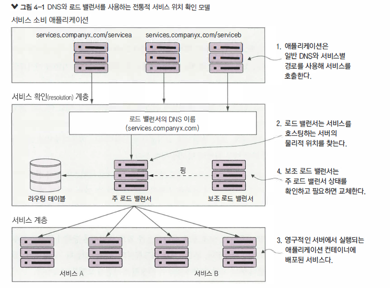
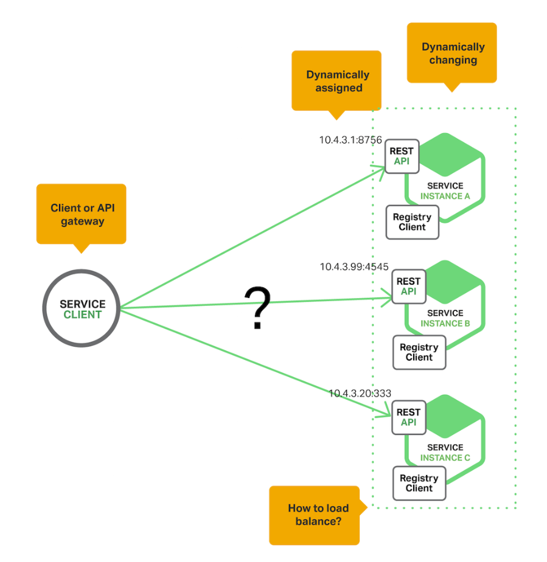
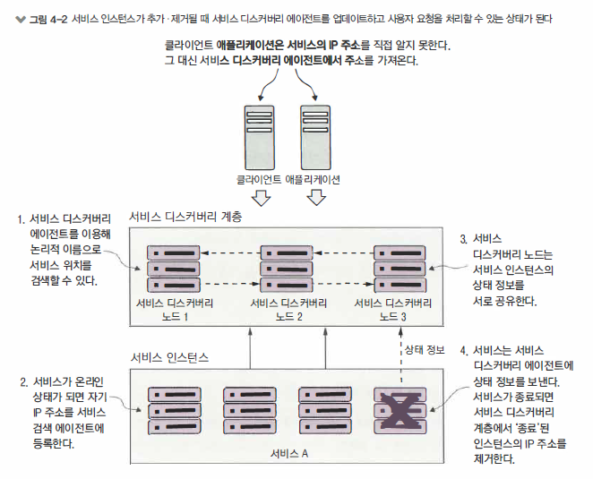
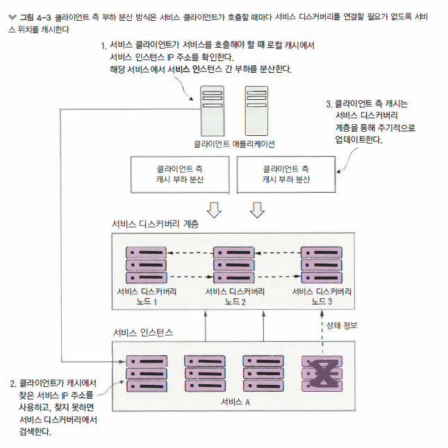

#MSA #serviceDiscovery


## 서비스 디스커버리

분산 아키텍처에서는 시스템의 물리적 위치주소를 찾아야 합니다. 

이 개념은 분산 컴퓨팅이 생기고 나서부터 존재했고 공식적으로 `서비스 디스커버리(service discovery)`라고 합니다.


> 목차

- 서비스 위치 찾기
- 클라우드에서 서비스 디스커버리
- 스프링 유레카 서비스 구축
- 스프링 유레카에 서비스 등록
- 서비스 디스커버리를 사용한 서비스 검색


> 중요점

- 서비스 디스커버리를 사용해서 해당 환경에서 실행하는 서비스 인스턴스 개수를 신소가게 수평 확장하거나 축소할 수 있습니다.
- 서비스 디스커버리를 통해 서비스의 물리적 위치는 서비스 소비자에게 드러나지 않습니다.


### [Before]로드밸런서



- 문제점
  - `단일 장애 지점`
    - 로드 밸런서가 고가용성을 지원해도 여전히 전체 인프라스트럭처의 단일 장애 지점
    - 로드 밸런서가 다운되면 로드 밸런서에 의존하는 모든 애플리케이션도 다운
  - `수평 확장성의 제약성`
    - 로드 밸런서 클러스터에 서비스를 모아 연결하므로 부하 분산 인프라스트럭처를 여러 서버에 수평적으로 확장하는 능력 제한
    - 상용 로드 밸런서 다수는 중복성 모델과 라이선싱 비용이라는 두가지 요소에 제약
    - 다부분 상용 로드 밸런서는 이중화를 위해 핫스왑(hot-swap) 모델에 따라 부하를 처리하는데 하나의 서버만 사용하고 
      보조 로드 밸런서는 주 로드 밸런서에 장애가 발생할 경우에 대체 작동용으로만 사용
    - 상용 로드 밸런서는 가변 모델이 아닌 고정 용량에 맞추어 한정된 라이선싱 모델을 보유
  - `정적관리`
    - 전통적 로드 밸런서 대부분은 서비스를 신속히 등록하고 취소하도록 설계되지 않음
    - 중앙 집중식 데이터베이스를 사용해서 경로 규칙을 저장하고 대개 공급업체의 독점적인 API를 사용해야만 새로운 경로를 저장
  - `복잡성`
    - 로드 밸런서가 서비스에 대한 프록시 역할을 하므로 서비스 소비자에게 요청할 때 물리적인 서비스에 매핑된 요청 정보가 있어야 함
    - 이 변환 계층은 서비스 매핑 규칙을 수동으로 정의하고 배포해야 하므로 서비스 인프라스트럭처의 복잡성을 가중
    - 전통적 로드 밸런서 시나리오에서 새로운 서비스를 인스턴스의 시작 시점이 아닌 수동으로 등록

> `장점`
>
> 로드 밸런서는 대부분의 애플리케이션이 중앙 집중화된 네트워크 인프라 스트럭처를 이용해 처리될 수 있는 크기와 규가있는 기업 환경에 어울림
>
> SSL 종료를 한곳에서 처리하고 서비스의 포트 보안을 관리하는 면에서 여전히 중요한 역할
>
> 로드밸런서가 자신의 후방의 모든 서버에 대한 인바운드 및 아웃바운드 포트 접근을 제어할 수 있습니다
>
> PCI 법규 준수처럼 산업 표준의 인증 요구 사항을 충족하려고 할 때 이러한 최소 네트워크 접근 개념은 종종 중요한 구성요소


> `단점`
>
> 하지만, 대용량의 트랜잭션과 중복성을 처리해야 하는 클라우드에서 중앙 집중식 네트워크 인트라 스트럭처는 효율적으로 확장되지 않고
>
> 비용 효율도 낮아서 결국 제대로 동작하지 못합니다.


### [After]서비스디스커버리



- `고가용성`
  - 서비스 디스커버리는 서비스 검색 정보를 서비스 디스커버리 클러스터의 여러 노드가 공유하는 `핫(hot)` 클러스터링 환경을 지원
  - 한 노드가 사용할 수 없게 되면 클러스터의 다른 노드가 인게를 받을 수 있어야 합니다.
- `피어투피어`
  - 서비스 디스커버리 클러스터와 각 노드는 서비스 인스턴스의 상태를 공유
- `부하분산`
  - 서비스 디스커버리는 요청을 동적으로 부하 분산해서 서비스 디스커버리가 관리하는 모든 서비스 인스턴스에 분배
  - 여러 면에서 초기 웹 애플리케이션을 구현하는데 사용, 더 정적이며 수동으로 관리되는 로드 밸런서는 서비스 디스커버리로 대체
- `회복성`
  - 서비스 디스커버리 클라이언트는 서비스 정보를 로컬에 캐시해야함
  - 로컬 캐싱은 서비스 디스커버리 기능을 점진적으로 저하하는데 서비스 디스커버리 서비스가 가용하지 않을 때 
    애플리케이션이 로컬 캐시에 저장된 정보를 기반으로 서비스를 계속 찾을 수 있고 동작하게 해야 함
- `장애내성`
  - 서비스 디스커버리는 서비스 인스턴스의 비정상을 탐지하고 가용 서비스 목록에서 인스턴스를 제거
  - 이러한 서비스 장애를 감지하며 사람의 개입없이 조치를 취해야 합니다.


#### 아키택처

- `서비스등록`
  - 서비스를 서시브디스커버리 에이전트에 어떻게 등록할텐가
- `클라이언트가서비스주소검색`
  - 서비스 클라이언트가 어떻게 서비스 정보를 검색할텐가
- `정보공유`
  - 서비스정보를 노드간에 어떻게 공유할텐가
- `상태모니터링`
  - 서비스가 자신의 상태정보를 서비스디스커버리 에이전트에 어떻게 전달할텐가




#### 클라이언트측부하분산

- 서비스소비자가 요청한 모든 서비스 인스턴스를 위해 서비스 디스커버리 서비스에 접속한 후 데이터를 서비스 소비자 기기에 로컬 캐시
- 클라이언트가 서비스를 호출하려할때 서비스 소비자는 캐시에서 위치 정보를 검색
  - 일반적으로 클라이언트 측 캐싱은 `라운드로빈 부하분산 알고리즘`과 같은 알고리즘으로 서비스 호출을 여러 인스턴스로 분산
- 클라이언트는 주기적으로 서비스 디스커버리 서비스에 접속해 서비스 인스턴스 캐시를 새로고침
  - 클라이언트 캐시는 최종 일관성을 유지하나 클라이언트가 목록을 새로고침하기 위해 서비스 디스커버리 인스턴스에 접속
  - 서비스를 호출할때 비정상적인 서비스 인스턴스를 호출할 위험성은 항상 존재
  - 서비스를 호출하는 동안 서비스 호출이 실패하면 로컬에 있는 서비스 디스커버리 캐시가 무효화되며 서비스 디스커버리 클라이언트는 
  - 서비스 디스커버리 에이전트에 목록 새로고침을 시도




### Eureka

- 서비스 디스커버리 에이전트를 설정
- 여러 서비스 에이전트를 등록해서 서비스 디스커버리를 구현
- 서비스 디스커버리에서 얻은 정보를 이용해서 다른 서비스를 호출할 수 있음


#### 과정요약

- 서비스 부트스트래핑 시점에 라이선싱 및 조직 서비스는 자신의 유레카 서비스에 등록
  - 서비스 ID와 함께 각각 서비스 인스턴스의 물리적 위치/포트 번호를 유레카에 알려줌
- 라이선싱 서비스가 조직 서비스를 호출할 때 넥플릭스 리본 라이브러리를 사용해서 클라 측 부하 분산 기능 수행
  - 리본 라이브러리는 유레카 서비스에 서비스 위치 정보를 조회하고 로컬 캐싱
- 주기적으로 넥플릭스 리본 라이브러리는 유레카 서비스를 핑해서 로컬 캐시의 서비스 위치를 새로고침


#### 서버구축

- Eureka Server를 구축하는 방법을 알아봅시다.


> pom.xml (EurekaServer)

```xml
<dependency>
    <groupId>org.springframework.cloud</groupId>
    <artifactId>spring-cloud-starter-netflix-eureka-server</artifactId>
</dependency>
```


> application.yml (EurekaServer)

- `server.port`
- `registerWithEureka`
  - 자신을 유레카 서비스에 등록하지 않도록 설정
- `fetchRegistry`
  - 유레카 서비스를 시작할 때 레지스트리 정보를 로컬에 저장하지 않음
- `waitTimeInMsWhenSyncEmpty`
  - 로컬에 유레카 서비스를 테스트할 시에 이 프로퍼티가 없으면 등록한 서비스를 즉시 알리지 않음 (주석제거필요)
  - 기본적으로 5분을 기다린 후 등록된 서비스 정보를 공유
  - 유레카는 등록된 서비스에서 10초 간격으로 연속 3회 상태 저보를 받아야 함으로 등록된 개별 서비스를 보여준는데 30초 소요

```yaml
# Default port is 8761
server:
  port: 8761 # 유레카 서버가 수신 대기할 포트

eureka:
  client:
    registerWithEureka: false # 유레카 서비스에 (자신을) 등록하지 않음
    fetchRegistry: false # 레지스트리 정보를 로컬에 캐싱하지 않음
  server:
    waitTimeInMsWhenSyncEmpty: 5 # 서버가 요청을 받기 전 대기할 초기 시간
  serviceUrl:
    defaultZone: http://localhost:8761
```


> application.java (EurekaServer)

```java
@SpringBootApplication
@EnableEurekaServer // 서비스를 유레카 서비스로 지정하기 위해 다음 애너테이션 사용
public class Application {
    public static void main(String[] args) {
        SpringApplication.run(EurekaServerApplication.class, args);
    }
}
```


#### 서비스등록

- Eukera에 Client Server를 등록하는 법을 알아봅시다.
- 조직과 라이선싱 서비스를 구성해 유레카 서비스에 등록


> pom.xml (Client)

- spring-cloud-starter-netflix-eureka-client
  - 스프링 클라우드가 유레카 서비스와 상호 작용하는데 필요한 jar 파일 포함

```xml 
<dependency>
    <groupId>org.springframework.cloud</groupId>
    <artifactId>spring-cloud-starter-netflix-eureka-client</artifactId>
</dependency>
```


> application.yml (Client)

- 유레카 서비스에 등록하는 서비스는 `애플리케이션  ID`와 `인스턴스 ID`라는 두 가지 구성 요소 필요
  - `애플리케이션 ID`는 서비스 인스턴스 그룹을 의미 - `spring.application.name` 프로퍼티값으로 설정
  - `인스턴스 ID`는 개별 서비스 인스턴스를 인식하는 임의의 숫자

- 유레카 서비스에 서비스를 등록하는 위치와 방법
  - `eureka.instance.preferIpAddress`프로퍼티는 서비스의 호스트 이름이 아닌 IP 주소를 유레카에 등록 
  - `eureka.client.registerWithEureka` 프로퍼티는 조직 서비스 자신을 유레카 서비스에 등록하도록 지정

```yaml 
spring:
  application:
    name: organizationservice
  profiles:
    active:
      default
  cloud:
    config:
      enabled: true

eureka:
  instance:
    preferIpAddress: true # 서비스 이름 대신 서비스 IP 주소 등록
  client:
    registerWithEureka: true # 유레카에 서비스 등록
    fetchRegistry: true # 유레카 서비스 위치
    serviceUrl:
        defaultZone: http://localhost:8761/eureka/
```


> `IP주소 선호`
>
> 기본적으로 유레카는 호스트이름으로 접속하는 서비스를 등록
>
> 이것은 DNS가 지원된 호스트 이름을 할당하는 서버 기반 환경에서 잘 동작하기 때문
>
> 그러나 컨테이너 기반의 배포에서 컨테이너는 DNS 엔트리가 없는 임의로 생성된 호스트 이름을 부여받아 시작
>
> `eureka.instance.preferIpAddress`를 true로 설정하지 않는다면 
>
> 해당 컨테이너에 대한 DNS 엔트리가 없으므로 클라이언트 애플리케이션은 호스트 이름 위치를 정상적으로 얻지 못함


#### 서비스확인

##### EurekaServer확인

- 반영 시간이 조금 걸릴 수 있습니다.

> http://{eureka_ip}:8761/eureka/apps/{name}


> warn-up

- 유레카에 등록하면 서비스가 가용하다고 확인될 때까지 30초간 연속 세 번의 상태정보를 확인하며 대기
- 개발자들은 이 예열(warn-up) 시간으로 서비스 시작 직후 서비스에 호출을 시도해 유레카가 등록되지 못하는 우려에서 벗어남


> 반환형식

- `eureka` 서비스가 반환하는 기본 형식은 XML
- HTTP Accept 헤더를 application/json 으로 설정하면 json 반환도 가능합니다.


##### EukekaClient확인

- 라이선싱 서비스는 조직 서비스 위치를 직접 알지 못해도 호출 할 수는 있음
- 라이선싱 서비스가 유레카를 사용해서 조직 서비스의 물리적 위치를 검색하기 때문
- 서비스 소비자가 리본과 상호 작용할 수 있는 스프링/넷플릭스의 클라이언트 라이브러리 세가지를 살펴봅니다.
  - `Spring DiscoveryClient`
  - `RestTemplate 활성화된 스프링 디스커버리 클라이언트`
  - `넷플릭스 Feign 클라이언트`


> LicenseServiceController.java

- Discovery 
  - 디스커버리 클라이언트와 표준 스프링 RestTemplate 클래스를 사용해서 조직 서비스 호출
- Rest
  - 향상된 스프링 RestTemplate을 사용해서 리본 기반의 서비스 호출
- Feign
  - 넷플릭스 Feign 클라이언트를 사용해서 리본을 통해 서비스 호출

```java
@RequestMapping(value="/{licenseId}/{clientType}",method = RequestMethod.GET)
public License getLicensesWithClient( @PathVariable("organizationId") String organizationId,
                                     @PathVariable("licenseId") String licenseId,
                                     @PathVariable("clientType") String clientType) {
    return licenseService.getLicense(organizationId,licenseId, clientType);
}
```


> LicensService.java

```java
public License getLicense(String organizationId,String licenseId, String clientType) {
    
    License license = licenseRepository.findByOrganizationIdAndLicenseId(organizationId, licenseId);
    Organization org = retrieveOrgInfo(organizationId, clientType);

    return license
        .withOrganizationName( org.getName())
        .withContactName( org.getContactName())
        .withContactEmail( org.getContactEmail() )
        .withContactPhone( org.getContactPhone() )
        .withComment(config.getExampleProperty());
}
```


###### [CASE1] DiscoveryClient

- 스프링 `DiscoveryClient`는 리본과 등록된 서비스에 가장 저수준의 접근성을 제공
- DiscoveryClient를 사용하면 리본 클라이언트와 해당 URL에 등록된 모든 서비스에 대해 질의할 수 있음


> [우선작업] Application.java
>
> = 유레카 Discovery Client를 사용하기 위해 부트스트랩 클래스 설정

- `@EnableDiscoveryClient` 
  - 스프링 클라우드에서 애플리케이션이 DiscoveryClient와 리본 라이브러리를 사용할 수 있게 처리

```java
@SpringBootApplication
@EnableDiscoveryClient // 스프링 DiscoveryClient 활성화
@EnableFeignClients
public class Application {
    public static void main(String[] args) {
        SpringApplication.run(Application.class, args);
    }
}
```


> `DiscoveryClient`를 사용한 정보 검색

- 만약 Discovery에 Organization 서버가 연동되어 있다면 DiscoveryClient를 이용하여 질의를 할 수 있습니다. 
- [ERROR] org.springframework.web.client.HttpClientErrorException: 404 null
  - instances를 선택하는 과정에서 다른 유레카 경로를 잡는 경우가 있음
  - uniquekey로 알맞은 instance를 선택해야 합니다

```java
@Component
public class OrganizationDiscoveryClient {

    /* org.springframework.cloud.client.discovery.DiscoveryClient */
    @Autowired
    private DiscoveryClient discoveryClient; // `DiscoveryClient`는 이 클래스에 자동 연결

    public Organization getOrganization(String organizationId) {
        RestTemplate restTemplate = new RestTemplate();

        // 조직 서비스의 모든 인스턴스 목록 얻기 (ServiceInstance)
        List<ServiceInstance> instances = discoveryClient.getInstances("organizationservice");
        if (instances.size()==0) return null;

        // 호출할 서비스 엔드포인트 조회
        String serviceUri = String.format(
            "%s/v1/organizations/%s",
            instances.get(0).getUri().toString(), organizationId);

        // 서비스를 호출하는데 표준 스프링 RestTemplate 클래스 사용
        ResponseEntity< Organization > restExchange =
                restTemplate.exchange(
                        serviceUri,
                        HttpMethod.GET,
                        null, Organization.class, organizationId);

        return restExchange.getBody();
    }
}
```


> `DiscoveryClient` 상세히

- DiscoveryClient를 살펴보며 리본으로 서비스 소비자를 구축하는 방법을 마무리
- 실제 서비스가 리본에 질의해서 등록된 서비스와 서비스 인스턴스를 알아야 할 때만  직접 DiscoveryClient 사용


> 다음코드의 문제점

- `리본 클라이언트 측 부하 분산의 장점을 얻지 못함`
  - DiscoveryClient를 직접 호출하면 서비스 목록이 반환되지만 목록에서 호출할 `서비스를 선택할 책임이 사용자에게 있음`
- `너무 많은 일을 처리`
  - 서비스 호출에 사용될 URL을 생성해야 하며, 사소한 일이지만 코드를 적게 작성하면 디버그할 코드도 줄어듬


###### [CASE2] RestTemplate

> 리본지원 스프링 RestTemplate을 사용한 서비스 호출

- 리본을 지원하는 RestTemplate을 사용하는 방법을 보여주는 예제
- 리본 지원 RestTemplate 클래스를 사용하려면 `@LoadBalanced` 애너테이션으로 RestTemplate 빈 생성 메서드를 정의
  - 리본 자원 RestTemplate 클래스에 빈 정의가 완료 되면 RestTemplate 빈으로 서비스를 호출할 때마다 사용하려는 클래스에 자동 연결

```java
@SpringBootApplication
@EnableDiscoveryClient // FeignClient만 사용함으로 @EnableDiscoveryClient 제거 가능
@EnableFeignClients // FeignClient 사용을 위해 @EnableFeignClients 추가
public class Application {

  	@LoadBalanced
  	@Bean
    public RestTemplate getRestTemplate() {
        return new RestTemplate();
    }
    
    public static void main(String[] args) {
        SpringApplication.run(Application.class, args);
    }

}
```


> OrganizationRestTemplateClient.class

- 차이점
  - 스프링 클라우드 DiscoveryClient 가 코드에 없음
  - restRemplate.exchange() 호출되는 URL 형태가 다름
  - `RestTemplate 클래스를 사용해서 서비스 인스턴스에 대한 모든 요청을 라운드 로빈 방식으로 부하 분산`
- [ERROR] java.lang.ClassNotFoundException: com.google.common.reflect.TypeToken
  - [SOLUTION] 의존성주입

```xml 
<dependency>
    <groupId>com.ecwid</groupId>
    <artifactId>ecwid-mailchimp</artifactId>
    <version>2.0.1.0</version>
</dependency>
```


```java
@Component
public class OrganizationRestTemplateClient {

    @Autowired
    RestTemplate restTemplate;

    public Organization getOrganization(String organizationId){
        ResponseEntity<Organization> restExchange =
                restTemplate.exchange(
                        "http://organizationservice/v1/organizations/{organizationId}", // 리본 지원 RestTemplate 사용시 유레카 서비스 ID로 URL 생성
                        HttpMethod.GET,
                        null, Organization.class, organizationId);

        return restExchange.getBody();
    }
}

```


###### [CASE3] Feign

- 넥플릿스 Feign 클라이언트로 서비스 호출
  - 스프링 리본이 활성화된 RestTemplate 클래스에 다른 대안
  - 개발자가 자바 인터페이스를 먼저 정의한 후 리본이 호출할 유레카 기반의 서비스를 매핑하고
  - 그 인터페이스 안에 스프링 클라우드 애너테이션을 추가해서 REST 서비스를 호출하는 접근

  

> Application.java

```java
@SpringBootApplication
@EnableDiscoveryClient // FeignClient만 사용함으로 @EnableDiscoveryClient 제거 가능
@EnableFeignClients // FeignClient 사용을 위해 @EnableFeignClients 추가
public class Application {
    public static void main(String[] args) {
        SpringApplication.run(Application.class, args);
    }
}
```


> OrganizationFeignClient.java

- `@FeignClient` 
  - 인터페이스를 대표할 서비스 애플리케이션 ID 전달
- getOrganization() 로 클라이언트가 조직 서비스를 호출

```java
@FeignClient("organizationservice")
public interface OrganizationFeignClient {
    @RequestMapping(
            method= RequestMethod.GET,
            value="/v1/organizations/{organizationId}",
            consumes="application/json")
    Organization getOrganization(@PathVariable("organizationId") String organizationId);
}
```


### 전체요약

- 서비스 디스커버리 패턴은 서비스의 물리적 위치 추상화에 사용
- 유레카 같은 서비스 디스커버리 엔진은 서비스 클라이언트에 영향을 주지 않고 해당 환경의 서비스 인스턴스를 원활하게 추가/삭제
- 클라이언트 측 부하 분산을 사용하면 서비스 호출하는 클라이언트에서 서비스의 물리적 위치를 캐싱해 더 나은 성능 및 회복성 제공
- 유레카는 넥플릭스 프로젝트의 스프링 클라우드와 사용하면 쉽게 구축하고 구성 가능
- 스프링 클라우드와 넥플릭스 유레카 그리고 서비스를 호출하는 넥플릭스 리본으로 다음 세가지 메커니즘 사용
  - 스프링 쿨라우드와 DiscoveryClient
  - 스프링 클라우드와 리본 지원 RestTemplate
  - 스프링 클라우드와 넥플릭스 Feign 클라이언트
