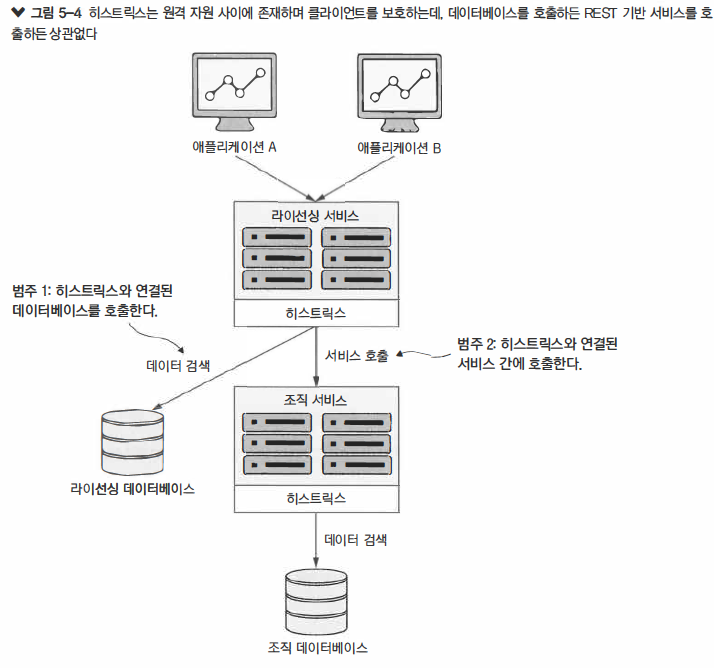
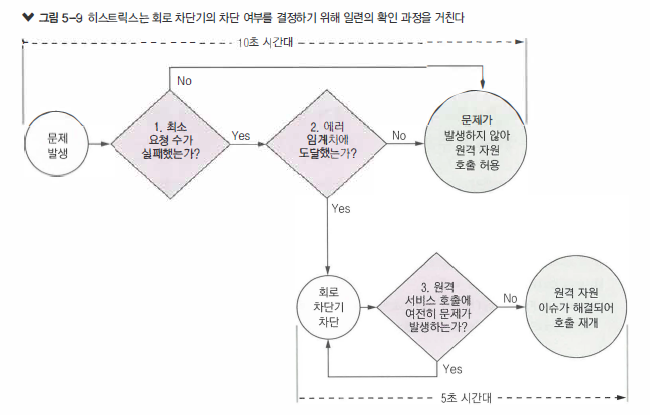

\#MSA #recovery


## 클라이언트 회복성패턴

> 나쁜 상황에 대비한 스프링 클라우드와 넥플릭스 히스트릭스의 클라이언트 회복성 패턴

 

> 목차

- 클라이언트 회복성 패턴이란
- 클라이언트 회복성이 중요한 이유
- 히스트릭스 시작
- 스프링 클라우드와 히스트릭스를 위한 라이선싱 서버 설정
- 히스트릭스를 사용한 회로 차단기 구현
- 폴백 프로세싱
- 벌크헤드 패턴 구현
- 히스트릭스 세부 설정
- 스레드 컨텍스트와 히스트릭스
- 요약


> 분산시스템에서 장애를 처리하기 위한 방법

- `서비스 저하는 간헐적으로 발생하고 확산될 수 있음`
  - 서비스 저하는 사소한 부분에서 갑자기 발생
  - 순식간에 애플리케이션 컨테이너가 스레드 풀을 모두 소진해 완전히 무너지기 전까지 장애 징후는 일부 사용자가 문제점을 불평하는 정도로 발생
- `원격 서비스 호출은 대게 동기식이며 오래 걸리는 호출을 중단하지 않음`
  - 서비스 호출자(caller)에게는 호출이 영구 수행되는 것을 방지하는 타임아웃 개념이 없음
  - 애플리케이션 개발자는 서비스를 호출해서 작업을 수행하고 서비스가 응답할 때까지 대기
- `애플리케이션은 대게 부분적인 저하가 아닌 원격 자원의 완전한 장애를 처리하도록 설계`
  - 서비스가 완전히 다운되지 않는다면 애플리케이션이 서비스를 계속 호출하고 빨리 실패하지 않는 일이 자주 발생
  - 애플리케이션은 제대로 동작하지 않는 서비스를 계속 호출
  - 호출하는 애플리케이션이나 서비스는 정상적으로 저하될 수 도 있지만 `자원고갈`로 비정상적으로 종료될 가능성 높음


### 회복성패턴개념

- 클라이언트의 회복성을 위한 소프트웨어 패턴은 원격 서비스가 에러를 던지거나 제대로 동작하지 못해  
  접근 실패 시에 원격자원을 호출하는 클라이언트 충돌을 막는데 초점이 맞춰짐
- 이 패턴의 목적은 데이터 베이스 커넥션 및 스레드 풀 같이 소중한 클라이언트의 소비자에게 `상향 전파`되는 것을 막음


#### 종류 

- `클라이언트 측 부하 분산`
  - 서비스 클라이언트는 서비스 디스커버리에서 조회한 MSA의 엔드포인트를 캐싱
- `회로 차단기`
  - 서비스 클라이언트가 장애중인 서비스를 반복적으로 호출하지 못하게 한다
- `폴백`
  - 호출이 실패하면 폴백은 실행 가능한 대안이 있는지 확인
- `벌크헤드`
  - 불량 서비스가 클라이언트의 모든 자원을 고갈시키지 않도록 서비스 클라이언트가 수행하는 서비스 호출을 격리


##### [방법1]클라이언트부하분산

- 클라이언트가 넥플릭스 유레카 같은 서비스 디스커버리 에이전트를 이용해 서비스의 모든 인스턴스를 검색한 후 해당 서비스 인스턴스의 실제 위치를 `캐싱`하는 것
- 서비스 소비자가 서비스 인스턴스를 호출해야 할 때마다 `클라이언트 측 로드밸런서`는 서비스 위치 풀에서 관리하는 서비스 위치를 하나씩 전달
- 클라이언트 측 로드 밸런서는 서비스 클라이언트와 서비스 소비자 사이에 위치함으로 서비스 인스턴스가 에러를 전달하거나 불량 동작하지 않는지 감지
- 클라이언트 측 로드 밸런서가 문제를 감지할 수 있다면 가용 서비스 위치 풀에서 문제가 된 서비스 인스턴스를 제거해 서비스 호출이 그 인스턴스로 전달 되는 것을 방지

> 모든 인스턴스의 문제들을 클라이언트에서 처리합니다.


##### [방법2]회로차단기

- 원격 서비스 호출을 모니터링
- 호출이 오래 걸릴경우 회로 차단기가 중재해서 호출을 중단
- 회로 차단기는 원격 자원에 대한 모든 호출을 모니터링하며 호출이 필요한 만큼 실패하면 회로 차단기가 횔성화되어 빨리 실패하게 만듬
- 고장 난 원격 자원은 더 이상 호출되지 않도록 차단


##### [방법3]폴백처리

- 원격 서비스에 대한 호출이 실패할 때 예외를 발생시키지 않고 서비스 소비자가 대체 코드 경로를 실행해 다른 방법으로 작업을 수행
- 일반적으로 이 패턴은 다른 데이터 소스에서 데이터를 찾거나 향후 처리를 위해 사용자 요청을 큐에 입력하는 작업과 연관
- 사용자의 호출에 문제가 있다고 예외를 표시하지 않지만 나중에 해당 요청


##### [방법4]벌크헤드

- 벌크헤드 패턴을 적용!하면 원격 자원에 대한 호출을 자원별 스레드 풀로 불리함으로 특정 원격 자원의 호출이 느려저 전체 애플리케이션이 다운되는 위험을 줄일 수 있음
- 스레드 풀은 서비스를 위한 벌크헤드(격벽) 역할
- 한 서비스가 느리게 반응한다면 해당 서비스 호출을 위한 스레드 풀은 포화되어 요청을 처리하지 못하겠지만 다른 스레드 풀에 할당된 다른 서비스 호출은 포화되지 않음


> 중요한이유


- 회로차단기 패턴이 분산 자원을 호출하는 모든 곳에 구현되었다면 자원이고갈되는 이슈는 발생하지 않음
- 서비스 C 호출에 회로차단기를 구현했다면 서비스 C가 제대로 수행되지 못할 때 
  서비스 C에 대한 특정 호출을 감지하는 회로차단기가 작동하여 스레드를 소진하지 않도록 빠르게 실패


- 서비스 B가 호출할때 에러를 받지만 서비스 C 호출이 완료될 때까지 자원이 점유되지 않음
- 서비스 C 호출이 회로차단기로 타임아웃되었다면 회로차단기는 발생한 실패횟수를 추적
- 원격 호출에 회로 차단 패턴이 제공하는 기능
  - `빠른 실패`
    - 원격 서비스가 저하를 겪으면 애플리케이션은 빨리 실패함으로 애플리케이션 전체를 다운시킬 수 있는 자원 고갈 이슈 방지
    - 대부분 장애 상황에서 완전히 다운되는 것 보다 부분적 다운이 낫다
  - `원만한 실패`
    - 타임아웃과 빠른 실패 방법을 사용하는 회로 차단기 패턴으로 애플리케이션 개발자는 
      원만하게 실패하거나 사용의도로 수행하는 대체 매커니즘을 찾을 수 있음
    - 예를들어 데이터소스에서 데이터 조회에 서비스 저하가 발생한다면 
      애플리케이션 개발자는 다른 소스위치에서 해당 데이터를 조회하게 만들 수 있습니다
  - `원활한 회복`
    - 회로 차단기 패턴이 중개자 역할을 한다면 회로 차단기는 요청 자원이 온라인 상태인지 주기적으로 확인하고
      사람의 개입없이 자원 접근을 다시 허용할 수 있음

## 히스트릭트

> 히스트릭스 시작

- 스프링 클라우드와 히스트릭스 랩퍼를 추가하도록 라이선싱 서비스의 메이븐 빌드 파일을 구성
- 스프링 클라우드와 히스트릭스 애너테이션을 사용해서 회로 차단기 패턴으로 원격 호출을 감싼다
- 호출별 타임아웃 설정을 위해 원격 자원에 개별 회로 차단기를 사용자 정의하는 방법을 알아봄
  회로 차단기의 구성 방법도 보여주며, 회로 차단기가 작동하기 전에 발생할 실패 횟수도 조절
- 회로 차단기가 호출을 중단하거나 호출이 실패한 경우 폴백 전략을 구현
- 서비스 내 개별 스레드 풀을 사용해서 서비스 호출을 격리하며, 호출되는 원격 자원간에 벌크헤드 구축


#### 서버설정

> pom.xml (licensing-service)

- 첫번째 태그(spring-cloud-starter-netflix-hystrix)는 메이븐에 스프링 클라우드 히스트릭스 의존성을 내려받도록 지시
  - `spring-cloud-starter-netflix-hystrix가 hisyrix-javanica`를 포함하므로 의존성을 파일에 직접 포함할 필요는 없음
- 두번째 태그(hisyrix-javanica)는 넥플릭스 히스트릭스의 핵심 라이브러리를 가져오도록 지시

```xml
<dependency>
    <groupId>org.springframework.cloud</groupId>
    <artifactId>spring-cloud-starter-netflix-hystrix</artifactId>
</dependency>

<!-- 스프링부트 2.0에서 별도로 추가하지 않고 삭제
<dependency>
    <groupId>org.netflex.hystrix</groupId>
    <artifactId>hystrix-javanica</artifactId>
</dependency>
-->
```

> Application.java (licensing-service)

- `@EnableCircuitBreaker`가 없다면 회로차단기는 활성화되지 않고 서비스가 시작하더라도 별다른 경고나 에러메시지 표시되지 않음

```java
@SpringBootApplication
@EnableEurekaClient
@EnableCircuitBreaker // 스프링 클라우드에 이 서비스에서 히스트릭스를 사용할 것이라고 지정
public class Application {
    @LoadBalanced
    @Bean
    public RestTemplate restTemplate() {
        return new RestTemplate();
    }

    public static void main(String[] args) {
        SpringApplication.run(Application.class, args);
    }
}
```


#### 1. 회로차단기

##### 구현방법

- 1.라이선싱서비스 및  2.조직서비스 모두 자기 데이터베이스에 대한 호출을 히스트릭스 회로 차단기에 연결
- 두 서비스 사이의 호출을 히스트릭스에 연결



##### [CASE1] 조직서비스에 대한 회로차단기 설정

- `@HystrixCommand`
  - getOrganization() 메서드 호출마다 히스트릭스 회로 차단기와 해당 호출이 연결
  - 회로 차단기는 메소드 호출이 1,000 미리초보다 오래 걸릴 때마다 호출을 중단
- 회로 차단기 동작을 호출 단위로 붙이는 메서드 수준의 애너테이션
  - 데이터베이스에 엑세스하거나 마이크로 서비스를 호출하는데 동일한 애너테이션을 사용하는것
- 라이선싱서비스에서 라이선스와 연관된 조직이름을 조회해야 한다고 가정했을때
  - 조직서비스에 대한 호출을 회로 차단기로 감싸려고 하면, 
    RestTemplate 호출 자체 메소드로 분해하고 `@HystrixCommand 만 추가

```java
@HystrixCommand // 회로차단기로 getLicenseByOrg() 메서드를 연결하는데 사용
private Organization getOrganization(String organizationId) {
    return organizationRestClient.getOrganization(organizationId);
}
```


##### [CASE2] 라이선싱DB에 대한 회로차단기 설정

- 랜덤으로 질의문이 오래걸릴때 라이선싱 서비스는 데이터베이스호출을 중지
- 데이터베이스 호출이 히스트릭스가 감싼 코드를 실행하는데 `1,000밀리초` 이상 걸린다면 
  서비스호출은 `HystrixRuntimeException` 예외반환

```java
private void randomlyRunLong() {
  Random rand = new Random();
  int randomNum = rand.nextInt((3-1) + 1) + 1;
  if(randomNum == 3) sleep();
}

private void sleep() {
  try {
    Thread.sleep(11000); // 11초대기 (histrix는 1초후에 호출을 타임아웃)
  } catch(InterruptedException e) {
    e.printStackTrace();
  }
}

@HystrixCommand
public List<License> getLicensesByOrg(String organizationId) { 
	logger.debug(
    "LicenseService.getLicensesByOrg Correlation id : {}",
    UserContextHolder.getContext().getCorrelationId());
  randomlyRunLong();
  
  return licenseRepository.findByOrganizationId(organizationId);
}
```


>  [결과1] 실패


> [결과2] 성공


> Organization-MSA 타임아웃

- 

```java
@HystrixCommand
private Organization getOrganization(String organizationId) {
    return organizationRestClient.getOrganization(organizationId);
}
```


> [주의]
>
>  `@HystrixCommand`는 사용은 쉬우나, `애너테이션 설정 없이 기본형태를 사용하는 것에는 주의가 필요`
>
> 기본적으로 프로퍼티없이 애너테이션을 지정하면 애너테이션은 모든 원격 서비스 호출에 동일한 스레드 풀을 사용하여 
>
> 애플리케이션에 문제를 발생시킬 수 있음


##### 사용자정의 회로차단기 

- `commandProperties` 
  - 히스트릭스를 사용자 정의하기 위해 추가 매개변수를 전달하는 속성
- `HystrixProperty (execution.isolation.thread.timeoutInMilliseconds)`
  - 회로차단기의 타임아웃 시간(단위:밀리초)을 설정하는데 사용되는 프로퍼티

```java
@HystrixCommand(
  commandProperties = {
    @HystrixProperty(name = "execution.isolation.thread.timeoutInMilliseconds", value = "12000")}
)
```


> [서비스타임아웃]
>
> 분산환경에서 개발팀이 자기들의 서비스 X에서 평균 5~6초가 소요되므로 원격 서비스 호출에 1초 타임아웃은 너무 낮다는 의견이 있음
>
> 이것은 서비스가 호출될 때 해결하지 못한 성능에 문제가 있음을 말함
>
> 느리게 실행되는 서비스 호출 문제에 대해 절대로 해결할 수 없는 경우가 아니라면 
>
> 히스트릭스 호출의 기본 타임아웃 시간을 늘리면 안됨


#### 2. 폴백프로세싱

- 회로차단기 패턴의 장점은 원격 자원의 소비자와 리소스 사이 `중간자`를 두어 개발자에게 서비스 실패를 가로채며, 
  다른 대안을 선택할 기회를 주는것
- 이것은 히스트릭스에서 폴백전략이라고 알려져 있고, 구현이 쉽다.
- 현재 라이선싱 정보가 가용하지 않다고 알려주는 라이선싱 객체를 만들어 반환하는 
  라이선싱 DB에 대해 간단한 폴백전략을 수립해보자


> 히스트릭스에서 풀백구현

```java
// fallbackMethod 속성으로 히스트릭스에서 호출이 실패할 때 불러오는 클래스 함수를 정의
@HystrixCommand(fallbackMethod="buildFallbackLicenseList") 
public List<License> getLicensesByOrg(String organizationId){
    logger.debug("LicenseService.getLicensesByOrg  Correlation id: {}", UserContextHolder.getContext().getCorrelationId());
    randomlyRunLong();

    return licenseRepository.findByOrganizationId(organizationId);
}

// fallbackMethod - 이 폴백 메서드에서 하드 코딩된 값을 반환
private List<License> buildFallbackLicenseList(String organizationId) { 
    List<License> fallbackList = new ArrayList<>();
    License license = new License()
        .withId("0000000-00-00000")
        .withOrganizationId( organizationId )
        .withProductName("Sorry no licensing information currently available");

    fallbackList.add(license);
    return fallbackList;
}
```

- 호출이 너무 오래 걸력 히스트릭스를 차단할 때 호출할 메소드 이름을 이 속성에 추가
- `폴백메서드 특징`
  - [1]  <u>보호메서드와 같은 클래스에 있어야 합니다.</u>
  - [2] <u>폴백 세머스는 이전 메서드와 서식이 완전히 동일해야 합니다.</u>


##### 폴백전략

- 폴백전략은 MSA가 데이터를 검색한 호출이 실패하는 상황에 적합
- [전략1] <u>try-catch 블록</u>
  폴백은 자원이 타임아웃되거나 실패할 때 행동 방침을 제공하는 메커니즘
  폴백을 사용해서 타임아웃 에외를 잡아내고 에러 로깅만 한다면 
  서비스 호출 전후로 표준 try-catch 블록을 사용하고 로깅  로직을 그 블록 안에 넣어도 무방
- [전략2] <u>방어적인 코딩</u>
  폴백 기능으로 수행하는 행동을 알고 있어야 함
  폴백 서비스에서 다른 분산 서비스를 호출한다면 @HystrixCommand로 폴백을 감싸야 할 수 있음
  1차 폴백 행동 방침을 겪게 한 동일한 장애가 2차 폴백 옵션에도 영향을 줄 수 있음


#### 3.벌크헤드

- MSA 기반의 애플리케이션이 종종 특정 작업을 완료하기 위해 MSA 호출 필요
- 벌크헤드 패턴을 적용하지 않는다면 기본적인 호출 행위는 <u>전체 자바 컨테이너에 대한 요청을 처리하는 스레드에서 이루어짐</u>
- 대류모 상황에서 한 서비스에 발생한 성능 문제로 자바 컨테이너의 모든 스레드가 최대치에 도달해 작업 처리를 대기하고, 
  새로운 요청들은 적재 결국 자바  컨테이너는 비정상 종료
- <u>히스트릭스는 스레드 풀을 사용해서 원격 서비스에 대한 모든 요청을 위임</u>

  - <u>기본적으로 모든 히스트릭스 명령은 요청을 처리하기 위해 동일한 스레드 풀을 공유</u>
- 이 스레드 풀에는 원격 서비스 호출을 처리할 10개의 스레드가 있고 원격 서비스 호출은 REST 서비스 호출 데이터베이스 호출 등 무엇이든 가능
- 애플리케이션 안에서 엑세스하는 원격 자원이 적고 비교적 균등하게 각 서비스를 호출 할 때 효과적으로 동작


> LicenseService.java

```java
@HystrixCommand(fallbackMethod = "buildFallbackLicenseList",
    threadPoolKey = "licenseByOrgThreadPool", // 스레드 풀의 고유 이름을 정의
    threadPoolProperties = { // threadPool 동작을 정의하고 설정
        @HystrixProperty(name = "coreSize",value="30"), // coreSize 속성은 스레드 풀의 스레드 개수를 정의
        @HystrixProperty(name="maxQueueSize", value="10") // maxQueueSize 속성은 스레드 풀 앞에 배치할 큐와 큐에 넣을 요청 수를 정의
    })
public List<License> getLicensesByOrg(String organizationId){
    return licenseRepository.findByOrganizationId(organizationId);
}
```

- `threadPoolKey` 
  - 새로운 스레드 풀을 설정하라고 알림
- `threadPoolProperties`
  - HistrixProperty 객체 배열에 저장하고 HistrixProperty  객체는 스레드 풀의 동작을 제어하는데 사용	
  - `coreSize`
    - 스레드 개수정의
  - `maxQueueSize`
    - 값을 -1로 설정하면 유입된 호출을 유지하는데 자바의 SynchronousQueue가 사용
      - 동기식 큐를 사용하면 본질적으로 스레드 풀에서 가용한 스레드 개수보다 더 많은 요청을 처리 불가
    - 값을 1 이상으로 설정하면 히스트릭스는 자바의 LinkedBlockingQueue를 사용
      - 모든 스레드가 요청을 처리하는데 분주하더라도 더 많은 요청을 큐에 넣을 수 있음
    - 스레드 풀이 처음 초기화 될 때만 설정할 수 있다
      - queueSizeRejectionThreshold 속성을 사용하면 히스트릭스는 큐 크기를 동적으로 변경할 수 있지만,
        maxQueueSize 속성이 0보다 클 때만 이 속성 설정 가능


> 스레드 풀의 적정 크기는 얼마일까 ( 넥슬릭스 제안 )

- (서비스가 정상일 때 최고점에서 초당 요청 수 x 99 백분위 수 지연 시간(단위:초)) + 오버헤드를 대비한 소량의 추가 스레드


#### 히스트릭스세부설정

- 히스트릭스 회로차단기의 동작을 실제로 사용자가 정의하는 방법
- 히스트릭스하는일
  - [1] 오래된 호출에 대한 타임아웃 
  - [2] 호출 실패 횟수를 모니터링해 호출이 필요 이상으로 실패할 때 원격자원에 도달하기 전에 호출을 실패시켜
    서비스로 들어오는 이후 호출을 자동으로 차단 
- 왜이렇게할까?
  - [1] 원격자원에 성능문제가 있는 경우 빨리 실패하게 하면 호출 애플리케이션이 호출 타임아웃을 기다리는 시간을 막음
  - [2] 서비스 클라이언트의 빠른 실패로 호출을 막으면 힘겨워하는 서비스가 부하를 견디고 완전히 비정상 종료되지 않음




> LicenseService.java

```java
@HystrixCommand(
    fallbackMethod = "buildFallbackLicenseList",
    threadPoolKey = "licenseByOrgThreadPool",
    threadPoolProperties = {
        @HystrixProperty(name = "coreSize", value = "30"),
        @HystrixProperty(name = "maxQueueSize", value = "10")},
    commandProperties = {
        // 호출차단을 고려하는데 필요한 10초 시간대 동안 연속 호출 횟수를 제어
        @HystrixProperty(name = "circuitBreaker.requestVolumeThreshold", value = "10"),
        // 회로 차단기를 차단하고 나서 requestVolumeThreshold 값만큼 호출한 후 
        // 타임아웃이나 예외 발생등으로 실패해야 하는 호출 비율
        @HystrixProperty(name = "circuitBreaker.errorThresholdPercentage", value = "75"),
        // 차단되고 나서 히스트릭스가 서비스 회복 상태를 확인할 때까지 대기하는 시간 간격
        @HystrixProperty(name = "circuitBreaker.sleepWindowInMilliseconds", value = "7000"),
        // 회로차단기 동작을 제어 - 서비스 호출 문제를 모니터할 시간 간격
        @HystrixProperty(name = "metrics.rollingStats.timeInMilliseconds", value = "15000"),
        // 회로차단기 동작을 제어 - 설정한 시간 간격 동안 통계르 수집할 횟수
        @HystrixProperty(name = "metrics.rollingStats.numBuckets", value = "5")}
)
```


#### 히스트릭스구성재검토

- 히스트릭스 환경 구성 레벨
  - [1] 애플리케이션 기본값 확인
    - 자바 클래스 레벨에서 설정하지 않거나 클래스 안에서 히스트릭스 스레드 풀을 별도로 재정의 하지 않으면,
      모든 히스트릭스 프로퍼티는 <u>[1] APP에서 사용되는 @HystrixCommand 애너테이션 값으로 기본 설정</u>
  - [2] 클래스 기본값 확인
    - 히스트릭스는 클래스 레벨에서 기본 매개변수를 설정할 수 있으므로
      <u>[2] 해당 클래스 안의 모든 히스트릭스 명령은 동일한 구성을 공유</u>
  - [3] 클래스 안에서 정의된 스레드 풀 레벨
    - 클래스 레벨 프로퍼티는 `@DefaultProperties`라는 클래스 레벨 애너테이션으로 설정
    - 명시적으로 스레드풀 레벨을 재정의 하지 않는다면 
      모든 스레스풀은 APP 레벨의 기본 프로퍼티나 클래스에서 정의된 기본값을 상속받음

```java
@DefaultProperties(
	commandProperty = {}
    	@HystrixProperty(
        	name="execution.isolation.thread.timeoutInMilliseconds", value="10000")})
class MService{ ... }
```


### 스레드컨텍스트

##### THREADvsSEMAPHORE

- @HystrixCommand 실행시에 THREAD(default)와 SEMAPHORE라는 두 가지 다른 격리 전략을 수행 가능

- [1] THREAD (권장)

  - 호출을 보호하는데 사용된 모든 히스트릭스 명령은 
    <u>호출을 시도한 부모 스레드와 컨텍스트를 공유하지 않는 격리된 스레드 풀에서 수행</u>
  - 히스트릭스가 자기 통제하에서 원래 호출을 시도한 부모 스레드와 연관된 어떤 활동도 방해하지 않고 
    스레드 실행을 중단할 수 있다는 것을 의미

- [2] SEMAPHORE (경량)

  - 새로운 스레드를 시작하지 않고 @HystrixCommand가 보호하는 분산 호출을 관리하며
    타임아웃이 발생하면 부모 스레드를 중단
  - 톰캣과 같이 동기식 컨테이너 서버 환경에서 부모 스레드를 중단하면 
    개발자가 예외처리를 할 수 없는 예외가 발생
  - 이처럼 발생한 예외를 처리할 수 없거나 자원 정리 및 에러 처리를 수행할 수 없다면 
    개발자가 코드를 작성할 때 예기치 않은 결과가 발생할 수 있음
  - <u>서비스에서 대용량을 처리하고 비동기 IO 프로그랩밍 모델을 적용할 때 사용 (Netty)</u>

  ```java
  @HystrixCommand(
      commandProperties = {
          @HystrixProperty(
              name = "execution.isolation.strategy", value = "SEMAPHORE")})
  ```


##### ThreadLocal

- 기본적으로 히스트릭스는 부모스레드의 컨텍스트를 히스트릭스명령이 관리하는 스레드에 전파하지 않음
  - ThreadLocal로 설정된 값은 기본적으로 부모스레드가 호출하는 메서드에서 사용할 수 없고
    @HystrixCommand 객체로 보호 (THREAD 격리 수준을 사용하고 있다 가정)


###### [방법1] UserContext

- 스프링필터클래스를 사용해 REST서비스에 대한 모든 호출을 가로채고
  유입되는 HTTP요청에서 컨텍스트 정보를 추출해 사용자 정의한 UserContext객체에 저장
- REST 서비스를 호출할 때, 코드에서 UserContext 액세스가 필요할 시에 
  ThreadLocal 저장소 변수에서 검색하여 읽어 올 수 있음


> UserContextFilter.java

```java
@Component
public class UserContextFilter implements Filter {
    private static final Logger logger = LoggerFactory.getLogger(UserContextFilter.class);

    @Override
    public void doFilter(ServletRequest servletRequest, 
                         ServletResponse servletResponse, 
                         FilterChain filterChain)
        throws IOException, ServletException {

        HttpServletRequest httpServletRequest = (HttpServletRequest) servletRequest;

        // HTTP 호출 헤더에서 검색한 값을 UserContextHolder의 UserContext에 저장
        UserContextHolder.getContext()
            .setCorrelationId(httpServletRequest.getHeader(UserContext.CORRELATION_ID));
        UserContextHolder.getContext()
            .setUserId(httpServletRequest.getHeader(UserContext.USER_ID));
      	UserContextHolder.getContext()
          .setAuthToken(httpServletRequest.getHeader(UserContext.AUTH_TOKEN));
        UserContextHolder.getContext()
            .setOrgId(httpServletRequest.getHeader(UserContext.ORG_ID));

        logger.debug("UserContextFilter Correlation id: {}", 
                     UserContextHolder.getContext().getCorrelationId());

        filterChain.doFilter(httpServletRequest, servletResponse);
    }

    @Override
    public void init(FilterConfig filterConfig) throws ServletException {}

    @Override
    public void destroy() {}
}
```


> UserContextHolder.java

- UserContext를 내포하는 자료구조 클래스

```java
public class UserContextHolder {
    private static final ThreadLocal<UserContext> userContext = new ThreadLocal<UserContext>();

    public static final UserContext getContext(){
        UserContext context = userContext.get();

        if (context == null) {
            context = createEmptyContext();
            userContext.set(context);
        }
        return userContext.get();
    }

    public static final void setContext(UserContext context) {
        Assert.notNull(context, "Only non-null UserContext instances are permitted");
        userContext.set(context);
    }

    public static final UserContext createEmptyContext(){
        return new UserContext();
    }
}
```


###### [방법2] *HystrixConcurrencyStrategy

- 히스트릭스 호출을 감싸는 병행성 전략을 사용자 정의하고 
  부모 스레드의 컨텍스트를 히스트릭스 명령이 관리되는 스레드에 주입
- 사용자 정의된 `HystrixConcurrencyStrategy` 구현하기
  - [1] 히스트릭스 병행성 전략 클래스를 사용자 정의
  - [2] 히스트릭스 명령에 UserContext를 주입하도록 자바 Callable 클래스 정의
  - [3] 히스트릭스 병행성 전략을 사용자 정의하기 위해 스프링 클라우드 구성


> ThreadLocalAwareStrategy.java

- [1] 스프링 클라우드가 이미 `HystrixConcurrencyStrategy`를 정의하기 때문에 재정의할 수 있는 모든 메서드는 
  기존 병행성 전략 메서드의 존재 여부를 확인한 후 기존 병행성 전략 메서드나 히스트릭스의 병행성 전략 기본 메서드를 호출
  - 보안을 처리하는 용도로 이미 사용중인 기존 `HystrixConcurrencyStrategy`를 적절히 호출하기 위해 관례를 따라야
    그렇지 않으면 히스트릭스가 보호하는 코드 안에서 스프링 보안 컨텍스트를 사용할려고 할 때 문제가 발생할 수 있음
- [2] `wrapCallable()` - Callable을 구현한 DelegatingUserContextCallable을 매개변수로 이 메서드에 전달
  이 매개변수는 사용자 REST 서비스 호출을 실행하는 부모 스레드의 UserContext를 작업이 수행되는 
  메서드를 보호하는 히스트릭스 명령 스레드에 설정하는데 사용

```java
// HystrixConcurrencyStrategy 상속
public class ThreadLocalAwareStrategy extends HystrixConcurrencyStrategy {

    private HystrixConcurrencyStrategy existingConcurrencyStrategy;

    // 스프링클라우드가 미리 정의한 병행성 클래스를 이 HystrixConcurrencyStrategy 클래스의 생성자에 전달
    public ThreadLocalAwareStrategy(
        HystrixConcurrencyStrategy existingConcurrencyStrategy) {
        this.existingConcurrencyStrategy = existingConcurrencyStrategy;
    }

    // 일부 메서드의 재정의, 
    // existingConcurrencyStrategy 메서드 구현을 호출하거나 
    // 부모 HystrixConcurrencyStrategy 메서드 호출
    @Override
    public BlockingQueue<Runnable> getBlockingQueue(int maxQueueSize) {
        return existingConcurrencyStrategy != null
            ? existingConcurrencyStrategy.getBlockingQueue(maxQueueSize)
            : super.getBlockingQueue(maxQueueSize);
    }

    @Override
    public <T> HystrixRequestVariable<T> getRequestVariable(
        HystrixRequestVariableLifecycle<T> rv) {
        return existingConcurrencyStrategy != null
            ? existingConcurrencyStrategy.getRequestVariable(rv)
            : super.getRequestVariable(rv);
    }

    @Override
    public ThreadPoolExecutor getThreadPool(HystrixThreadPoolKey threadPoolKey,
                                            HystrixProperty<Integer> corePoolSize,
                                            HystrixProperty<Integer> maximumPoolSize,
                                            HystrixProperty<Integer> keepAliveTime, TimeUnit unit,
                                            BlockingQueue<Runnable> workQueue) {
        return existingConcurrencyStrategy != null ? 
            existingConcurrencyStrategy.getThreadPool(
            	threadPoolKey, corePoolSize, maximumPoolSize, keepAliveTime, unit, workQueue)
            : super.getThreadPool(
                threadPoolKey, corePoolSize, maximumPoolSize, keepAliveTime, unit, workQueue);
    }

    @Override
    public <T> Callable<T> wrapCallable(Callable<T> callable) {
        return existingConcurrencyStrategy != null ? 
                existingConcurrencyStrategy.wrapCallable(
            			// UserContext를 설정할 Callable 구현체 주입
                        new DelegatingUserContextCallable<T>(
                            callable, UserContextHolder.getContext()))
                : 
                super.wrapCallable(
                        new DelegatingUserContextCallable<T>(
                            callable, UserContextHolder.getContext()));
    }
}
```


> DelegatingUserContextCallable.java

- 히스트릭스 명령에 UserContext를 주입하도록 자바 Callable 클래스 정의
- 부모 스레드의 스레드 컨텍스트를 히스트릭스 명령에 전파하는 다음 단계는 작업을 수행할 Callable 클래스를 구현하는 것

```java
public final class DelegatingUserContextCallable<V> implements Callable<V> {
    private final Callable<V> delegate;
    private UserContext originalUserContext;

    // 사용자 정의 Callable 클래스에 히스트릭스로 보호된 코드를 호출하는 원본 Callable 클래스와
    // 부모 스레드에서 받은 UserContext를 전달
    public DelegatingUserContextCallable(Callable<V> delegate, UserContext userContext) {
        this.delegate = delegate;
        this.originalUserContext = userContext;
    }

    // @HystrixCommand가 메서드를 보호하기 전에 호출되는 call() 함수
    public V call() throws Exception {
        // UserContext 설정 - UserContext를 저장하는 ThreadLocal 변수는 
        // 히스트릭스가 보호하는 메서드를 실행하는 스레드에 연결
        UserContextHolder.setContext(originalUserContext);
        try {
            // UserContext가 설정되면 LicenseServer.getLicenseByOrg() 같은 
            // 히스트릭스가 보호하는 메서드의 call() 메서드 호출
            return delegate.call();
        } finally {
            this.originalUserContext = null;
        }
    }

    public static <V> Callable<V> create(Callable<V> delegate, UserContext userContext) {
        return new DelegatingUserContextCallable<V>(delegate, userContext);
    }
}
```


### 전체요약

- MSA에 기반을 둔 애플리케이션처럼 고도로 분산된 애플리케이션을 설계할 때는 클라이언트 회복성 고려 필요
- 심각한 서비스 장애 (서버 비정상종료)는 탐지하고 처리하기 쉽다
- 성능이 나쁜 서비스 하나가 호출을 완료할 때까지 호출 클라이언트를 대기시키므로 연쇄적인 자원고갈 유발
- 세가지 핵심적인 클라이언트 회복성패턴은 `회로차단기와 폴백, 벌크헤드패턴`
- `회로차단기 패턴`은 느리게 실행되고 성능 저하된 시스템 호출을 종료해 빨리 실패시켜 자원 고갈 방지
- `폴백 패턴`은 사용하면 개발자가 원격 서비스 호출이 실패하거나 호출에 대한 회로 차단기가 실패할 때 대체할 코드경로를 정의
- `벌크헤드 패턴`은 원격 호출을 서로 격리하고 원격 서비스 호출을 자체 스레드 풀로 분리
  - 일련의 서비스 호출이 실패할 때 애플리케이션 컨테이너의 모든 자원이 고갈되어서는 안됨
- 스프링 클라우드와 넥플릭스 히스트릭스 라이브러리는 회로차단기와 폴백, 벌크헤드패턴에 대한 구현을 제공
- 히스트릭스 라이브러리는 구성기능이 뛰어나며, 애플리케이션 전역과 클래스, 스레드풀레벨로 설정가능
- 히스트릭스는 `THREAD와 SEMAPHORE 격리모델`을 지원
- 히스트릭스의 기본 격리 모델인 `THREAD 모델`은 히스트릭스로 보호된 호출을 완벽히 격리하여 
  부모 스레드 컨텍스트를 히스트릭스가 관리하는 스레드에 전파하지 않음
- 히스트릭스의 또 다른 격리모델인 `SEMAPHORE 모델`은 히스트릭스 호출을 위해 별도의 스레드를 사용하지 않음
  이 모델은 더 효츌적이나 히스트릭스가 호출을 중단할 때 서비스가 예상하지 않은 동작도 유발할 수 있음
- 히스트릭스를 사용하면 사용자가 정의한 HystrixConcurrencyStrategy를 구현해 
  부모 스레드 컨텍스트를 히스트릭스가 관리하는 스레드에 주입가능