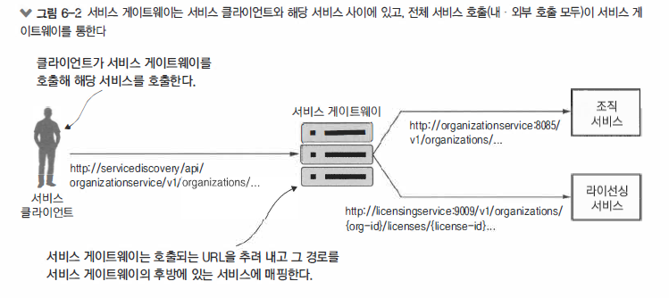
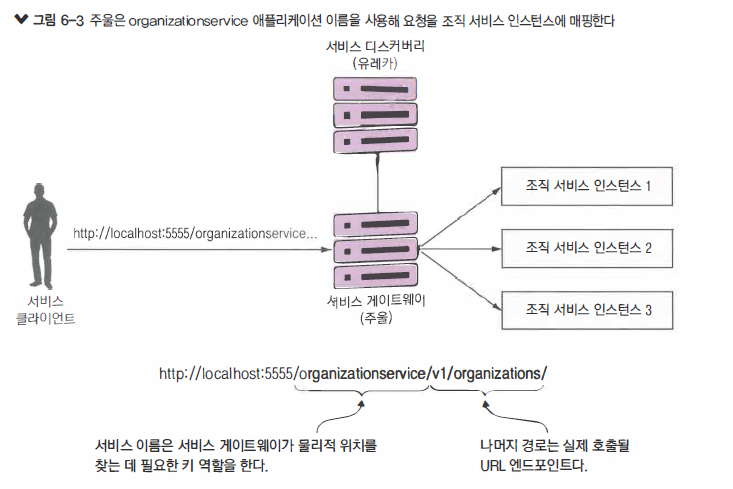
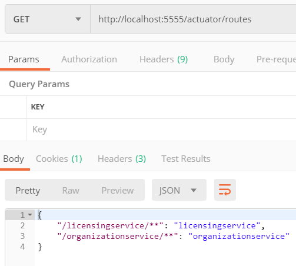
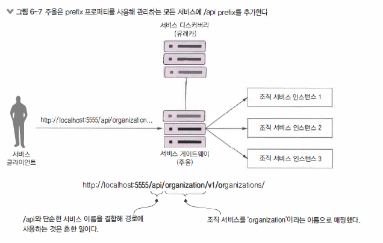
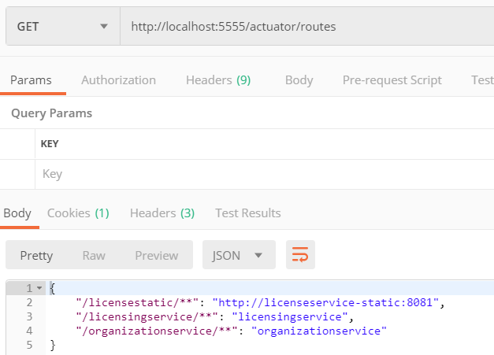
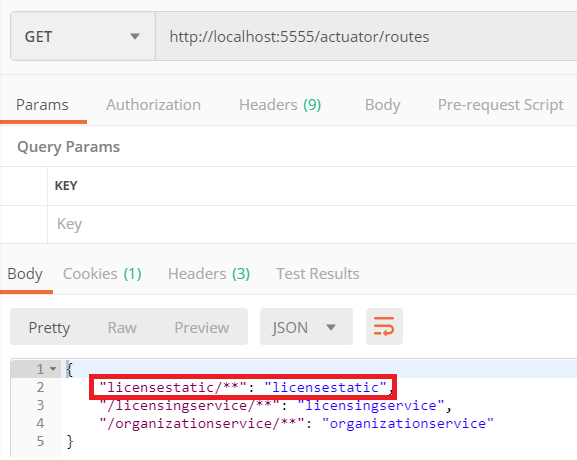
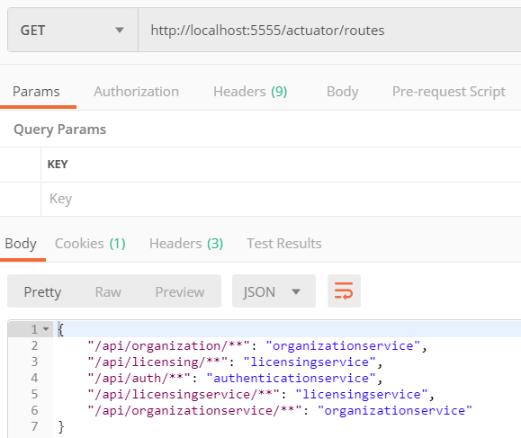
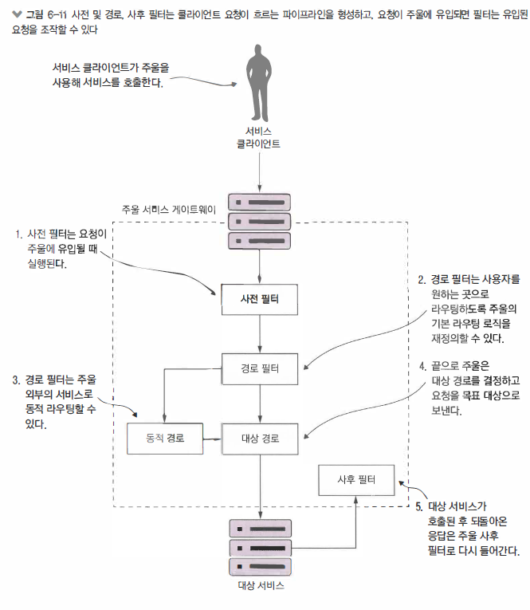
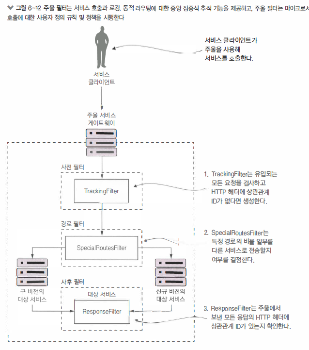
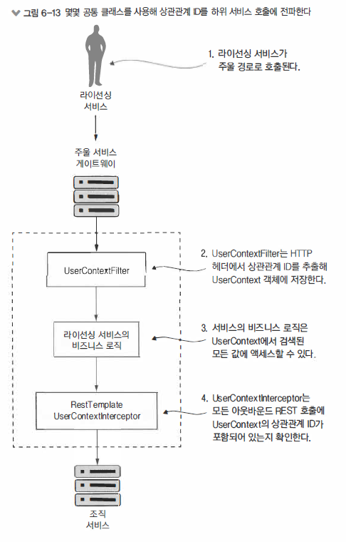

\#MSA #zuul #route #gateway

## 서비스게이트웨이

> 스프링 클라우드와 주울로 서비스 라우팅 (목차)

- 서비스 게이트웨이란 ? 
- 스프링 클라우드와 넷플릭스 주울 소개
- 주울에서 경로 구성
- 주울의 진정한 힘 ! 필터 
- 상관관계 ID를 생성하는 주울의 사전 필터 작성
- 상관관계 ID를 전달받는 사후 필터 작성
- 동적 경로 필터 작업
- 전체요약


> 개념

MSA와 같은 분산형 아키텍처에서 여러 서비스 호출 사이에서 발생하는 
보안과 로깅, 사용자 추적 등 주요 행위를 확인해야 할 때
공통 라이브러리나 프레임워크를 사용해서 서비스마다 이러한 기능을 직접 구축할 수 있다


>  문제점

- 구축중인 각 서비스에 이러한 기능을 일관되게 구현이 어려움
- 이러한 기능을 적절하게 구현하기 어려움
- 서비스간 복잡한 의존성을 만듬


> 횡단관심사?

- 특정 서비스에서 이러한 횡단 관심사들을 추상화하고 독립적인 위치에서 
  애플리케이션의 모든 MSA 호출에 대한 필터와 라우터 역할을 해야함
- 다음과 같은 횡단 관심사를 `서비스게이트웨이`라고 합니다.
- 서비스 클라이언트가 서비스를 직접 호출하지 않고 단일한 정책 시행지점 역할을 하는 
  서비스 게이트웨이로 모든 호출을 경유시켜 최종 목적지로 라우팅


> 중요사항

- 하나의 URI 뒤에 모든 서비스를 배치하고 서비스 디스커버리를 이용해서 모든 호출을 실제 서비스 인스턴스로 매핑
- 서비스 게이트웨이를 경유하는 모든 서비스 호출에 `상관관계 ID`를 삽입
- 호출할 때 생성된 상관관계 ID를 HTTP 응답에 삽입하고 클라이언트에 회신
- 대중이 사용중인 것과 다른 조직 서비스 인스턴스 엔드포인트로 라우팅하는 동적 라이팅 매커니즘을 구축


### 서비스게이트웨이?



- 서비스 게이트웨이는 서비스 클라이언트와 호출될 서비스 사이에서 중개 역할

- 서비스 클라이언트는 서비스 게이트웨이가 관리하는 하나의 URI를 통해 통신

- 서비스 게이트웨이는 서비스 클라이언트 호출에서 보낸 경로를 추려 내고 서비스 클라이언트가 호출하려는 서비스를 판별

- 서비스 게이트웨이는 클라이언트가 각 서비스에 보내는 모든 호출사이에 위치하므로 게이트웨이는 각 서비스 호출에 대한
   `중앙 집중식 정책 시행 지점(PEP)`역할을 한다

- 각 개발팀이 이러한 관심사를 구현하지 않아도 서비스의 횡단 관심사를 단일 지점에서 구현할 수 있다는 것을 의미

   

   

#### 횡단관심사예제

- `정적라우팅`
  - 서비스 게이트웨이는 단일 서비스 URI와 API 경로로 모든 서비스를 호출
  - 개발자는 모든 서비스에 대해 하나의 서비스 엔드포인드만 알면됨
- `동적라우팅`
  - 서비스 게이트웨이는 유입되는 서비스 요청을 조사하고 요청 데이터를 기반으로 서비스 호출자 대상에 따라 지능형 라우팅 수행 가능
  - 베타 프로그램에 참여하는 고객의 서비스 호출은 모두 다른 코드 버전이 수행되는 특정 서비스 클러스터로 라우팅
- `인증과 인가`
  - 모든 서비스 호출은 서비스 게이트웨이로 라우팅 되므로 서비스 게이트웨이는 서비스 호출자가 자신을 인증하고 서비슬를 호출할 권한 여부를 확인할 수 있는 최적 장소
- `측정 지표 수집과 로깅`
  - 서비스 게이트웨이를 사용합면 서비스 호출이 서비스 게이트웨이를 통과할 때 측정 지표와 로그 정보를 수집할 수 있음 
  - 규격화된 로깅을 보장하기 위해서 사용자 요청에서 주요 정보가 누락되지 않았는지 확인하는데 사용


#### 단일장애 및 병목위험

- 집중화된 로드 밸런서는 단일 장애 지점과 서비스의 병목점이 될 가능성이 있으며,
  서비스 게이트웨이를 올바르게 구현하지 않으면 동일한 위험 부담을 가짐

- 서비스 게이트웨이를 구현할 때 다음을 염두하자

  - `로드 밸런서는 각 서비스 그룹 앞에 있을 때 여전히 유용`
    - 여러 서비스 게이트웨이 인스턴스 앞에 로드 밸런서를 두는 것은 적절한 설계
    - 서비스 게이트웨이를 확장할 수 있음
    - 모든 서비스 인스턴스 앞에 로드 밸런서를 두는 것이 병목점이 될 수 있어 좋은 방법은 아님
  - `작성하는 서비스 게이트웨이 코드를 무상태(stateless)로 유지` 
    (무상태? TCP를 사용하지만 연결지향적인 성격을 버린 무상태 프로토콜 - 연결상태를 가지고 있지 않는 즉 일회성 접속을 허용하는 프로토콜)
    - 서비스 게이트웨이 정보를 메모리에 저장하지 말아야 함
    - 주의하지 않으면 게이트웨이의 확장성을 제한하고 모든 서비스 게이트웨이 인스턴스에 데이터가 복제되도록 해야함
  - `작성하는 서비스 게이트웨이 코드를 가볍게 유지`
    - 서비스 게이트웨이는 서비스 호출에 대한 병목점
    - 여러 DB 호출이 포함된 복잡한 코드는 서비스 게이트웨이에서 추적하기 힘든 성능 문제의 원인

  

### Zuul

> 스프링 클라우드와 넥플릭스 주울 소개
>
> 주울(Zuul)은 스프링 클라우드 애너테이션으로 설정, 매우 쉬운 서비스 게이트웨이


- 제공기능
  - `애플리케이션의 모든 서비스 경로를 단일 URI로 매핑`
    - 주울의 매핑이 단일 URI로 제한 되는 것은 아님
    - 주울에서는 여러 경로 항목을 정의해서 경로 매핑을 매우 세분화 가능
      (서비스 엔드포인트는 고유한 경로로 매핑)
    - 주울의 가장 일반적인 사용 사례는 모든 서비스 호출이 통과하는 단일 진입점을 구축하는 것
  - `게이트웨이로 유입되는 요청을 검사하고 대응할 수 있는 필터 작성`
    - 필터를 사용하면 코드에 정책 시행 지점(PEP)을 주입해서 모든 서비스 호출에 광범위한 작업을 일관된 방식으로 수행가능


> 시작전 3가지

- 주울 스프링 부트 프로젝트를 설정하고 메이븐 의존성 적절히 구성
- 스프링 부트 프로젝트를 주울 서비스로 설정하도록 스프링 클라우드 애너테이션으로 수정
- 주울을 유레카와 통신하도록 구성 (선택사항)


#### 구성&셋팅

>  pom.xml

```xml
<dependency>
    <groupId>org.springframework.cloud</groupId>
    <artifactId>spring-cloud-starter-netflix-zuul</artifactId>
</dependency>
```


> ZuulServerApplication.java

- `@EnableZuulServer` 
  - 주울 리버스 프록시 필터를 로드하지 않은 주울 서버나 넥플릭스 유레카를 상요하는 주울 서버를 생성가능
  - 자체 라우팅 서비스를 만들고 내장된 주울 기능도 사용하지 않을 때 선택
  - 유레카가 아닌 서비스 디스커버리 엔젠과 통합할 경우 해당

```java
@SpringBootApplication
@EnableZuulProxy // 서비스를 주울 서버로 사용
public class ZuulServerApplication {
    public static void main(String[] args) {
        SpringApplication.run(ZuulServerApplication.class, args);
    }
}
```


> Discovery와 통신하는 Gateway 구성

- 주울 프록시 서저는 기본적으로 스프링 제품과 동작하도록 설계
- 주울을 자동으로 유레카를 사용해서 서비스 ID로 서비스를 찾은 후 
  넷플릭스 리본으로 주울 내부에서 요청에 대한 클라이언트 측 부하 분산을 수행


> application.yml

```yaml
eureka:
  instance:
    preferIpAddress: true
  client:
    registerWithEureka: true
    fetchRegistry: true
    serviceUrl:
      defaultZone: http://localhost:8761/eureka/
```


#### 경로구성

- 주을은 본래 `리버스 프록시 `
  - `리버스 프록시`는 자원에 접근하려는 클라이언트와 자원 사이에 위치한 중개 서버
- 클라이언트는 프록시가 아닌 다른 서버와 통신하는 것 조차 알 수 없고, 
  리버스 프록시는 클라이언트의 요청을 받아 클라이언트를 대신해 원격 자원 호출
- MSA에서 주울(리버스프록시)은 클라이언트에서 받은 마이크로서비스 호출을 하위 서비스에 전달
- 서비스 클라이언트는 주울과 통신한다고 생각
- 주울이 하위 클라이언트와 통신하려면 유입되는 호출을 어떻게 하위 경로로 매핑할지 알아야 합니다.


> 주울 매커니즘

- `[1] 서비스 디스커버리를 이용한 자동 경로 매핑`
- `[2] 서비스 디스커버리를 이용한 수동 경로 매핑`
- `[3] 정적 URI을 이용한 수동 경로 매핑`


##### [1] 자동경로매핑

> 서비스 디스커버리를 이용한 자동 경로 매핑

- application.yml 에 경로를 정의해서 모든 경로를 매핑
- 특별한 구성 없이도 서비스 ID를 기반으로 요청을 자동 라우팅
- 경로를 지정하지 않으면 호출되는 서비스의 유레카 서비스 ID를 사용해서 하위 서비스 인스턴스에 매핑
  - organizationservice (조직서비스) 를 호출하고 주울로 자동화된 라우팅을 사용하고자 하면 
    클라이언트가 다음 URI 엔트포인트로 주울 서비스 인스턴스를 호출하면된다
  - localhost:5555/`organizationservice`/vi/organizations/e254f8c-c442-4ebe-a82a-e2fc1d1ff78a
    - localhost:5555 : 주울 서버에 접근 
    - organizationservice : 서비스 엔드포인트 경로 첫 부분에 호출하려는 서비스를 표시




> 주울서버관리경로확인하기 
> http://localhost:5555/actuator/routes 




##### [2] 수동경로매핑

> 서비스 디스커버리를 이용한 수동 경로 매핑

- 주울 사용시 서비스의 유레카 서비스 ID로 자동 생성된 경로에 의존하지 않고 명시적으로 매핑 경로를 정의할 수 있어 더욱 세분화 가능
- 주울에서 조직 서비스의 기본 경로를 수정
  - `/organizationservice/v1/organizations/{organization-id}`
- 자동경로매핑이 없어지는 것은 아니라 그대로 존재


> application.yml

```yaml
zuul:
  ignored-service: 'organizationservice' # 자동경로매핑 유지
  # ignored-services: 'organizationservice' # 자동경로매핑 제외
  # ignored-services: '*' # 자동경로매핑 모두제외
  routes:
    organizationservice: /organization/**
```

-  주울은 유레카 서비스 ID 기반으로 서비스를 제공하는 자동 경로 매핑만 사용시에 
   실행 중인 서비스 인스턴스가 없으면 서비스 경로를 노출하지 않음
-  수동으로 서비스 디스커버리 ID 경로를 매핑한다면 
   유레카에 등록된 서비스 인스턴스가 없어도 주울은 그 경로를 계속 표시
- 존재하지 않는 서비스 경로를 호출하면 주울은 500에러 반환


> application.yml

- http://localhost:5555/api/organization/v1/organizations/

```yaml
zuul:
  ignored-services: '*' # 자동경로매핑 모두제외
  prefix: /api
  routes:
    organizationservice: /organization/**
    licensingservice: /licensing/**
```




> [주의] 수동매핑주의점
>
> 주울은 유레카 서비스 ID 기반으로 서비스를 제공하는 자동 경로 매핑만 사용할 때 
> 실행중인 서비스 인스턴스가 없다면 서비스 경로를 노출하지 않음
>
> 하지만 수동으로 서비스 디스커버리 ID 경로를 매핑한다면 유레카에 등록된 서비스 인스턴스가 없어도
> 주울은 그 경로를 계속 표시, 존재하지 않는 서비스 경로를 호출하면 주울은 500에러를 반환


##### [3] 정적URI수동경로매핑

- `유레카로 관리하지 않는 서비스`를 라우팅하는데도 주울을 사용할 수 있음
- 주울은 고정 URI에 직접 라우팅하도록 설정이 가능


> 리본을 유레카를 통하지 않고 
>
> 주울이 직접 호출할 `정적경로`

```yaml 
zuul:
  routes:
  	# 주울은 키 이름으로 서비스를 식별
    licensestatic: 
    	# 라이선싱 서비스에 대한 정적 경로
    	path: /licensestatic/** 
    	# 유레카를 통하지 않고 주울이 직접 호출할 라이선싱 서비스의 정적 경로
    	url: http://licenseservice-static:8081  인스턴스를 설정
```




> 리본을 유레카와 통합하지 않고 
> `부하분산할 대상이 될 서비스인스턴스`를 추가

```yaml 
zuul:
  routes:
    licensestatic: 
    	path: licensestatic/**
    	# 리본에서 서비스를 찾는데 사용하는 Service-ID 정의
    	serviceId: licensestatic 
ribbon:
	eureka:
		# 리본에서 유레카 지원을 끈다
		enabled: false 
	licensestatic:
		ribbon:
			# 요청을 라우팅하는데 사용된 서버 목록
			listOfServers: http://licenseservice-static1:8801, http://licenseservice-static2:8802  
```




###### JVM기반아닌_서비스 :: 사이드카

경로를 정적으로 매핑하고 리본에서 유레카를 비활성화 할 때 

문제는 주울 서비스 게이트웨이로 실행되는 모든 서비스에 대해 리본을 지원할 수 없음

주울이 서비스 검색 결과를 캐시하는데 리본을 사용할 수 없어 유레카 서버가 더 많은 부하를 받음

(리본은 호출할 때 유레카를 호출하는 것이 아님)

서비스 인스턴스 위치를 로컬에 캐시하고 유레카에 변경 사항을 정기적으로 확인

리본을 사용하지 않으면 주울은 서비스 위치를 확인할 필요가 있을 때마다 유레카 호출


JVM기반이 아닌 APP은 이러한 경로를 처리할 별도의 주울 서버를 설정할 수 있음

스프링 클라우드의 `사이드카` 인스턴스를 설정하면 더 좋음

스프링 클라우드의 사이드카를 이용하면 JVM 기반이 아닌 서비스를 유레카 인스턴스에 등록후에 주울로 프록시 가능

http://bit.ly/2PCw2UL


##### [4] 경로구성동적로딩

- 경로를 동적으로 재로딩하면 주울 서버를 재활용하지 않고도 경로 매핑을 변경할 수 있어  유용
- 기존 경로를 신속하게 수정하고 새로운 경로를 추가하면 환경 내 각 주울 서버를 재활용해야함
- 스프링 클라우드 컨피그 서비스를 사용해서 마이크로서비스 구성 데이터를 외부화하는 방법과 같이 주울 경로를 외부화 가능
  - EagleEye 예제에서 구성 저장소인 config-repo에 새로운 애플리케이션 폴더를 설정
  - 구성정보가 있는 `zuulservice.yml`과 `zuulservice-dev.yml`, `zuulservice-prod.yml` 파일생성


> zuul.prefix=/api

- `/routes`  엔드포인트를 호출하면 현재 주울에서 볼 수 있는 모든 유레카 기반 서비스의 경로 앞에 `/api`가 붙어 표시
- 새로운 경로 매핑을 바로 추가하고 싶다면 구성 파일을 수정하고 
  스프링 클라우드 컨피그 서버가 구성 정보를 가져오는 깃 저장소에 다시 커밋


> zuulservice-*.yml (경로조작)

```yml 
zuul.ignored-services: '*'
zuul.prefix: /api
zuul.routes.organizationservice: /organization/**
zuul.routes.organizationservice: /licensing/**
```




##### [5] 서비스타임아웃

- 주울은 넷플릭스의 히스트릭스와 리본 라이브러리를 사용해 
  오래 수행되는 서비스 호출이 서비스 게이트웨이 성능에 영향을 미치지 않도록함
- 기본적으로 주울은 요청을 처리하는데 1초 이상 걸리는 모든 호출을 종료  & HTTP 500 에러 반환 (히스트릭스 기본동작)


> zuulservice.yml (in git)
>
> 히스트릭스의 기본 타임아웃 시간을 2.5초로 설정 (기본 1초)
>
> 넥플릭스 리본 타임아웃 시간을 7초로 수정 ( 기본 5초)

```yml
zuul.prefix:  /api
zuul.routes.organizationservice: /organization/**
zuul.routes.licensingservice: /licensing/**
zuul.debug.request: true
hystrix.command.licensingservice.execution.isolation.thread.timeoutInMilliseconds: 2500
licensingservice.ribbon.ReadTimeout: 7000
```


#### 필터

##### 개념

> 주울의 진정한 힘 ! 필터 ?

[1] 주울 케이트웨이로 유입되는 모든 요청을 프록시하여 서비스 호출을 단순화

[2] 하지만 주울의 진정한 능력은 게이트웨이를 통과하는 모든 서비스 호출에 대해 사용자 정의 로직을 작성할 때 드러남


APP의 각 서비스를 수정하지 않고 모든 서비스에서 작용하기 원하기 때문에 이 정책을 `횡단관심사`로 간주

마찬가지로 주울 필터는 J2EE 서블릿 필터나 스프링 애스팩트와 유사한 방식으로 사용되어 다양한 동작을 가로채며

처음 작성자 모르게 호출 행동 약식을 꾸미거나 변경 가능

>  서플릿 필터나 스프링 애스팩트는 특정 서비스에 국한되지만 
>
> 주울과 주울필터를 사용하면 주울로 라우팅되는 모든 서비스에 대한 횡단 관심사를 구현 가능


##### 종류

- `사전필터`
  - 주울에서 목표 대상에 대한 실제 요청이 발생하기 전에 호출
  - 일반적으로 사전 필터는 서비스의 일관된 메시지 형식 ( ex http 해더 포함 여부) 을 확인하는 작업을 수행하거나 
    서비스 이용하는 사용자가 인증 및 인가되었는지 확인하는 `게이트키퍼` 역할
- `사후필터`
  - 대상 서비스를 호출하고 응답을 클라이언트로 전송한 후 호출
  - 일반적으로 사후 필더는 대상 서비스의 응답을 `로깅하거나 에러 처리, 민감한 정보에 대한 응답을 감시`
- `경로필터`
  - 대상 서비스가 호출되기 전에 호출을 가로채는데 사용
  - 일반적으로 경로 필터는 일정 수준의 동적 라우팅 필요 여부를 결정하는데 사용
  - 예를 들어 뒷부분에서 동일 서비스의 다른 두 버전을 라우팅할 수 있는 경로 단위 필터를 사용해서 
    작은 호출 비율만 새 버전의 서비스로 라우팅 할 수 있음
    이렇게 하면 모든 사용자가 새로운 서비스를 이용하지 않고도 소수 사용자에게 새로운 기능을 노출




- `TrackingFilter`
  - 주울에서 보내는 모든 요청에 연관된 상관관계 ID 여부를 확인하는 사전 필터
  - `상관관계 ID`는 고객 요청을 수행할 때 실행되는 모든 MSA에 전달되는 고유 ID
  - `상관관계 ID`를 사용하면 특정 호출이 일련의 MSA를 통과할 때 발생하는 모든 이벤트 체인을 추적
- `SpecialRoutesFilter`
  - 유입되는 경로를 확인하고 해당 경로에서 A/B 테스팅 수행 여부를 결정하는 주울의 경로 필터
  - A/B 테스팅은 사용자 ( 이 경우 서비스 ) 에게 동일한 서비스에 기반을 둔 다른 두 버전의 서비스를 무작위로 제시
  - A/B 테스팅의 기본 개념은 새로운 기능을 전체 사용자에게 출시되기 전에 테스트 할 수 있다는 것
  - 예에서 동일 조직 서비스의 다른 두 버전이 있으며, 
    대다수는 구 버전의 서비스로 라우팅되고
    소수 사용자는 새 버전의 서비스로 라우팅
- `ResponseFilter`
  - 서비스 호출과 연관된 `상관관계 ID`를 클라이언트로 회신하는 HTTP 응답 해더에 삽입하는 사후 필터
  - 이것으로 클라이언트는 호출한 요청과 연관된 `상관관계 ID`에 액세스




##### TrackingFilter

> 상관관계ID를 생성하는사전필터

`TrackingFilter` 라는 사전 필터를 만들어 게이트웨이로 들어오는 모든 요청을 검사하며

요청안에 `tmx-correlation-id` 라는 HTTP 해더가 있는지 판별

`tmx-correlation-id` 해더에는 여러 MSA 전달되는 사용자 요청을 추적하는데 사용하는 고유한 GUID ( Globally Unique ID) 포함


> TrackingFilter.java

```java
// 모든 주울 필터는 ZuulFilter 클래스를 확장
// filterType()과 filterOrder(), run() 등등 4개의 메서드를 재정의
@Component
public class TrackingFilter extends ZuulFilter{
    private static final int      FILTER_ORDER =  1;
    private static final boolean  SHOULD_FILTER=true;
    private static final Logger logger = LoggerFactory.getLogger(TrackingFilter.class);

    // 모든 필터에서 공통으로 사용되는 기능을 FilterUtils 클래스에 담음
    @Autowired
    FilterUtils filterUtils;

    // filterType() 메서드는 주울에서 사전 - 경로 - 사후 필터를 지정하는데 사용
    @Override
    public String filterType() {
        return FilterUtils.PRE_FILTER_TYPE;
    }

    // filterOrder() 메서드는 주울이 다른 필터 유형으로 요청을 보내야 하는 순서를 나타내는 정수 값 반환
    @Override
    public int filterOrder() {
        return FILTER_ORDER;
    }

    // shouldFilter() 메서드는 활성화 여부를 나타내는 불 값을 반환
    public boolean shouldFilter() {
        return SHOULD_FILTER;
    }
    
    // shouldFilter() 메서드는 활성화 여부를 나타내는 불 값을 반환
    private boolean isCorrelationIdPresent(){
      if (filterUtils.getCorrelationId() !=null){
          return true;
      }
      return false;
    }

    // 실제로 tmx-correlation-id 존재 여부를 확인하고 상관관계 ID의 GUID 값을 생성하는 헬퍼 메서드
    private String generateCorrelationId(){
        return java.util.UUID.randomUUID().toString();
    }

    // run() 메서드는 서비스가 필터를 통과할 때 마다 실행되는 코드
    // tmx-correlation-id의 존재 여부를 확인하고, 없다면 생성하고 tmx-correlation-id HTTP 헤더를 설정
    public Object run() {

        if (isCorrelationIdPresent()) {
           logger.debug(
               "tmx-correlation-id found in tracking filter: {}. ", 
               filterUtils.getCorrelationId());
        }
        else{
            filterUtils.setCorrelationId(generateCorrelationId());
            logger.debug(
                "tmx-correlation-id generated in tracking filter: {}.", 
                filterUtils.getCorrelationId());
        }

        RequestContext ctx = RequestContext.getCurrentContext();
        logger.debug(
            "Processing incoming request for {}.",  
            ctx.getRequest().getRequestURI());
        return null;
    }
}
```


###### 상관관계ID의사용

> 서비스호출에서상관관계ID의사용

이제 주울을 관통하는 모든 MSA 호출에 상관관계 ID 추가가 보장

- 호출되는 MSA에서 상관관계 ID를 손쉽게 접근
- MSA 호출하는 하위 서비스 호출에도 상관관계 ID 전파


HTTP 요청에서 상관관계 ID를 읽어 와서 접근할 수 있는 클래스에 매핑하고 하위 서비스에 전파하는데 사용

- 주울 게이트웨이로 라이선싱 서비스가 호출되면 TrackingFilter는 주울로 유입되는 
  모든 호출의 HTTP 헤더에 상관관계 ID 삽입
- `UserContextFilter`클래스는 `사용자정의 HTTP ServletFilter`이며 상관관계 ID를 `UserContext`클래스에 매핑
  UserContext클래스는 나중에 호출할 때 사용할 수 있도록 스레드로컬 저장소에 저장된 값
- 라이선싱 서비스 비즈니스 로직은 조직 서비스에 대한 호출을 실행해야 함
- RestTemplate은 조직 서비스를 호출하는데 사용되고 
  사용자 정의된 Spring Interceptor 클래스 (UserContextInterceptor)로 
  상관관계 ID를 아웃바운드 호출의 HTTP 헤더에 삽입




> 코드중복 vs 공유라이브러리
>
> MSA 전반에 공통 라이브러리의 사용 여부에 대한 주제는 MSA 설계에서 애매한 부분
>
> 1. MSA 순수주의자들은 사용자 정의 프레임워크가 서비스간 인위적인 의존성을 가져와 사용하면 안된다고 말함
>
> 2. MSA 실무자들은 공통 라이브러리를 만들어 서비스간 공유해야 하는 특정 상황이 존재한다고 말함
>
> `절충점`
>
> <u>공통 라이브러리는 인프라 스트럭처 유형의 작업을 처리할 때는 사용해도 좋음</u>
>
> <u>하지만 비즈니스 경향을 클래스를 공유하기 시작하면 서비스 사이의 경계를 허물기 때문에 문제를 야기</u>


##### UserContextFilter

> 유입되는 HTTP 요청을 가로채는 UserContextFilter

서비스에 유입되는 모든 HTTP 요청을 가로채서 HTTP 요청에서 

상관관계 ID (일부 다른 값도 포함)를 UserContext 클래스에 매핑하는 서블릿 필터


> UserContextFilter.java

```java
// 필터는 스프링 @Component를 사용하고 javax.servlet.Filter 인터페이스를 구현하여 스프링에 등록
@Component
public class UserContextFilter implements Filter {
    private static final Logger logger = LoggerFactory.getLogger(UserContextFilter.class);

    @Override
    public void doFilter(
        ServletRequest servletRequest, 
        ServletResponse servletResponse, 
        FilterChain filterChain)
            throws IOException, ServletException {
        HttpServletRequest httpServletRequest = (HttpServletRequest) servletRequest;

        // 필터는 헤더에서 상관관계 ID를 검색해서 UserContext 클래스에 설정
        UserContextHolder.getContext().setCorrelationId(
            httpServletRequest.getHeader(UserContext.CORRELATION_ID));
        // 코드의 README 파일에 정의된 인증 서비스 예제를 사용하면 HTTP 헤더에서 다른 값이 추출되어 동작
        UserContextHolder.getContext().setUserId(
            httpServletRequest.getHeader(UserContext.USER_ID));
        UserContextHolder.getContext().setAuthToken(
            httpServletRequest.getHeader(UserContext.AUTH_TOKEN));
        UserContextHolder.getContext().setOrgId(
            httpServletRequest.getHeader(UserContext.ORG_ID));

        logger.debug(
            "Special Routes Service Incoming Correlation id: {}", 
            UserContextHolder.getContext().getCorrelationId());

        filterChain.doFilter(httpServletRequest, servletResponse);
    }

    @Override
    public void init(FilterConfig filterConfig) throws ServletException {
    }

    @Override
    public void destroy() {
    }
}
```


##### UserContext&UserContextHolder

> 서비스가 쉽게 액세스 할 수 있는 HTTP 헤더를 만드는 UserContext

UserContext 클래스는 MSA 처리하는 개별 서비스 클라이언트 요청에 대한 HTTP 헤더 값을 저장하는데 사용

이 클래스는 java.lang.ThreadLocal 값을 검색하고 저장하는 getter/setter 메서드로 구성'


> UserContext.java

- HTTP 요청에서 추출한 값을 보관하는 POJO

```java
@Component
public class UserContext {
    public static final String CORRELATION_ID = "tmx-correlation-id";
    public static final String AUTH_TOKEN     = "tmx-auth-token";
    public static final String USER_ID        = "tmx-user-id";
    public static final String ORG_ID         = "tmx-org-id";

    private String correlationId= new String();
    private String authToken= new String();
    private String userId = new String();
    private String orgId = new String();

    // getter / setter 생략 .. 
}
```


> UserContextHolder.java

- ThreadLocal 변수에 UserContext를 저장
- ThreadLocal 변수는 사용자 요청을 처리하는 해당 스레드에서 호출되는 모든 메서드에 엑세스 가능한 변수

```java
public class UserContextHolder {
    private static final ThreadLocal<UserContext> userContext = new ThreadLocal<UserContext>();

    public static final UserContext getContext(){
        UserContext context = userContext.get();

        if (context == null) {
            context = createEmptyContext();
            userContext.set(context);
        }
        return userContext.get();
    }

    public static final void setContext(UserContext context) {
        Assert.notNull(context, "Only non-null UserContext instances are permitted");
        userContext.set(context);
    }

    public static final UserContext createEmptyContext(){
        return new UserContext();
    }
}
```


##### RestTemplate&UserContextInterceptor

> 상관관계 ID의 전파를 보장하는 사용자 정의 RestTemplate과 UserContextInterceptor

 RestTemplate 인스턴스에서 실행되는 모든 HTTP 기반 서비스 발신 요청에 상관관계 ID를 삽입

이 작업은 서비스 호출간 연결을 형성하는데 수행

RestTemplate 클래스에 삽입되는 스프링 인터셉터(Interceptor)를 사용


> UserContextInterceptor.java

- userContextInterceptor를 사용하려면 RestTemplate 기반

```java
// UserContextInterceptor는 스프링 프레임워크의 ClientHttpRequestInterceptor 구현
public class UserContextInterceptor implements ClientHttpRequestInterceptor {
    
    // RestTemplate으로 실제 HTTP 서비스 호출을 하기 전에 intercept() 메서드가 호출
    @Override
    public ClientHttpResponse intercept(
        HttpRequest request, byte[] body, 
        ClientHttpRequestExecution execution) throws IOException {

        HttpHeaders headers = request.getHeaders();
        // 서비스 호출을 위해 준비할 HTTP 요청 해더를 가져와 UserContext에 저장된 상관관계 ID를 추가
        headers.add(UserContext.CORRELATION_ID, UserContextHolder.getContext().getCorrelationId());
        headers.add(UserContext.AUTH_TOKEN, UserContextHolder.getContext().getAuthToken());

        return execution.execute(request, body);
    }
}
```

