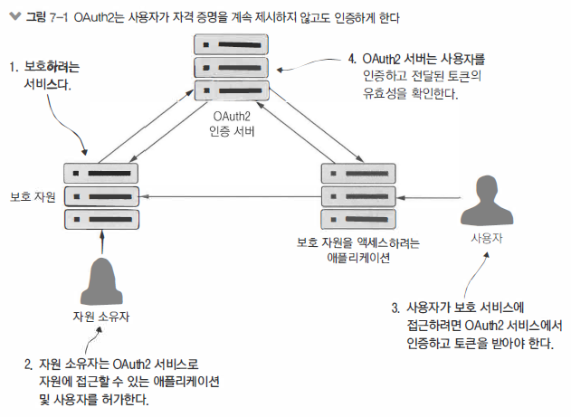
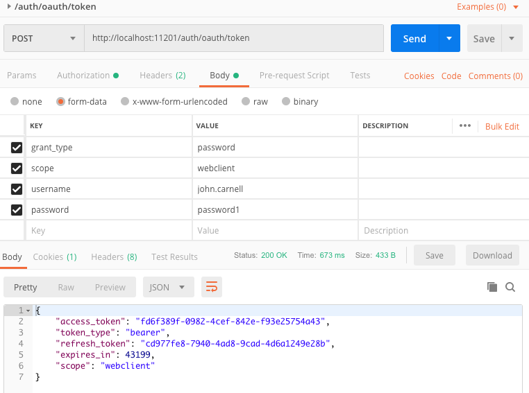
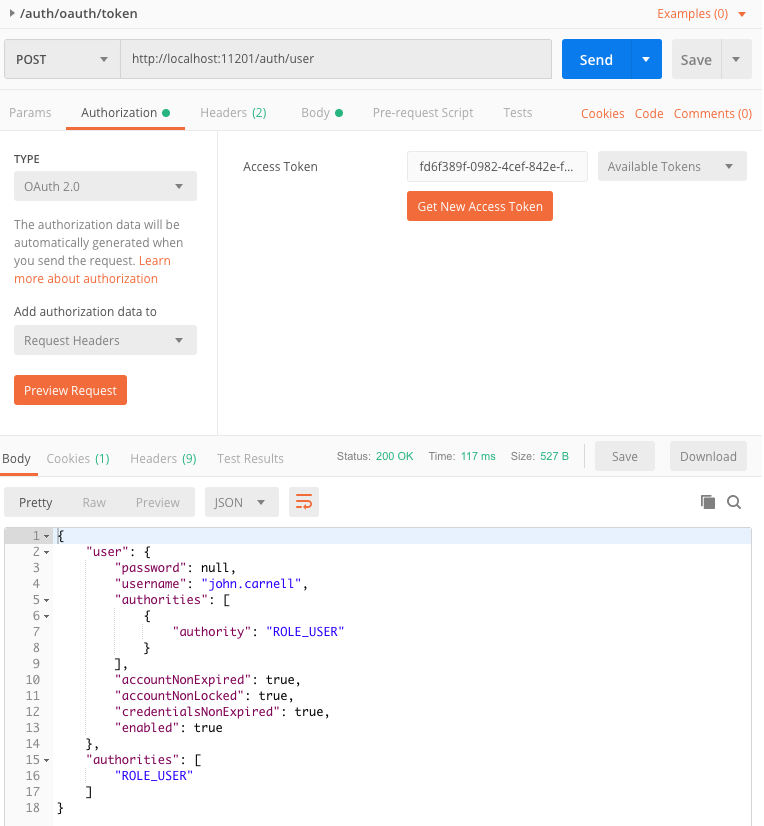
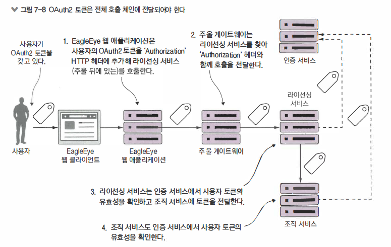
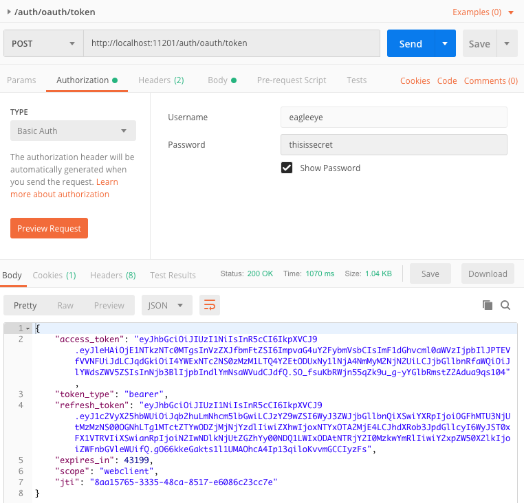
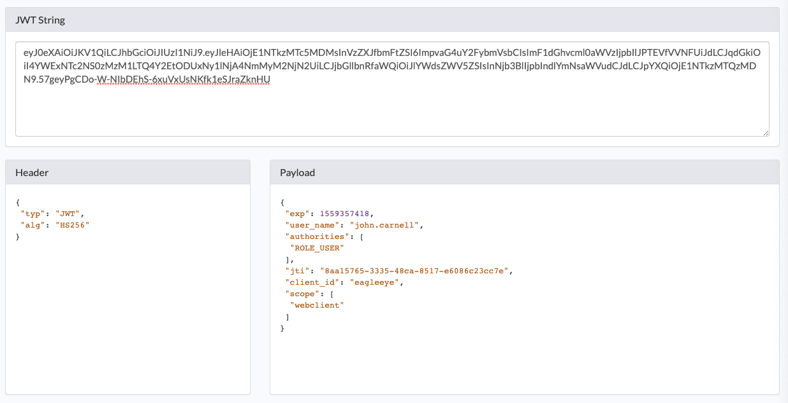
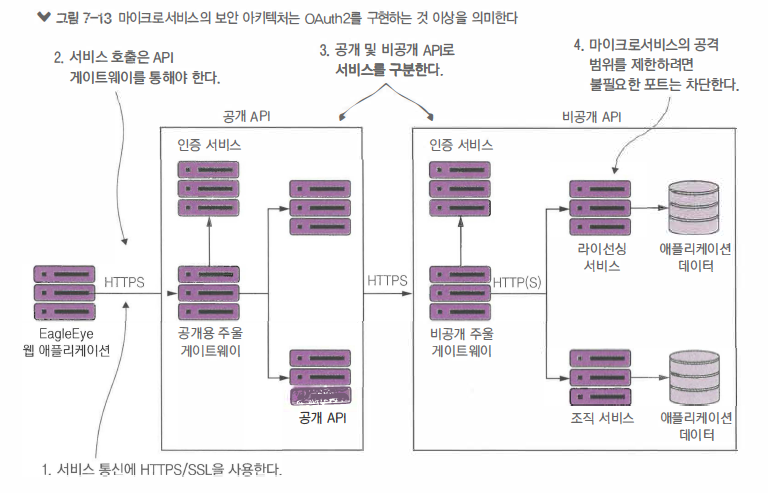

\#MSA #security

# MSA보안

Spring Security 파트에 `방식`이라는 글에서 `Session + Cookie, JWT, OAuth2.0`을 간략히 정리한 글이 있습니다.

OAuth2.0을 시작하기전에 다음글을 먼저 읽으면 도움이 됩니다.


> 순서

- OAuth2 소개
- 작게시작 - 스프링과 OAuth2로 1개의 엔트포인트 보호
- OAuth2를 사용한 조직 서비스 보호
- 자바스크립트 웹토큰과 OAuth2
- 마이크로서비스 보안을 마치며
- 요약


## 보안

> 안전한어플

- 사용자를 적절히 통제해 사용자 본인 여부를 확인하고 수행하려는 작업에 대한 권한 여부를 검증
- 서비스가 실행되는 인프라 스트럭처를 꾸준히 패치 , 최신 상태로 유지 취약점의 위험 최소화
- 서비스는 명확히 정의된 포트로만 접근하고 소수의 인가된 서버만 접근할 수 있도록 네트워크 접근 통제


>  인증과 인가

- `인증(Authentication)`
  - `자격증명을 제공해서 자신이 누구인지 증명하는 행위
- `인가(Authorization)`
  - 사용자가 수행하려는 작업의 허용여부를 결정


## OAuth2

- 토큰기반의 보안 프레임워크
  - 사용자는 자원에 접근하려는 app을 통해서 자격 증명을 제시하고 OAuth2 서버에서 인증
  - 사용자의 자격 증명이 유효하면 OAuth2 서버는 사용자 app이 이용하는 서비스가 보호 자원(MSA)에 접근하려고 시도할 때마다 제시할 토큰을 제공
  - 보호자원은 OAuth2서버에 접속해서 토큰 유효성을 확인하고 사용자가 지정한 역할을 조회할 수 있음
  - 역할은 연관된 사용자를 함께 그룹으로 묶고 사용자 그룹이 액세스할 수 있는 자원을 정의


> 구성요소

- `보호자원(Protected Resource)`
  - 보호하려는 자원(여기서는 MSA)이며 적절한 권한 부여받은 인증된 사용자만 액세스 가능
- `자원소유자(Resource Owner)`
  - 서비스를 호출할 수 있는 app 및 서비스에 접근할 수 있는 사용자
  - 서비스에서 수행할 수 있는 작업을 정의
  - 자원 소유자가 등록한 app은 식별가능한 app이름과 시크릿 키를 받음
  - app 이름과 시크릿 키는 OAuth2
- `애플리케이션(Application - Server)`
  -  사용자 대신 서비스를 호출할 app
  - 사용자는 서비스를 직접 호출하지 않는 대신 app에 의존해 작업 수행
- `OAuth2 인증서버(OAuth2 authertication server)`
  - app과 소비되는 서비스 사이의 중개자
  - app이 사용자 대신 호출하는 모든 서비스에 사용자의 자격 증명을 전달하지 않고 사용자 자신을 인증할 수 있음

> OAuth 인증서버 : Application = 1 : N 의 관게를 가집니다


> 구조



- 보호자원은 OAuth2 서버에 접속해 토큰 유효성을 확인하고 사용자가 지정한 역할(ROLE)을 조회할 수 있습니다

- 역할은 연관된 사용자르 함께 그룹으로 묶어 사용자그룹이 엑세스할 수 있는 자원을 정의

- OAuth2.0의 그랜트(Grants)라는 인증체계를 이용하여 다양한 시나리오에서 REST기반 서비스를 보호


> 다음 4가지의 그랜트 타입

  - 패스워드
  - 클라이언트 자격증명
  - 인가코드
  - 암시적


> 더 자세한 OAuth2.0의 그랜트 개요는 후반후에 설명


## 시작하기

- OAuth2의 인증과 인가설정방법을 이해하기 위해서 OAuth2 패스워드 그랜트 타입을 구현
- 필요한 수행작업
  1. 스프링 클라우드 기반 `OAuth2 인증 서비스`를 설정
  
  2. OAuth2 서비스와 사용자 신원을 인증 및 인가할 수 있도록 인가된 app 역할을 하는 `가짜 EagleEye UI app` 등록
  
  3. OAuth2 패스워드 그랜트 타입을 사용해서 EagleEye 서비스 보호
     EagleEye UI를 만들지 않고 EagleEye OAuth2 서비스에 인증하는 PostMan으로 사용자 로그인 시뮬레이션 진행
  
  4. 인증된 사용자만 호출 할 수 있도록 라이선싱 및 조직서비스 보호


### OAuth2 구성 (Server)

> [궁금증] EagleEye가 무엇?
>
> => 로그인을 제공하기 위해서 OAuth와 연결해주는 중간 서버라고 생각


- OAuth2.0 인증서버는 스프링부트로 제작

- 인증서비스는 사용자 자격증명을 인증하고 토큰을 발행
- 인증 서비스가 보호하는 서비스에 사용자가 접근할 시 자기가 발급한 OAuth2 토큰인지 만료되지 않았는지 확인


> application.yml

```yml
server:
  servlet:
    contextPath: /auth
```


> pom.xml

- `spring-cloud-security`
  - 일반적인 스프링과 스프링 클라우드 보안 라이브러리
- `spring-security-oauth2`
  -  OAuth2 라이브러리를 가져옵니다.

```&gt; xml
<dependency>
    <groupId>org.springframework.cloud</groupId>
    <artifactId>spring-cloud-security</artifactId>
</dependency>

<dependency>
    <groupId>org.springframework.security.oauth</groupId>
    <artifactId>spring-security-oauth2</artifactId>
</dependency>
```


> Application.java (authentication-service)

- `@EnableAuthorizationServer`
  - 스프링 클라우드에 서비스가 OAuth2 서비스로 사용되며 
    OAuth2 인증 및 인가 과정에서 사용될 여러 REST 기반 엔드포인트를 추가할 것이라 알림
- `/user(/auth/user로 매핑)`
  - OAuth2로 보호되는 서비스에 접근하려할 때 사용
  - 보호 서비스로 호출되어 OAuth2 엑세스 토큰의 유효성을 검증하고 보호 서비스에 접근하는 할당된 사용자 역할을 조회

```java
@SpringBootApplication
@RestController
@EnableResourceServer
@EnableAuthorizationServer // 이 서비스가 OAuth2 서비스가 될 것이라고 스프링 클라우드에게 알림
public class Application {
    
    // 사용자 정보를 조회하는데 사용
    @RequestMapping(value = { "/user" }, produces = "application/json")
    public Map<String, Object> user(OAuth2Authentication user) {
        Map<String, Object> userInfo = new HashMap<>();
        userInfo.put("user", user.getUserAuthentication().getPrincipal());
        userInfo.put("authorities", AuthorityUtils.authorityListToSet(user.getUserAuthentication().getAuthorities()));
        return userInfo;
    }


    public static void main(String[] args) {
        SpringApplication.run(Application.class, args);
    }
}
```


> OAuth2Config.java

```java
@Configuration 
public class OAuth2Config extends AuthorizationServerConfigurerAdapter {

    @Autowired
    private AuthenticationManager authenticationManager;

    @Autowired
    private UserDetailsService userDetailsService;

    // configure() 재정의
    @Override
    public void configure(ClientDetailsServiceConfigurer clients) throws Exception {
        clients.inMemory()
                .withClient("eagleeye")
          .secret(PasswordEncoderFactories.createDelegatingPasswordEncoder().encode("thisissecret"))
                .authorizedGrantTypes("refresh_token", "password", "client_credentials")
                .scopes("webclient", "mobileclient");
    }

    // AuthorizationServerConfigurerAdapter 안에서 사용될 여러 컴포넌트를 정의
    // 스프링의 기본 인증 관리자와 스프링과 함께 제공되는 사용자 상세 서비스를 이용한다고 알려줌
    @Override
    public void configure(AuthorizationServerEndpointsConfigurer endpoints) throws Exception {
      endpoints
        .authenticationManager(authenticationManager)
        .userDetailsService(userDetailsService);
    }
}
```

- `AuthorizationServerConfigurerAdapter`
  - 스프링 시큐리티의 핵심부로 핵심 인증 및 인가 기능을 수행하는 기본 매커니즘
- `OAuth2Config `
  - configure() 
    - 인증 서비스에 등록된 클라이언트 APP을 정의하는데 사용
    - ClientDetailsServiceConfigurer 타입의 clients 매개변수를 하나 사용
      - Memory and JDBC의 저장방식을 지원
      - `withClient() and secret()` OAuth2 AccessToken 받기위해 OAuth2 서버를 호출할 때 
        제시할 시크릿과 등록하는 애플리케이션이름을 제공
      - `authorizedGrantTypes()` OAuth2 서비스에서 지원하는 인가 그랜트 타입을 쉼표로 구분하여 전달
      - `scopes()` 호출 애플리케이션이 OAuth2 서버에 AccessToken 을 요청할 때 애플리케이션의 수행 경계를 정의
        소트메카닉스는 동일한 애플리케이션을 웹기반과 모바일 기반의 두 애플리케이션 버전으로 제공 가능
        이 두 애플리케이션은 동일한 클라이언트 이름과 시크릿 키를 사용해 OAuth2 서버가 보호하는 자원에 접근 요청
        하지만 애플리케이션 키를 요청할 때 스코프(Scope)라는 특정 동작 범위를 정의
        스코프를 정의하면 애플리케이션이 작동할 범위에 대한 인가 규칙을 만듬

```java
   public void configure(ClientDetailsServiceConfigurer clients) throws Exception {
        clients.inMemory()
                .withClient("eagleeye")
         	 			.secret(PasswordEncoderFactories
                  .createDelegatingPasswordEncoder()
                  .encode("thisissecret"))
                .authorizedGrantTypes("refresh_token", "password", "client_credentials")
                .scopes("webclient", "mobileclient");
```


> WebSecurityConfigurer.java

- AutherticationManagerBean
- UserDetailsService

```java
@Configuration
public class WebSecurityConfigurer extends WebSecurityConfigurerAdapter {
  
  // AutherticationManagerBean 스프링 시큐리티가 인증을 처리하는데 사용
  @Override
  @Bean
  public AuthenticationManager authenticationManagerBean() throws Exception {
    return super.authenticationManagerBean();
  }

  // UserDetailsService 스프링 시큐리티에서 반환될 사용자 정보를 저장하는데 사용
  @Override
  @Bean
  public UserDetailsService userDetailsServiceBean() throws Exception {
    return super.userDetailsServiceBean();
  }

  
  @Override
  protected void configure(AuthenticationManagerBuilder auth) throws Exception {
    PasswordEncoder encoder = PasswordEncoderFactories.createDelegatingPasswordEncoder();
    auth
      .inMemoryAuthentication()
      .passwordEncoder(encoder)
      .withUser("john.carnell").password(encoder.encode("password1")).roles("USER")
      .and()
      .withUser("william.woodward").password(encoder.encode("password2")).roles("USER", "ADMIN");
  }
}
```


> 결과 (사용자토근)




> 결과 (사용자정보)




### OAuth2 인증 (Client)

POSTMAN에서s http://localhost:8901/auth/oauth/token 엔드포인트를 호출시에 

시크릿 키 / 패스워드를 제공하여 OAuth2 토큰을 획득하는 사용자 시뮬레이션 진행

> Request

- `그랜트타입(grant_type) `
  - 실행할 OAuth2 그랜트 타입
- `스코프(scope)`
  - 애플리케이션을 위한 범위로 애플리케이션(webclient & mobileclient)을 등록할 떄 두 스코프 중 한 값이 전달되야
- `사용자이름(username) `
  - 로그인하는 사용자이름
- `패스워드(password)`
  - 로그인하는 사용자패스워드		

> Response

- `access_token`
  - 사용자가 보호 자원에 대한 서비스를 호출할 때 마다 제시할 OAuth2 토큰
- `token_type`
  - OAuth2 표준 명세는 여러 토큰 타입을 정의할 수 있도록 허용
  - 베어러(bearer)토큰이 가장 일반적
- `refresh_token`
  - 토큰이 만료된 후 재발행하기 위해 OAuth2 서버에 다시 제시하는 토근
- `expires_in`
  - OAuth2 엑세스 토큰이 만료되기때지 남은시간(초) 
  - 스프링에서 default 는 12시간
- `scope`
  - OAuth2 토큰이 유효한 범위


### OAuth2 연동

지금까지 OAuth2 인증서비스에 애플리케이션 등록 및 개별사용자 계정의 역할을 설정했음

OAuth2로 어떻게 자원을 보호하는지 알아보자

- AccessToken의 발급과 관리는 OAuth2 서버가 담당
- 스프링에서는 사용자 역할과 작업 수행의 권한 여부는 각각의 서비스에서 정의


> 보호자원설정 

- 스프링 시큐리티와 OAuth2 jar 파일을 보호하려는 서비스에 추가
- OAuth2 인증서비스를 향하도록 서비스 구성
- 서비스에 접근할 수 있는 대상을 정의


> 스프링 시큐리티와 OAuth2 jar 파일을 각 서비스에 추가

- spring-cloud-security-*.jar 는 핵심 보안 파일

```xml
<dependency>
  <groupId>org.springframework.cloud</groupId>
  <artifactId>spring-cloud-security</artifactId>
</dependency>

< -- <dependency>
  <groupId>org.springframework.security.oauth</groupId>
  <artifactId>spring-security-oauth2-client</artifactId>
</dependency> -->
```


> application.yml

- security.oauth2.resource.userInfoUri 으로 유저정보를 얻는 엔드포인트 지정

```yml
security:
	oauth2:
		resource:
			userInfoUri: http://localhost:8901/auth/user
```


> Application.java

- @EnableResourceServer
  - 스프링 클라우드와 스프링 시큐리티에 해당 서비스가 보호 자원이라 알림
  - 서비스로 유입되는 모든 호출을 가로채 HTTP 해더에 OAuth2 Access Token이 있는지 확인한 후 토큰 유효성을 확인하기 위해 
    `security.oauth2.resource.userInfoUri`에 정의된 콜백 URL로 다시 호출

```java 
@SpringBootApplication
@EnableEurekaClient
@EnableCircuitBreaker 
@EnableResourceServer
public class Application {
    @Bean
    public Filter userContextFilter() {
        UserContextFilter userContextFilter = new UserContextFilter();
        return userContextFilter;
    }

    public static void main(String[] args) {
        SpringApplication.run(Application.class, args);
    }
}
```


> ResourceServerConfiguration.java

서비스접근대상정의

접근 제어 규칙을 정의하려면 다음 클래스를 확장하고 configure() 메서드를 재정의

접근 규칙은 인증된 사용자라면 모든 서비스에 접근할 수 있게 대략적으로 정하거나 

특정 역할을 가진 애플리케이션만 DELETE URL에 접근하는 것처럼 세세하게 정의가 가능

```java
@Configuration
public class ResourceServerConfiguration extends ResourceServerConfigurerAdapter {


  @Override
  public void configure(HttpSecurity http) throws Exception{
		// 메서드로 전달된 HttpSecurity 객체로 모든 접근 규칙이 구성
    /*http.authorizeRequests().anyRequest().authenticated();*/

    // 특정 역할을 이용한 서비스 보호
    http
      .authorizeRequests()
      .antMatchers(HttpMethod.DELETE, "/v1/organizations/**")
      .hasRole("ADMIN")
      .anyRequest()
      .authenticated();
  }
}
```


### OAuth2 전파 (AccessToken)

서비스 간 OAuth2 토큰을 전파하는 방법

한 서비스에서 다른 서비스로 OAuth2 토큰을 어떻게 전달할 것인가 



1. 주울 서비스 게이트웨이가 OAuth2 토큰을 라이선싱 서비스에 전달하도록 수정해야
   기본적으로 주울은 Cookie / Set-Cookie / Authorization 같은 민감한 HTTP 헤더를 하위 서비스에 전달하지 않음
   주울에서 Authorization HTTP 헤더를 전파하게 하려면 주울 서비스 게이트웨이의 application.yml 파일 재구성

> zuul.sensitiveHeaders : Cookie,Set-Cookie

2. OAuth2 자원 서비스가 되도록 구성하고 인가 규칙을 설정
3. HTTP Authorization 헤더가 호출에 주입되었는지 확인
   - 스프링 시큐리티가 없다면 라이선싱 서비스로 유입되는 호출에서 HTTP 헤더를 가져오는서블릿 필터를 작성
   - 라이선싱 서비스에서 나가는 모든 호출에 이 헤더를 직접 추가
   - 스프링 OAuth2 는 OAuth2 호출을 지원하는 새로운 RestTemplate 클래스인 `OAuth2RestTemplate` 제공
   - 사용하려면 먼저 다른 OAuth2 보호서비스를 호출하는 서비스에 자동 연결 될 수 있는 빈으로 노출

```java
@Bean
public OAuth2RestTemplate restTemplate (UserInfoRestTemplateFactory factory) {
  return factory.getUserInfoRestTemplate();
}  
```

```java
@Component
public class OrganizationRestTemplateClient {

  // 표준 RestTemplate에 대한 드롭인 대체품으로 OAuth2 엑세스토큰의 전파를 처리
  @Autowired
  OAuth2RestTemplate restTemplate;


  private static final Logger logger = LoggerFactory.getLogger(OrganizationRestTemplateClient.class);
  
  public Organization getOrganization(String organizationId) {
    logger.debug("In Licensing Service.getOrganization : {}", UserContext.getCorrelationId());
    
    // 조직서비스호출은 표준 RestTemplate과 똑같은 방식으로 수행
    ResponseEntity<Organization> restExchange = restTemplate.exchange(
      "http://zuulserver:5555/api/organization/v1/organizations/{organizationId}", 
      HttpMethod.GET,
      null,
      Organization.class,
      organizationId);
    
    /* 캐시의 데이터 저장 */
    return restExchange.getBody();
  }
}
```


## JWT


### JWT OAuth2 구성 (Server)

OAuth2 토큰 표준이 부족한 것을 해결하기 위해 JWT(Javascript Web Token) 표준 등장

OAuth2 토큰을 위한 표준 구조를 제공


> 특징

- `작다`
  - Base64로 인코딩되어 UR이나 HTTP 헤더, HTTP POST 매개변수로 쉽게 전달
- `암호로 서명`
  - 토큰을 발행하는 인증 서버에서 서명
  - 토큰이 조작되지 않았다는것을 보장할 수 있다는 의미
- `자체 완비형 (self-contained)`
  - JWT 토큰은 암호로 서명되어 서비스를 수신하는 MSA 토큰의 내용물이 유효하다는 것을 보장 받음
  - 수신 MSA가 토큰의 서명 유효성을 검증하고 토큰 내용물(토큰의 만료 시간과 사용자 정보 같은)을 확인할 수 있음
  - 토큰 내용물을 검증하기 위해 인증 서비스를 다시 호출하지 않음
- `확장 가능`
  - 인증 서비스가 토큰을 생성할 때 토큰이 봉인되기 전에 토큰에 추가 정보를 넣음
  - 수신 서비스는 토큰 페이로드를 복호화해서 추가 정보를 조회


> JWT 발행을 위한 인증 서비스 수정

- OAuth2 로 보호될 MSA_Client에 `JWT OAuth2` 라이브러리를 포함


> pom.xml

```xml
<dependency>
  <groupId>org.springframework.security</groupId>
  <artifactId>spring-security-jwt</artifactId>
  <version>1.0.9.RELEASE</version>
</dependency>
```


> JWTTokenStoreConfig.java

- 스프링이 JWT 토큰을 생성-서명-변환을  관리하는 방법을 정의
- tokenServices() 스프링시큐리티에 있는 기본 토큰 서비스의 구현체를 사용할 것
- jwtAccessTokenConverter() 중요한 메서드로 토큰의 변환 방법을 정의, 토큰을 서명하는데 사용할 키를 설정

```java
@Configuration
public class JWTTokenStoreConfig {
  @Autowired
  private ServiceCOnfig serviceConfig;
  
  @Bean
  public TokenStore tokenStore() {
    return new JwtTokenStore(jwtAccessTokenConverter());
  }
  
  // 서비스에 전달된 토큰에서 데이터를 읽는데 사용
  @Bean
  @Primary // 특정 타입의 빈이 둘 이상일 때 우선 적용되도록
  public DefaultTokenServices tokenServices() {
    DefaultTokenServices defaultTokenServices = new DefaultTokenServices();
    defaultTokenServices.setTokenStore(tokenStore());
    defaultTokenServices.setSupportRefreshToken(true);
    return defaultTokenServices;
  }
  
  // JWT와 OAuth2 서버 사이의 변환기로 동작
  @Bean
  public JwtAccessTokenConverter jwtAccessTokenConverter() {
    JwtAccessTokenConverter converter = new JwtAccessTokenConverter();
    // 토큰 서명에 사용되는 서명키를 정의
    converter.setSigningKey(serviceConfig.getJwtSigningKey());
    return converter;
  }
  
  @Bean
  public TokenEnhancer jwtTokenEnhancer() {
    return new JWTTokenEnhancer();
  }
}
```


> JWTOAuth2Config.java

```java
@Configuration
public class JWTOAuth2Config extends AuthorizationServerConfigurerAdapter {
  @Autowired
  private AuthenticationManager authenticationManager;
  
  @Autowired
  private UserDetailsService userDetailsService;
  
  @Autowired
  private TokenStore tokenStore;
  
  @Autowired
  private DefaultTokenServices tokenServices;
  
  @Autowired
  private JwtAccessTokenConverter jwtAccessTokenConverter;
  
  @Override
  public void configure(AuthorizationServerEndpointsConfigurer endpoints) throws Exception {
    TokenEnhancerChain tokenEnhancerChain = new TokenEnhancerChain();
    tokenEnhancerChain.setTokenEnhancers(
      Arrays.asList(
    		jwtTokenEnhancer,
        jwtAccessTokenConverter)
    );
    endpoints.tokenStore(tokenStore)
      .accessTokenConverter(jwtAccessTokenConverter)
      .authenticationManager(authenticationManager)
      .userDetailsService(userDetailsService);
  }
}
```


> POSTMAN 테스트



- 실제 토큰 자체는 자바스크립트로 반환되지 않고 자바스크립트 본문의 Base64로 인코딩
- JWT 디코더를 이용해여 토큰 결과를 볼 수 있음
  - https://jsonwebtoken.io
- JWT 토큰을 `서명했으나 암호화 하지 않음`
- JWT 명세에서는 토큰을 확장하고 추가 정보를 토큰에 넣을 수 있도록 허용하므로 노출가능성 있음




### JWT OAuth2 인증 (Client) 

> OAuth2를 사용하는 Client Project내에 다음 2가지를 설정 (위내용참조)

- `spring-security-jwt` 의존성추가
- `JWTTokenStoreConfig` 설정 


> Application.java

```java
public class Application {

    @Primary
    @Bean
    public RestTemplate getCustomRestTemplate() {
        RestTemplate template = new RestTemplate();
        List interceptors = template.getInterceptors();
        if (interceptors == null) {
            template.setInterceptors(Collections.singletonList(
                    // UserContextInterceptor = Authorization 헤더를 모든 REST 호출에 삽입
                    new UserContextInterceptor()));
        } else {
            interceptors.add(
                    // UserContextInterceptor = Authorization 헤더를 모든 REST 호출에 삽입
                    new UserContextInterceptor());
            template.setInterceptors(interceptors);
        }
        return template;
    }

}
```


> UserContextInterceptor.java

```java
public class UserContextInterceptor implements ClientHttpRequestInterceptor {

    @Override
    public ClientHttpResponse intercept(HttpRequest request, byte[] body, ClientHttpRequestExecution execution) throws IOException {
        HttpHeaders headers = request.getHeaders();
        headers.add(UserContext.CORRELATION_ID, UserContextHolder.getContext().getCorrelationId());
        headers.add(UserContext.AUTH_TOKEN, UserContextHolder.getContext().getAuthToken());
        // HTTP 헤더에 인증토큰을 추가
        return execution.execute(request, body);
    }
}
```


#### 토큰확장

> JWTTokenEnhancer.java 

- 토큰확장
- OAuth2 서비스에 JWTTokenEnhancer 클래스를 사용한다고 알려야함

```java
public class JWTTokenEnhancer implements TokenEnhancer {

    // DB Connection 생략
    // @Autowired
    // private OrgUserRepository orgUserRepository;

    private String getOrgId(String userName) {
        // UserOrganization orgUser = orgUserRepository.findByUserName(userName);
        return "orgId";
    }

    @Override
    public OAuth2AccessToken enhance(OAuth2AccessToken oAuth2AccessToken, OAuth2Authentication oAuth2Authentication) {
        Map<String, Object> additionalInfo = new HashMap<>();
        String orgId = getOrgId(oAuth2Authentication.getName());
        additionalInfo.put("organizationId", orgId);
        // 모든 추가 속성은 `HashMap`에 추가하고 메서드에 전달된 accessToken 변수에 설정
        ((DefaultOAuth2AccessToken) oAuth2AccessToken).setAdditionalInformation(additionalInfo);
        return oAuth2AccessToken;
    }
}
```

> JWTTokenStoreConfig.java

```java
@Configuration
public class JWTTokenStoreConfig {

  // ~~

  @Bean
  public TokenEnhancer jwtTokenEnhancer() {
    return new JWTTokenEnhancer();
    /*return new JwtAccessTokenConverter();*/
  }
}
```


#### 토근사용자정의필드파싱

주울서버에 아래 항목을 구성

> pom.xml

```xml
<!-- jsonwebtoken : JWT 파싱 -->
<dependency>
  <groupId>io.jsonwebtoken</groupId>
  <artifactId>jjwt</artifactId>
  <version>0.9.1</version>
</dependency>
```

> TrackingFilter.java

```java
@Component
public class TrackingFilter extends ZuulFilter{
	
  	// ...
  
    private String getOrganizationId() {
        String result = "";
        if(filterUtils.getAuthToken() != null) {
            // HTTP `Authorization` 헤더에서 토큰을 파싱
            String authToken = filterUtils.getAuthToken().replace("Bearer ", "");

            try {
                Claims claims = Jwts.parser()
                        .setSigningKey(serviceConfig.getJwtSigningKey().getBytes("UTF-8"))
                        .parseClaimsJws(authToken).getBody();
                result = (String) claims.get("organizationId");
            } catch (Exception e) {
                e.printStackTrace();
            }
        }
        return result;
    }
}
```


## 요약



- 모든 서비스 통신에 HTTPS/SSL(Secure Socket Layer) 사용
- 모든 서비스 호출은 API 게이트웨이를 통과
- 공개 API와 비공개 API영역을 정함
- 불필요한 네트워크 포트를 차단해 마이크로서비스의 공격범위를 제한


> MSA 보안 요약

- OAuth2는 사용자를 인증하는 토큰기반 인즈 프레임워크
- OAuth2를 이용하면 사용자 요청을 처리하는 각 MSA를 호출할때 사용자 자격증명을 제공할 필요 없음
- OAuth2는 그랜트라는 다양한 메커니즘을 제공하여 웹서비스 호출을 보호
- OAuth2를 스프링에서 사용하려면 OAuth2 기반의 인증 서비스를 설정
- 서비스를 호출하려는 모든 애플리케이션은 OAuth2 인증 서비스에 등록되어야함
- 애플리케이션마다 고유 애플리케이션 이름과 시크릿 키가 있음
- 사용자 자격증명과 역할은 메모리나 데이터 저장소에 있고 스프링 보안으로 접근
- 각 서비스는 역할이 수행할 행위를 정의
- 스프링 클라우드 시큐리티는 JWT 명세 지원
- JWT는 OAuth2 토큰을 생성하기 위해 서명된 자바스크립트 표준을 정의
- JWT를 사용하면 사용자 정의 필드를 명세에 삽입
- MSA 보안은 OAuth2 사용 이상을 포함
- HTTPS를 사용하여 서비스간 모든 호출을 암호화
- 서비스게이트웨이를 사용하여 서비스에 접근 가능한 지점을 줄이자
- 서비스가 실행되는 운영체제의 인바운드 및 아웃바운드 포트수를 제한해 서비스 공격지점을 제한

