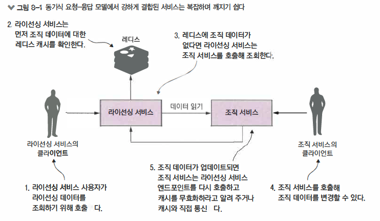
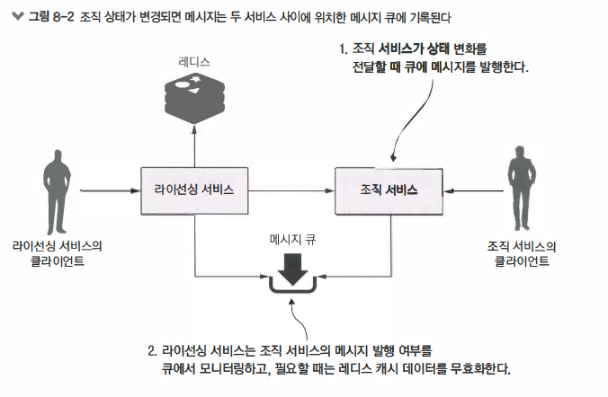
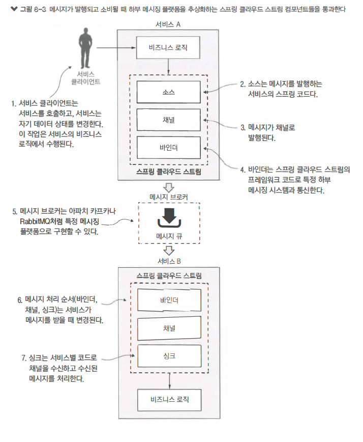
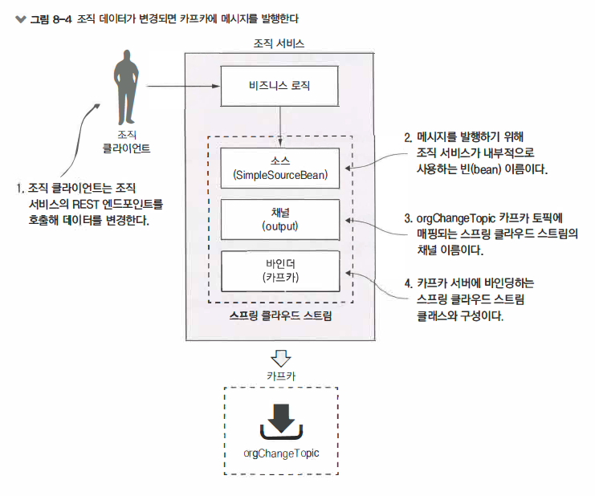
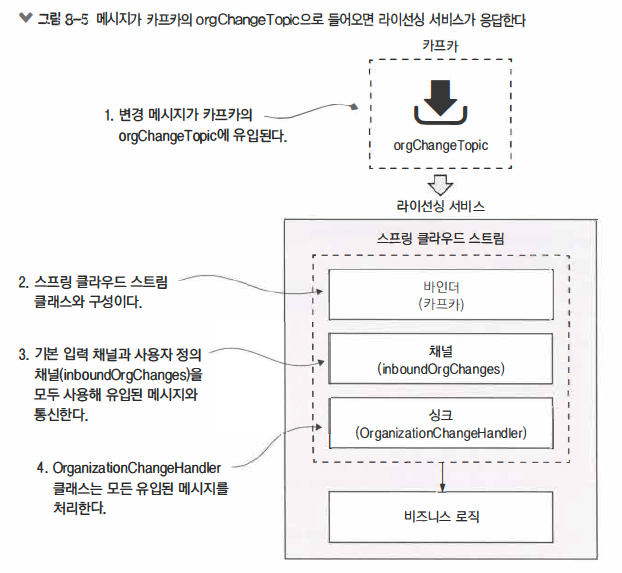
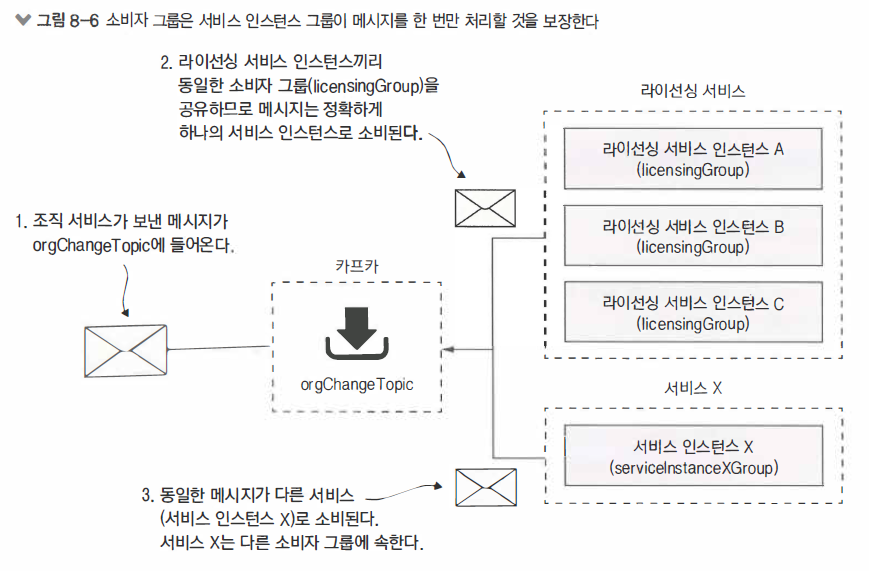

> 스프링 클라우드 스트림을 사용한 이벤트 기반 아키텍처

- 차례
  - 메시지와 EDA, 마이크로 서비스의 사례
  - 스프링 클라우드 스트림 소개
  - 간단한 메시지 생산자와 소비자 작성
  - 스프링 클라우드 스트림 사용 사례 : 분산 캐싱
  - 요약
- 핵심
  - 이벤트 기반 아키텍처 프로세싱 및 이와 연관된 마이크로서비스 이해
  - 스프링 클라우드 스트림을 사용한 마이크로서비스의 이벤트 처리 단순화 
  - 스프링 클라우드의 구성
  - 스프링 클라우드 스트림과 카프카를 사용한 메시지 발행
  - 스프링 클라우드 스트림과 카프카를 사용한 메시지 소비
  - 스프링 클라우드 스트림과 카프카, 레디스로 분산 캐싱 구현

> 이벤트기반 아키텍처 (EDA, Event Driven Architecture)
>
> 메시지 기반 아키텍처(MDA, Message Driven Architecture)


## 메시지와 EDA 

> 캐싱솔루션

- 캐싱된 데이터는 라이선싱 서비스의 모든 인스턴스에 일관성이 있어야 한다
  - 이것은 어떤 인스턴스에 접근하더라도 동일한 조직 데이터 읽기가 보장되아야 하므로 
  - 데이터를 라이선싱 서비스안에 로컬캐싱해서는 안된다는 것을 의미
- 라이선싱 서비스를 호스팅하는 컨테이너 메모리에 조직 데이터를 캐싱해서는 안됨
  - 서비스를 호스팅하는 런타임 컨테이너는종종 크기 제약이 있으며 다양한 엑세스 패턴으로 데이터를 엑세스
  - 로컬캐시는 클러스터 내 다른 모든 서비스와 동기화를 보장해야 함으로 복잡성 증가
- 업데이트나 삭제 연산으로 조직 레코드가 변경될 때 라이선싱 서비스는 조직 서비스의 상태 변화를 인식해야 한다
  - 이것으로 라이선싱 서비스는 캐싱된 특정 조직 데이터를 무효화하고 삭제할 수 있음

> 방법1
>
> - 동기식 요청-응답 모델을 사용해 요구사항 구현
>
> 방법2
>
> - 조직서비스가 자신이 변경되었음을 알리는 비동기 이벤트(메시지)를 발송하는 것
> - 조작서비스는 메시지를 발행하고 조직 레코드가 업데이트되거나 삭제되었다는 메시지를 큐에 발행(publish)
> - 라이선싱서비스는 중개자에게서 수신하며 조직 이벤트가 발생했는지 확인하고 조직 데이터를 캐시에서 삭제


### 동기식

- 서비스간 강한 결합
- 쉽게 깨지는 서비스 관계
- 조직 서비스 변경에 관심 있는 새 소비자르 추가할 때 경직성




### 비동기식

- 느슨한 결합
  - HTTP는 라이선싱 및 조직 서비스 사이에 강한 의존성을 만듬
  - 메시징 방식에서는 상태 변화를 전달하는 과정에서 두 서비스가 서로 알지 못함으로 결합되지 않음
  - 조직 서비스는 상태 변화를 발행해야 할 때 큐에 메시지를 기록하며 
  - 라이선싱 서비스는 메시지르 수신 여부만 알고 누가 메시지를 발행했는지 알 수 없음
- 내구성
  - 큐가 존재하므로 서비스 소비자가 다운될 때도 메시지 전달을 보장할 수 있으며 
  - 조직 서비스는 라이선싱 서비스가 가용하지 않더라도 메시지를 계속 발행 가능
- 확장성
  - 메시지가 큐에 저장되므로 메시지 발신자는 메시지 소비자의 응답을 기다릴 필요가 없음
  - 큐에서 메시지를 읽어 오는 소비자가 메시지르 빠르게 처리하지 못한다면 
    메시지 소비자를 더 많이 가동시켜 큐의 메시지를 신속히 처리하는 것은 큰일이 아님
- 유연성
  - 메시지 발신자는 누가 메시지를 소비할지 모름
  - 원래 발신 서비스에 영향을 주지 않고 새로운 메시지 소비자( 및 새로운 기능) 를 쉽게 추가할 수 있음
  - 이것은 기존 서비스를 건드리지 않고 새로운 기능을 애플리케이션에 추가할 수 있기 때문에 매우 강력한 개념
  - 새로운 기능의 코드는 발행되는 이벤트를 수신해서 적절히 대응



#### 단점

- 메시지 처리의 의미론 ( message handling semantics )
  - MSA 기반 애플리케이션에서 메시지를 사용하려면 메시지를 발행하고 소비하는 방법을 아는 것 이상이 필요
  - 애플리케이션 메시지의 소비 순서를 기반으로 어떻게 동작할지와 메시지가 순서대로 처리되지 않을 때 어떤일이 발생할지 이해
    - 메시지가 실패하면 에러 처리를 재시도할 것인가 ?
    - 실패하게 놔둘 것인가 ?
    - 특정 고객 메시지 중 하나가 실패할 경우 고객과 관련된 향후 메시지를 어떻게 처리할 것인가 ?
- 메시지 가시성 (message visibility )
  - MSA에서 메시지 사용은 종종 동기식 서비스 호출과 서비스 내 비동기 처리가 합쳐진 것을 의미
  - 메시지의 비동기적 특성으로 메시지가 발행되거나 소비될 때 메시지의 수신과 처리가 아주 근접한 곳에서 이루어 질 필요 없음
  - 웹 서비스의 호출과 메시징을 경유하는 사용자 트랜잭션을 추적하기 위해 
    상관관계 ID를 사용하는 것도 애플리케이션에서 발생하는 일을 이해하고 디버깅하는데 중요
- 메시지 코레오그래피 ( message choreography )
  - 애플리케이션 비즈니스 로직을 추론하는 것은 어려워짐
  - 메시징 기반 애플리케이션의 디버깅은 사용자 트랜잭션이 순서가 바뀌고 다른 시점에 실행될 수 있다는 
    다양한 서비스 로그를 꼼꼼히 살펴보는 일


## 스프링클라우드 스트림

- 컴포넌트 
  - 소스
  - 채널
  - 바인더
  - 싱크



### 소스(SOURCE)

서비스가 메시지를 발행할 준비가 되면 소스를 사용해 메시지를 발행

소스는 발행될 메시지를 표현하는 POJO를 전달받는 스프링 애너테이션 인터페이스

소스는 메시지를 받아 직렬화하고 메시지를 채널로 발행


### 채널(CHANNEL)

채널은 메시지 생산자와 소비자가 메시지를 발행하거나 소비한 후 메시지를 보관할 큐를 추상화

채널 이름은항상 대상 큐의 이름과 관련이 있지만 코드에서 큐 이름을 직접 사용하지 않고 채널 이름을 사용

따라서 채널이 읽거나 쓰는 큐를 전환하려면 애플리케이션 코드가 아닌 구성 정보를 변경


### 바인더 (BINDER)

바인더는 스프링 클라우스 스트림 프레임워크의 일부인 스프링 코드로 특정 메시지 플랫폼과 통신

스프링 클라우스 스트림 바인더를 사용하면 메시지를 발행하고 

소비하기 위해 플랫폼마다 별도의 라이브러리와 API를 제공하지 않고도 메시징을 사용


### 싱크(SINK)

스프링 클라우드 스트림에서 서비스는 싱크를 사용해 큐에서 메시지 받음

싱크는 들어오는 메시지르 위해 채널을 수신대기하고 메시지를 다시 POJO로 역직렬화

이 과정에서 스프링 서비스의 비즈니스로직이 메시지를 처리


## 간단한 메시지 생산자와 소비자 작성



### 메시지 생산자 작성

> pom.xml

```xml
<dependency>
  <groupid>org.springframework.cloud</groupid>
  <artifactid>spring-cloud-stream</artifactid>
</dependency>
<dependency>
  <groupld>org.springframework.cloud</groupld>
  <artifactld>spring-cloud-starter-stream-kafka</artifactld〉
</dependency>
```


> Application.java

```java
@SpringBootApplication
@EnableEurekaClient
@EnableCircuitBreaker
// 스프링 클라우드 스트림에 애플리케이션을 메시지 브로커로 바인딩
@EnableBinding(Source.class)
public class Application {
  
    @Bean
    public Filter userContextFilter() {
        UserContextFilter userContextFilter = new UserContextFilter();
        return userContextFilter;
    }

    public static void main(String[] args) {
        SpringApplication.run(Application.class, args);
    }
}
```


> SimpleSourceBean.java

- Source.class 를 사용하면 해당 서비스가 Source 클래스에 정의된 채널들을 이용해서 메시지 브로커와 통신
- 채널은 메시지 큐 위에 있다는 것을 상기
- 스프링 클라우드 스트림은 메시지 브로커와 통신할 수 있는 기본 채널이 있음
- 

```java
@Component
public class SimpleSourceBean {
  private Source source;

  private static final Logger logger = LoggerFactory.getLogger(SimpleSourceBean.class);

  // 스프링 클라우드 스트림은 서비스가 사용할 소스 인터페이스 구현을 주입
  @Autowired
  public SimpleSourceBean(Source source){
    this.source = source;
  }

  public void publishOrgChange(String action,String orgId){
    logger.debug("Sending Kafka message {} for Organization Id: {}", action, orgId);
    OrganizationChangeModel change =  new OrganizationChangeModel(
      OrganizationChangeModel.class.getTypeName(),
      action,
      orgId,
      UserContext.getCorrelationId()); // 발행될 메시지는 자바 POJO

    // 메시지를 보낼 준비가 되면 Source 클래스에서 정의된 채널에서 send() 메서드를 사용
    source.output().send(MessageBuilder.withPayload(change).build());
  }
}
```

- 액션(action)
  - 이벤트를 발생시킨 액션
  - 메시지에 액션을 포함시키면 메시지 소비자가 이벤트를 처리하는데 더 많은 컨텍스트를 제공
- 조직ID(organization ID) 
  - 이벤트와 연관된 조직 iD
- 상관관계 ID(correlation ID)
  - 이벤트를 발생시킨 서비스 호출에 대한 상관관계 ID
  - 상관관계 ID는 서비스들을 경유하는 메시지 흐름을 추적하고 디버킹하는데 도움이 많이 되므로 항상 이벤트에 포함


> application.yaml

```yaml
spring:
  cloud:
  
  	# stream.bindings는 서비스가 스프링 클라우드 스트림의 메시지 브로커에 발행하려는 구성의 시작
    stream:
      bindings:
      	# output 채널이름이며 Source.output() 채널에 매핑
        output:
        		# orgChangeTopic은 메시지를 넣을 메시지큐(또는 토픽) 이름
            destination:  orgChangeTopic
            # content-type은 스프링 클라우드 스트림에 송수신할 메시지 타입의 정보를제공 (JSON)
            content-type: application/json
        # stream.binding.kafka는 해당 서비스가 메시지 버스로 카프카를 사용할 것이라고 스프링에 전달 (RabbitMQ가능)
        kafka:
          binder:
          	# zkNodes와 brokers 프로퍼티는 스프링 클라우드 스트림에 카프카오 주키퍼의 네트워크 위치 전달
            zkNodes: localhost
            brokers: localhost
```


> OrganizationService.java

```java
@Service
public class OrganizationService {
  
  @Autowired
  private OrganizationRepository orgRepository;


  @Autowired
  SimpleSourceBean simpleSourceBean;

  public Organization getOrg(String organizationId) {
    return orgRepository.findById(organizationId).get();
  }

  public void saveOrg(Organization org){
    org.setId( UUID.randomUUID().toString());

    orgRepository.save(org);
    // 조직데이터를 변경하는 메서드 모두 simpleSourceBean.publishOrgChange() 호출
    simpleSourceBean.publishOrgChange("SAVE", org.getId());
  }

  public void updateOrg(Organization org){
    orgRepository.save(org);
    simpleSourceBean.publishOrgChange("UPDATE", org.getId());

  }

  public void deleteOrg(String orgId){
    orgRepository.deleteById( orgId );
    simpleSourceBean.publishOrgChange("DELETE", orgId);
  }
}
```


### 메시지 소비자 작성



> pom.xml

```xml
<dependency>
    <groupId>org.springframework.cloud</groupId>
    <artifactId>spring-cloud-stream</artifactId>
</dependency>

<dependency>
    <groupId>org.springframework.cloud</groupId>
    <artifactId>spring-cloud-starter-stream-kafka</artifactId>
</dependency>
```


> Application.java

- @EnableBinding
  - 스프링 Sink 인터페이스를 사용해서 메시지 브로커를 바인딩하라고 지정
- @StreamListener
  - input 채널에 메시지가 수신될 때마다 loggerSink() 메서드를 실행하도록 스프링 클라우드 스트림을 설정
  - 스프링 클라우드 스트림은 채널에서 받은 메시지를 OrganizationChangerModel 이라는 자바 POJO로 자동 역직렬화

```java
// 들어오는 메시지를 수신할 수 있게 Sink 인터페이스에 정의된 채널을 사용하도록 서비스에 지시
@EnableBinding(Sink.class)
public class Application {

    // ...
    
    // 스프링 클라우드 스트림은 메시지가 입력 채널에서 수신될 때마다 이 메서드를 실행
    @StreamListener(Sink.INPUT)
    public void loggerSink(OrganizationChangeModel orgChange) {
        logger.debug("Received an event for organization id {}", orgChange.getOrganizationId());
    }

}
```


> application.yaml

- input 채널은 Sink.INPUT 채널에 매핑

- group 프로퍼티는 메시지를 소비할 소비자 그룹의 이름 정의

```yaml
spring:
  cloud:
    stream:
      bindings:
        # inboundOrgChanges:
        # spring.cloud.stream.bindings.input 프로퍼티는 input 채널을 orgChangeTopic 큐에 매핑
        input: 
          destination: orgChangeTopic
          content-type: application/json
          # group 프로퍼티는 한번만 처리하는 의미를 보장하는데 사용
          group: licensingGroup
      kafka:
        binder:
          zkNodes: localhost
          brokers: localhost
```



- 조직서비스가 보낸 메시지가 orgChangeTopic에 들어옴
- 라이선싱서비스 인스턴스끼리 동일한 소비자 그룹(licensingGroup)을 공유하므로 메시지는 정확하게 하나의 서비스 인스턴스로 소비
- 동일한 메시지가 다른 서비스 (서비스 인스턴스 X)로 소비 , 서비스 X는 다른 소비자 그룹에 속함


>  실제 메시지 서비스

이제 레코드를 추가하거나 수정 / 삭제 할 때마다 

메시지를 orgChangeTopic 에 발생하는 조직 서비스와 그 토픽의 메시지를 받는 라이선싱 서비스 준비

TODO -> 캡처본


## 분산캐싱

라이선싱 서비스는 특정 라이선스와 연관된 조직 데이터에 대한 분산 레디스 캐시를 항상 확인

조직 데이터가 캐시에 있다면 캐시 데이터를 반환

캐시에 없다면 조직 서비스를 호출하고 호출 결과를 레디스 해시에 캐싱

조직 서비스의 데이터가 업데이트되면 조직 서비스는 카프카에 메시지 전송

라이선싱 서비스가 캐시를 지우려면 메시지를 가져와 캐시 삭제를 위해 레디스에 삭제 호출을 함


> 클라우드 캐싱과 메시싱

레디스를 분산 캐시로 사용하는 것은 클라우드에서 마이크로 서비스를 개발하는 것과 관려니 많음

- 일반적으로 보유한 데이터 조회성능을 향상
  - 캐시를 사용해 일부 주요 서비스의 성능을 크게 향상
- 데이터를 가진 Dynamo 테이블 부하 및 비용 감소
  - Dynamo 데이터 엑세스는 비용 문제가 됨
  - 읽기를 할 때마다 비용
  - 레디스 서버를 사용해서 기본 키로 읽은 후 Dynamo를 읽는 것이 훨씬 저렴
- 회복성을 높여 주는 데이터 저장소에 성능 문제가 있을 때 적절히 성능을 저하
  - AWS Dynamo 성능 문제를 겪고 있다면 레디스 같은 캐시를 사용해 서비스 성능을 정상적으로 저하
  - 캐싱 솔루션은 캐시에 보관하는 데이터 용량에 따라 데이터 저장소를 히트할때 발생하는 에러수 감소


### 레디스 조회 캐싱

1. 스프링 데이터 레디스 의존성을 포함해서 라이선싱 서비스 구성
2. 레디스에 대한 데이터베이스 커넥션을 설정
3. 레디스 해시와 통신하는 스프링 데이터 레디스의 레포지토리 클래스를 정의
4. 레디스와 라이선싱 서비스를 사용해서 조직 데이터를 저장하고 읽음


#### 의존성 구성

> pom.xml

```xml 
<dependency>
    <groupId>org.springframework.data</groupId>
    <artifactId>spring-data-redis</artifactId>
    <version>2.0.9.RELEASE</version>
</dependency>

<dependency>
    <groupId>redis.clients</groupId>
    <artifactId>jedis</artifactId>
    <version>2.9.0</version>
</dependency>

<dependency>
    <groupId>org.apache.commons</groupId>
    <artifactId>commons-pool2</artifactId>
    <version>2.6.0</version>
</dependency>
```


#### 데이터베이스 커넥션 설정

> Application.java

- 스프링은 레디스 서버와 통신하는데 오픈소스 프로젝트인 제디스(Jedis)를 사용

```java
@SpringBootApplication
@EnableEurekaClient
@EnableCircuitBreaker
@EnableBinding(Sink.class)
public class Application {

    @Autowired
    private ServiceConfig serviceConfig;
    
    // ..

    // jedisConnectionFactory() 메서드는 레디스 서버에 실제 데이터베이스 커넥션을 설정
    @Bean
    public JedisConnectionFactory jedisConnectionFactory() {
        JedisConnectionFactory jedisConnFactory = new JedisConnectionFactory();
        jedisConnFactory.setHostName( serviceConfig.getRedisServer());
        jedisConnFactory.setPort( serviceConfig.getRedisPort() );
        return jedisConnFactory;
    }

    // redisTemplate() 메서드는 레디스 서버에 작업을 수행하는데 사용할 RedisTemplate 객체를 생성
    @Bean
    public RedisTemplate<String, Object> redisTemplate() {
        RedisTemplate<String, Object> template = new RedisTemplate<String, Object>();
        template.setConnectionFactory(jedisConnectionFactory());
        return template;
    }
}
```


#### 레디스 레포지토리 정의

> OrganizationRedisRepository.java

- 레디스는 키-값을 저장하는 데이터 저장소 & 대규모 분산된 메모리 상주형 해시맵처럼 동작
- 정교한 질의 언어가 없으며 이 단순함이 강력함

```java
public interface OrganizationRedisRepository {
    void saveOrganization(Organization org);
    void updateOrganization(Organization org);
    void deleteOrganization(String organizationId);
    Organization findOrganization(String organizationId);
}
```


> OrganizationRedisRepositoryImpl.java

- 레디스의 모든 데이터를 키를 사용해 저장하고 조회
  - 조직 서비스에서 조회한 데이터를 레디스에 저장하므로 조직 ID는 자연스럽게 조직 레코드를 저장하는 키로 사용
- 레디스 서버가 여러 해시와 데이터 구조를 가질 수 있다는 것
  - 레디스 서버에 대한 모든 연산에서 작업을 수행할 데이터 구조 이름을 레디스에 알려주어야함
  - 다음 예제에서는 HASH_NAME 상수의 organization

```java
// 스프링 데이터에서 사용되는 Repository 클래스라고 스프링에 지정
@Repository
public class OrganizationRedisRepositoryImpl implements OrganizationRedisRepository {
    
    // 조직 데이터가 저장되는 레디스 서버의 해시 이름
    private static final String HASH_NAME ="organization";
    private RedisTemplate<String, Organization> redisTemplate;
    
    // 레디스 서버엣 데이터 작업을 수행하는 스프링 헬퍼 메서드의 집합 
    private HashOperations hashOperations;

    public OrganizationRedisRepositoryImpl(){
        super();
    }

    @Autowired
    private OrganizationRedisRepositoryImpl(RedisTemplate redisTemplate) {
        this.redisTemplate = redisTemplate;
    }

    @PostConstruct
    private void init() {
        hashOperations = redisTemplate.opsForHash();
    }

	// 레디스와 모든 통신은 키를 사용해 저장되는 Organization 객체 단위로 이루어짐
    @Override
    public void saveOrganization(Organization org) {
        hashOperations.put(HASH_NAME, org.getId(), org);
    }

    @Override
    public void updateOrganization(Organization org) {
        hashOperations.put(HASH_NAME, org.getId(), org);
    }

    @Override
    public void deleteOrganization(String organizationId) {
        hashOperations.delete(HASH_NAME, organizationId);
    }

    @Override
    public Organization findOrganization(String organizationId) {
       return (Organization) hashOperations.get(HASH_NAME, organizationId);
    }
}

```


#### 레디스 저장하고 읽기

> OrganizationRestTemplateClient.java

- getOrganization()
  - 조직 서비스에 대한 호출이 이루어 지는 곳
  - 실제 REST 호출을 하기 전에 checkRedisCache() 메서드를 사용해 호출과 연관된 Organization 객체 조회를 레디스에 시도
  - 질의한 객체가 레디스에 없다면 이 코드는 null 반환
- checkRedisCache() 
  - null 값이 반환되면 조직 서비스의 REST 엔드포인트를 호출해서 원하는 조직 레코드 조회
  - 조직 서비스가 조직 데이터를 반환하면 cacheOrganizationObject() 메서드로 캐싱

```java
@Component
public class OrganizationRestTemplateClient {
    @Autowired
    RestTemplate restTemplate;

    @Autowired
    OrganizationRedisRepository orgRedisRepo;

    private static final Logger logger = LoggerFactory.getLogger(OrganizationRestTemplateClient.class);

    // 조직 ID로 레디스에 저장된 Organization 클래스 조회를 시도
    private Organization checkRedisCache(String organizationId) {
        try {
            return orgRedisRepo.findOrganization(organizationId);
        }
        catch (Exception ex){
            logger.error(
                "Error encountered while trying to retrieve organization {} check Redis Cache.  Exception {}", 
                organizationId, 
                ex);
            return null;
        }
    }

    private void cacheOrganizationObject(Organization org) {
        try {
            orgRedisRepo.saveOrganization(org);
        }catch (Exception ex){
            logger.error(
                "Unable to cache organization {} in Redis. Exception {}", 
                org.getId(), 
                ex);
        }
    }

    public Organization getOrganization(String organizationId){
        logger.debug(
            "In Licensing Service.getOrganization: {}", 
            UserContext.getCorrelationId());

        Organization org = checkRedisCache(organizationId);

        // 레디스에 데이터가 없다면, 원본 데이터에서 데이터를 조회하기 위해 조직 서비스를 호출
        if (org!=null){
            logger.debug(
                "I have successfully retrieved an organization {} from the redis cache: {}", 
                organizationId, 
                org);
            return org;
        }

        logger.debug("Unable to locate organization from the redis cache: {}.", organizationId);

        ResponseEntity<Organization> restExchange =
                restTemplate.exchange(
                        "http://zuulservice/api/organization/v1/organizations/{organizationId}",
                        HttpMethod.GET,
                        null, Organization.class, organizationId);

        // 캐시 레코드 저장 
        org = restExchange.getBody();
        
        // 조회한 객체를 캐시에 저장 
        if (org!=null) {
            cacheOrganizationObject(org);
        }
        return org;
    }

}
```

> 캐시와 통신할 때 예외처리에 세심한 주의를 기울여야 합니다.
>
> 회복력을 높이기 위해 레디스와 통신할 수 없더라도 전체 호출이 실패하게 두지 않고 예외를 로깅하고 호출을 조직 서비스로 보냅니다.
>
> 이 예제와 같은 사례에서도 캐싱은 성능 향상을 돕기 위한 것이므로 캐싱 서버가 없어도 호출의 성공 여부가 영향을 받아서는 안됩니다.


### 사용자 정의 채널

라이선싱 및 조직 서비스간 메시징을 구축하여 

스프링 클라우드 스트림 프로젝트의 Source와 Sink 인터페이스와 함께 제공되는 

output 및 input 채널으 사용했다

하지만 애플리케이션에 둘 이상의 채널을 정의하거나 고유한 채널 이름을 사용하려고 한다면 

사용자 고유 인터페이스를 정의하고 애플리케이션에 필요한 만큰 input 과 output 채널을 노출하면 됩니다.


> CustomChannel

```java
public interface CustomChannels {
    // 채널 이름을 정의하는 메서드 레벨 애너테이션
    @Input("inboundOrgChanges")
    // 노출된 채널은 모두 SubscribableChannel 클래스를 반환
    SubscribableChannel orgs();
}
```

```java
@OutputChannal("outboundOrg")
MessageChannal outboundOrg();
```


> application.yaml

```yaml 
spring:
  cloud:
    stream:
      bindings:
      	// 채널 이름을 input -> inboundOrgChanges 로 변경
        inboundOrgChanges:
          destination: orgChangeTopic
          content-type: application/json
          group: licensingGroup
```


> OrganizationChangeHandler

```java
// Application 클래스에서 OrganizationChangeHandler 클래스로 이동
// 이때는 Sink.class 대신 CustomChannels 클래스를 사용하고 매개변수로 전달
@EnableBinding(CustomChannels.class)
public class OrganizationChangeHandler {

    @Autowired
    private OrganizationRedisRepository organizationRedisRepository;

    private static final Logger logger = LoggerFactory.getLogger(OrganizationChangeHandler.class);

    // Sink.INPUT 대신 @StreamListener 애너테이션을 사용해서 채널이름인 inboundOrgChanges 전달
    @StreamListener("inboundOrgChanges")
    public void loggerSink(OrganizationChangeModel orgChange) {
    	// ..
    }
}
```


### 메세지 받으며 캐시 삭제

> OrganizationChangeHandler.java

```java
@Autowired
private OrganizationRedisRepository organizationRedisRepository;

@StreamListener("inboundOrgChanges")
public void loggerSink(OrganizationChangeModel orgChange) {
    // 메시지 수령시에 데이터에 수행된 액션을 조사하고 적절하게 대응하는 로직 작성
    logger.debug("Received a message of type " + orgChange.getType());
    switch(orgChange.getAction()){
        case "GET":
            logger.debug(
                "Received a GET event from the organization service for organization id {}", 
                orgChange.getOrganizationId());
            break;
        case "SAVE":
            logger.debug(
                "Received a SAVE event from the organization service for organization id {}", 
                orgChange.getOrganizationId());
            break;
        case "UPDATE":
            logger.debug(
                "Received a UPDATE event from the organization service for organization id {}",
                orgChange.getOrganizationId());
            organizationRedisRepository.deleteOrganization(orgChange.getOrganizationId()); // 레디스에서 데이터 삭제
            break;
        case "DELETE":
            logger.debug(
                "Received a DELETE event from the organization service for organization id {}", 
                orgChange.getOrganizationId());
            organizationRedisRepository.deleteOrganization(orgChange.getOrganizationId()); // 레디스에서 데이터 삭제
            break;
        default:
            logger.error(
                "Received an UNKNOWN event from the organization service of type {}", 
                orgChange.getType());
            break;

    }
}
```


## 요약

- 메시징을 사용한 비동기식 통신은 MSA에서 중요한 부분
- APP 에서 메시징을 사용하면 서비스를 확장하고 결함에 더 잘 견디게 만들 수 있음
- 스프링 클라우드 스트림은 간단한 애너테이션을 사용하고 하부 메시지 플랫폼별 세부 정보를 추상화하여 메시지 발행과 소비를 단순화
- 스프링 클라우드 스트림의 메시지 소스는 애너테이션된 자바 메서드로 메시지 브로커 큐에 메시지를 발행
- 스프링 클라우드 스트림의 메시지 싱크는 애너테이션된 자바 메서드로 메시지 브로커에서 메시지를 수신
- 레디스는 데이터베이스와 캐시로 사용될 수 있는 키-값 저장소