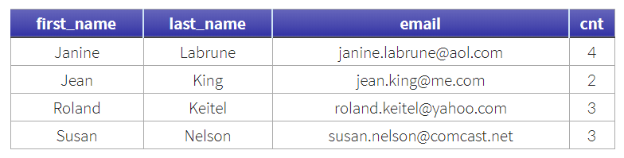

\#MySQL #exist

> 참조페이지
>
> http://jason-heo.github.io/mysql/2014/05/28/mysql-in-vs-exists-vs-inner-join.html (IN, EXISTS, INNER JOIN 성능비교) 
> https://yahwang.github.io/posts/79 (SQL로 중복데이터 확인 및 삭제)


## Exists vs In

- IN 연산자
  - 특정 Table(View) 데이터의 Row값에 따른 다른 Table 데이터를 추출해내고자 할 때 사용합니다.
  - 그래서 IN 연산자를 Row가 있는지 체크하는 용도로 사용하기도 합니다.
- EXISTS 연산자
  - Row가 있는지 체크하는 용도로는 EXISTS 연산자가 더 적합합니다. 
  - EXISTS 연산자는 Row가 존재하는지 확인 후 더 이상 수행되지 않습니다. 그러나 IN 연산자는 실제 존재하는 모든 값을 확인 합니다.

```sql
SELECT item
FROM TABLE_A as a
WHERE NOT EXISTS (
	SELECT item
    FROM TABLE_B as b
    WHERE a.item = b.item
)
```


## Exists vs In vs Inner Join

- Exists & In & Inner Join은 상호 변환이 가능하며 성능의 차이가 있습니다.
  - 예제 :: n번에 속한 고객의 주문 건수를 구하여라
  - 성능 :: Inner Join > In > Exists
    - 하나 경우에 따라 Exists 연산자가 더 빠른 경우도 있습니다.

> INNER JOIN

```sql
SELECT COUNT(*)
FROM orders INNER JOIN customer
  ON orders.o_custkey = customer.c_custkey
WHERE customer.c_nationkey = 10;
```

> IN()

```sql
SELECT COUNT(*)
FROM orders
WHERE o_custkey IN (
  SELECT c_custkey FROM
  customer WHERE c_nationkey = 10
);
```

> EXISTS

```sql
SELECT COUNT(*)
FROM orders
WHERE EXISTS (
  SELECT 1 FROM customer
  WHERE c_nationkey = 10 
  AND c_custkey = orders.o_custkey
);
```

- EXISTS & INNER JOIN 
  - 

- NOT IN & NOT EXISTS & LEFT OUTER JOIN
  - 예제 :: 고객 ID가 존재하지 않는 케이스를 구하여라
  - 성능 :: Left Join > In > Exists

> LEFT JOIN

```sql
SELECT COUNT(*)
FROM orders t1 LEFT JOIN customer t2
  ON t1.o_custkey = t2.c_custkey
WHERE t2.c_custkey IS NULL;
```

> NOT IN

```sql
SELECT COUNT(*)
FROM orders
WHERE o_custkey NOT IN (
  SELECT c_custkey FROM customer
);
```

> NOT EXISTS

```sql
SELECT COUNT(*)
FROM orders
WHERE NOT EXISTS (
  SELECT 1 FROM customer
  WHERE c_custkey = orders.o_custkey
);
```


## 중복데이터 삭제전략

- 중복데이터를 삭제하기 위해서는 먼저 남길 데이터를 제외한 데이터를 구분할 컬럼의 값을 구해야



### 중복데이터확인

```sql
SELECT first_name, last_name, email, COUNT(*) as cnt
FROM contacts
GROUP BY email, first_name, last_name
HAVING COUNT(email) > 1 AND COUNT(first_name) > 1 AND COUNT(last_name) > 1;
```


### 중복데이터삭제(ROW_NUMBER)

> - `WINDOW FUNCTION`을 지원하는 경우 `ROW_NUMBER `사용가능
> - `PARTITION BY` 로 중복된 칼럼 지정하고 `ROW_NUM > 1`을 설정하여 삭제할 데이터만 가져옴

```sql
-- 확인
SELECT *
FROM (SELECT id, first_name, last_name, email, 
      ROW_NUMBER() OVER(PARTITION BY first_name, last_name, email) as row_num
      FROM contacts) a
WHERE row_num > 1
ORDER BY first_name;

-- 삭제
DELETE FROM contacts
WHERE id IN (SELECT id 
             FROM (SELECT id, ROW_NUMBER() OVER(PARTITION BY first_name, last_name, email) as row_num
                   FROM contacts) a
             WHERE row_num > 1);
```


### 중복데이터삭제(DISTINCT)

```sql
-- 확인
SELECT *
FROM contacts
WHERE (first_name, last_name, email) IN ( SELECT DISTINCT first_name, last_name, email
                                          FROM contacts
                                          GROUP BY email, first_name, last_name
                                          HAVING COUNT(email) > 1 AND COUNT(first_name) > 1 AND COUNT(last_name) > 1)
ORDER BY first_name;

-- 삭제
SELECT a.*
FROM contacts a
JOIN (SELECT DISTINCT first_name, last_name, email
      FROM contacts
      GROUP BY email, first_name, last_name
      HAVING COUNT(email) > 1 AND COUNT(first_name) > 1 AND COUNT(last_name) > 1) b
ON a.first_name = b.first_name AND a.last_name = b.last_name AND a.email = b.email
ORDER BY a.first_name;
```


### 중복데이터삭제(NOT IN)

- MIN 함수를 활용하여 남길 데이터를 제외한 id를 NOT IN으로 처리
- (MySQL은 DELETE 자체 데이터를 바로 사용 못하는 이유)

```sql
DELETE FROM contacts
WHERE id NOT IN ( SELECT *
                  FROM (SELECT MIN(id)
                        FROM contacts
                        WHERE (first_name,last_name,email) IN ( SELECT DISTINCT first_name, last_name, email
                                                                FROM contacts
                                                                GROUP BY email, first_name, last_name
                                                                HAVING COUNT(email) > 1 AND COUNT(first_name) > 1 
                                                                       AND COUNT(last_name) > 1)
                        GROUP BY first_name, last_name, email) tmp);
```

