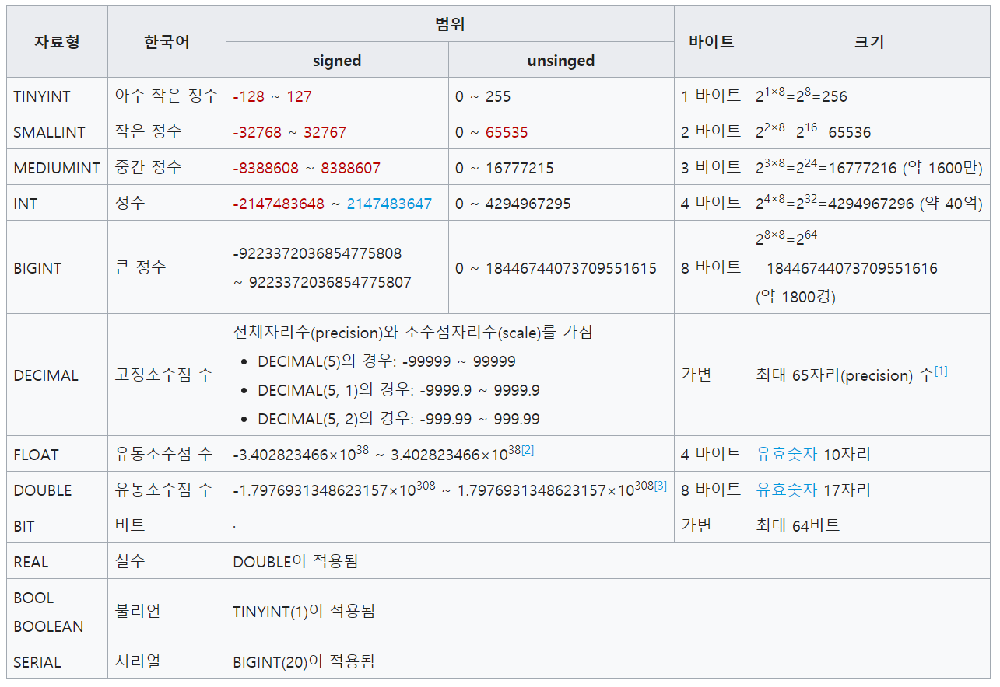

\#mysql #create #table

# MySQL Table

## #자료형

### #숫자형

- TINYINT[(M)] [UNSIGNED] [ZEROFILL] - 아주 작은 정수
  - size : 1바이트 ( -128 ~ 128 )
- SMALLINT[(M)] [UNSIGNED] [ZEROFILL] - 작은 정수
  - size : 2바이트( -32768~32767 )
- MEDIUMINT[(M)] [UNSIGNED] [ZEROFILL] - 중간 정수
  - size : 3 byte ( -8388608~8388607 )
- INT[(M)] [UNSIGNED] [ZEROFILL] - 정수
  - size : 4 byte
- BIGINT[(M)] [UNSIGNED] [ZEROFILL] - 큰 정수
  - size : 8 byte
- DECIMAL - 고정소수점 수
  - size : 가변
- FLOAT[(M,D)] [ZEROFILL] - 유동소수점 수
  - size : 4 byte 
- DOUBLE[(M,D)] [ZEROFILL] - 유동소수점 수
  - size : 8 byte
- BIT - 비트
  - size : 가변 (최대 64bit)
- REAL[(M,D)] [ZEROFILL] - 실수 ( DOUBLE 적용 )
- BOOL & BOOLEAN - 불리언 ( TINYINT (1) 적용 )
- SERIAL - 시리얼 ( BIGINT(20) 적용 )



### #문자형

- CHAR(M) [BINARY] - 고정길이
  - size : 가변 ( 최대 255 byte )
- VARCHAR(M) [BINARY] - 가변길이 ( 지정된 길이보다 짧다면 채우지 않음 )
  - size : 가변 ( 최대 65535 byte )
- TINYTEXT - 문자열
  - size : 가변 ( 최대 255 byte ) 
- TEXT - 문자열
  - size : 가변 ( 최대 65535 byte )
- MEDIUMTEXT
  - size : 가변 ( 최대 16777215 byte )
- LONGTEXT
  - size : 가변 ( 최대 4294967295 byte )

### #날짜형

- DATE - 날짜(년, 월, 일)
  - size : 3 byte
- TIME - 시간(시, 분, 초)
  - size : 3 byte
- DATETIME - 날짜 + 시간
  - size : 8 byte
- TIMESTAMP[(M)] 
  - size : 4 byte
- YEAR - 년도표현
  - size : 1byte

### #이진데이터

- BINARY(n) & BYTE(n) - CHAR 형태 이진데이터
  - size : 가변 ( 최대 255 byte ) 
- VARBINARY(n) - VARCHAR 형태 이진데이터
  - size : 가변 ( 최대 65535 byte ) 
- TINYBLOB(n) - 이진 데이터
  - size : 가변 ( 최대 255 byte ) 
- BLOB(n) - 이진 데이터
  - size : 가변 ( 최대 65535 byte )
- MEDIUMBLOB(n) - 이진 데이터
  - size : 가변 ( 최대 16777215 byte )
- LONGBLOB(n) - 이진 데이터
  - size : 가변 ( 최대 4294967295 byte )

### #기타

- ENUM(‘value1′,’value2’,…)
- SET(‘value1′,’value2’,…)


## #기능

### #UNSIGNED


### #PRIMARY_KEY


### #FOREIGN_KEY

- ON UPDATE CASCADE
  - 변경사항이 있으면 연쇄적으로 변경사항을 적용
- ON DELETE CASCADE
  - 삭제항목이 있으면 연쇄적으로 같이 삭제

```sql
CREATE TABLE Test2
(
    ID INT,
    ParentID INT,
    FOREIGN KEY (ParentID)
    REFERENCES Test1(ID) ON UPDATE CASCADE ON DELETE CASCADE
);
```


### #DEFAULT

- 저장되는 값이 `null`로 전달됬을 경우 설정한 Default 값이 설정됩니다.
- `NOT NULL` 의 속성이 있는 경우 보통 같이 사용합니다.


### #ENGINE

- UTF8 -> utf8mb3, utf8mb4
  - utf8mb4 (utf8과 비슷하지만 확장된 문자를 지원하기 위해 4바이트까지 저장가능)

```sql
ENGINE=InnoDB DEFAULT CHARSET=utf8mb4;
```


### #AUTO_INCREMENT

- UniqueKey를 자동으로 증가하는 Sequence로 처리하는 방식입니다.
- 가장 큰 수에서 +1을 하는 방식으로 UniqueKey를 생성합니다.


### #주의

- DESC 필드로 사용시 \`DESC\` 다음과 같이 처리해야 합니다.
  - DESC는 MySQL 명령어로 사용되는 문자이기때문


## #명령어

- CREATE TABLE table_name ( ... );

  - 테이블 생성

- DESC table_name; (=DESCRIBE)

  - 테이블 정보조회

- INSERT INTO table_name (column1, column2, ...) VALUES
  (c1, c2, ...),

  (c1, c2, ...);

  - 데이터 추가

  


[참조] https://zetawiki.com/wiki/MySQL_%EC%9E%90%EB%A3%8C%ED%98%95