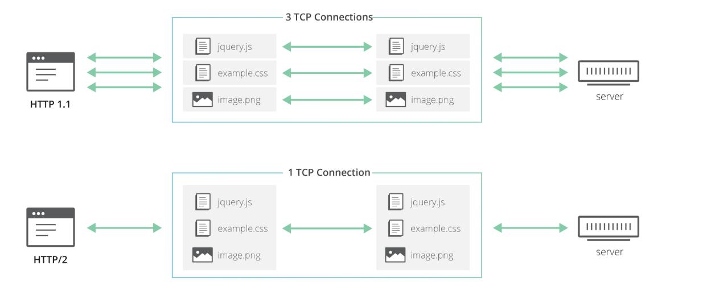
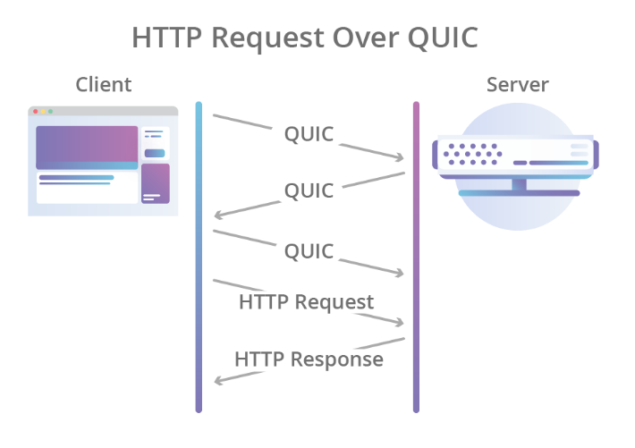
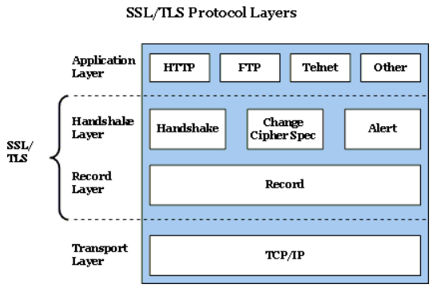
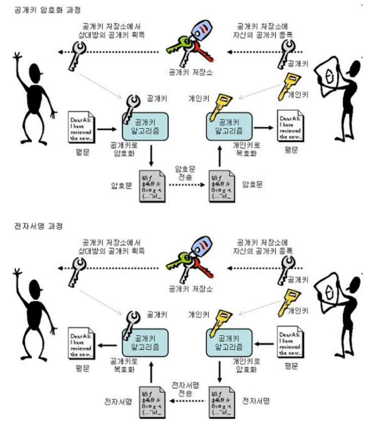

# HTTP

## HTTP

## HTTP/2

> HTTP Stream

HTTP 구현이 동일한 TCP 연결에 복수의 HTTP 응답/요청 교환을 동시 다중 송신할 수 있도록 하는 추상 개념

브라우저가 TCP 연결을 더 효율적으로 재사용할 수 있도록

HTTP/2는 복수의 요청/응답이 동시에 같은 연결 위에서 전송될 수 있도록 하여 단일 TCP 연결의 사용의 비효율성이라는 문제를 해결

> HoLB(Head-of-Line Blocking)

하지만 모든 응답과 요청을 패킷 손실에 대해서 하나의 요청에만 관계된 것이라도 동등하게 같은 영향을 받음 (네트워크 혼잡상황)

이것은 HTTP/2 계층이 서로 다른 HTTP 응답/요청 교환을 벽랙의 스트림으로 분리하였지만. 

TCP는 그러한 추상화에 대해 알지 못하여 특별한 의미 없는 바이트 열로만 보기 때문

TCP의 역할은 전체 데이터를 순서대로 한 곳에서 다른 곳으로 전달하는 것

데이터 일부를 담고 있는 TCP 패킷이 네트워크 경로 상에서 손실되면 데이터 스트림에 누락 구간이 생기고 

TCP는 손실이 탐지 되었을 때 영향받은 패킷만 재전송

그렇게 하는 동안 분실과 관계없는 완전히 독립된 HTTP 요청에 속하는 경우도 

분실된 데이터 이후 성공적으로 받은 데이터는 어플리케이션으로 전달 되지 못함

TCP는 잃어버린 데이터 없이 어플리케이션이 진행 가능한지 알지 못하므로 불필요한 지연이 발생하게 되고 

이는 `HoLB(Head-of-Line Blocking)`이라고 알려진 문제입니다.

> HTTP/2

## HTTP/3

> QUIC

TCP 세션 전송 계층으로 사용하는 대신,  

HTTP/3은 여러가지 특징 중 전송 계층에 스트림을 기본 구조로 도입하는 `새 인터넷 전송 프로토콜인 QUIC`를 사용

QUIC 스트림은 동일 QUIC 연결을 공유하므로 새 스크림을 만들 때 추가적인 핸드쉐이크나 슬로우 스타트가 필요하지 않음

QUIC 스트림은 독립적으로 전달되어 어떤 스트림에 패킷 손실이 있는 경우에도 다른 스트림에 영향이 없음

이는 QUIC 패킷이 UDP 데이터그램위에 캡슐화 되어 있기 때문

UDP를 사용하는 것은 TCP 보다 더 유연하며 QUIC 구현을 완전히 사용자 수준 구현으로 할 수 있게 함

프로토콜 구현의 업데이트는 TCP의 경우 운영체제의 업데이트에 묶여 있지 않음

QUIC에서 HTTP 수준 스트림은 QUIC 스트림에 단순 매핑되어 있어 HoLB() 없이 HTTP/2의 모든 장점을 누림

QUIC는 TCP의 전형적인 3방향 핸드세이크와 TLS 1.3의 핸드세이크를 결합

이런 결합은 암호화와 인증이 기본으로 제공되며 연결을 더 빨리 만들 수 있게 함

달리 말하면 HTTP 첫 요청에 필요한 QUIC 연결을 새로 만들 때에도 데이터 전송 시작까지 걸리는 지연 시간은 TCP 상의 TLS보다 작음

> HTTP/3

## HTTPS

> HTTPS

HTTP의 보안이 강화된 버전이며 HTTPS(HTTP over Secure Socket Layer)는 통신의 인증과 암호화를 위해 개발됐으며, 전자 상거래에 널리 사용

HTTPS는 소켓 통신에서 일반 텍스트를 이용하는 대신, SSL이나 TLS 프로토콜을 통해 세션 데이터를 암호화 따라서 데이터의 적절한 보호를 보장

보호의 수준의 웹브라우저에서의 구현 정확도와 서버 소프트웨어, 지원하는 암호화 알고리즘에 따라 다름

HTTPS의 기본 TCP/IP 포트는 443

> SSL과 TLS

표준화 되며 TLS로 바뀌었지만 통상적으로 SSL이란 단어로 더 많이 사용

SSL/TSL는 두 개의 프로토콜 계층으로 구성되며, Application Layer와 Transport Layer 사이에 존재

- Handshake Layer : 사용할 암호 및 키 교환을 관리
- Record Layer : 실제 데이터를 처리하는 계층

> 공개키와 개인키

암호화 복호화 할 수 있는 서로 다른 키 2개가 존재하며,

**이 두개의 키는 서로 1번 키로 암호화하면 반드시 2번키로만 복화활 할 수 있고, 2번키로 암호화하면 반드시 1번키로만 복호화 가능**

- 그 중 하나 키를 모두에게 공개하는 `공개키(1번 키)`로 만들어서 공개키 저장소에 등록
- 서버는 서버만 알 수 있는 `개인키(2번 키)`를 소유

`공개키(1번 키)`로 암호화된 HTTP 요청, 즉 HTTPS 프로토콜을 사용한 요청이 온다면 서버키는 `개인키(2번 키)`를 이용하여 복호화

서버는 요청이 무엇인지 알게되고 요청에 맞는 응답을 다시 `개인키(2번 키)`를 이용하여 1번키로 암호화하여 클라이언트에게 전송

> 공개키는 누구에게나 노출되어 있는데 어떤 의미가 있을까?

보안상의 의미는 없으나, 전달 주체를 확실히 보장할 수 있음 

**공개키로 해독이 가능하면 반드시 해당 매칭된 개인키로 암호화했다는 것을 보장**

> 공개키 저장소

공개키 저장소라고 부르는 곳은 CA(Certificate Authority)

CA는 민간기업이지만 아무나 운영할 수 없고 신뢰성이 검증된 기업만 CA를 운영할 수 있음

> 공개키를 얻는 방법

- 먼저 애플리케이션 `서버(A)` 를 만드는 기업은 HTTPS를 적용하기 위해 `공개키와 개인키`를 생성

- 그 다음 신뢰 할 수 있는 `CA기업`을 선택하고 그 기업에 내 공개키를 관리해달라고 계약하고 돈을 지불 

- 계약을 완료한 CA기업은 CA기업만의 공개키와 개인키가 존재
  - CA기업은 `CA기업의 이름과 A서버 공개키, 공개키의 암호화 방법` 등의 정보를 담은 인증서를 생성
  - 해당 인증서를 `CA 기업의 개인키로 암호화`해서 A서버에 제공

- A서버는 CA기업의 암호화된 인증서를 갖으며 A서버는 A서버의 공개키로 암호화된 HTTPS 요청이 아닌 요청이 오면 
  `이 암호화된 인증서`를 클라이언트에게 전달

- 이제 클라이언트 입장에선 A서버로 index.html 파일을 달라고 요청시에, HTTPS 요청이 아니기 때문에 
  A서버로 부터 인증서(CA기업이 A서버의 정보를 CA기업의 개인키로 암호화한)를 받음

- 세계적으로 신뢰할 수 있는 CA기업의 공개키는 브라우저가 이미 알고  있음으로
  브라우저가 CA기업 리스트를 탐색하며 인증서에 적혀있는 CA기업 이름이 같으면 해당 CA기업의 공개키를 이미 알고 있는 브라우저는 해독 가능
- 따라서 클라이언트가 `서버(A)`의 공개키를 얻을 수 있음
- 서버(A)의 공개키를 얻으면 서버와 통신할 때 서버(A) 공개키로 암호화하여 Request를 전달

> 브라우저에서 지원하지 않는 CA기업?

HTTPS라도 CA기업을 통한 것이 아닌 자체적인 인증서를 발급할 수도 있고,

신뢰할 수 없는 CA기업을 통해서 인증서를 발급받을 수 있기 때문에 (브라우저에서 지원하지 않는) 무조건 안전하다고 할 수 없음

이럴 경우 브라우저는 HTTPS지만 `안전하지 않은 사이트`라는 알림으로 클라이언트에게 주의를 요함

> CA없이 HTTPS를 사용할 수 있지 않은가?

###### 참조

- http/2, http/3
  - https://blog.cloudflare.com/ko/http3-the-past-present-and-future-ko/
- https
  - https://ko.wikipedia.org/wiki/HTTPS
  - https://jeong-pro.tistory.com/89
  - https://cryptocat.tistory.com/3
  - https://opentutorials.org/course/228/4894
  - https://sites.google.com/site/tlsssloverview/ssl-tls-protocol-layers