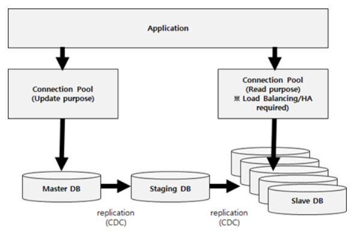

# Query Off Loading

## 대용량 시스템을 위한 데이터베이스 아키텍처

- DB 성능 향상을 위한 기법 - 처리량 증가 시키기 위한 설계 기법
- 질의의 70~90%는 대부분 READ이며 나머지 10~30%가 Create/Delete/Update와 같은 트랜잭션일 때, 두 트랜잭션을 분리하는 기법

> Master/Slave 구조

- `MasterDB`에 쓰기를 허용하고 MasterDB 내용을 중간의 `StagingDB`라는 곳으로 복사
- `StagingDB`는 복제된 내용을 N개의 SlaveDB로 복제
- `MasterDB`는 쓰기만 허용되고, 복제된 `SlaveDB`는 읽기만 허용

> Application의 DBConnection

- Application을 DB에 대한 쓰기 로직과 읽기 로직을 분리해서 구현하여 각각 연결되는 DBConnection이 분리
- 일반적으로 Application Server에서는 이러한 Connection을 Connection Pool을 이용해서 관리
- 읽기 DB의 경우 N개의 SlaveDB로 부터 읽기 때문에 Application이 N개의 Slave DB에 대한 요청을 `LoadBalancing` 함
- 또한 특정 SlaveDB의 장애 발생시에 다른 SlaveDB 인스턴스에 접근할 수 있도록 HA(High Availability) 기능을 제공
- Connection Pool 자체에 Load Banlancing과 HA 기능을 가지고 있는 Connection Pool을 이용하거나 
  JDBC Driver와 같이 DBMS용 Driver 자체에 LoadBalancing과 HA 기능 사용

> StagingDB

- StagingDB는 SlaveDB로 복제하기 위한 중간 경유지 역할
- 다수의 SlaveDB로 복제해야 하기 때문에 이에 대한 부하가 높음
- 만약 MasterDB에서 SlaveDB로 바로 복제된다면, 
  MasterDB가 쓰기 트렌젝션 이외에 복제에 대한 부분을 처리해야 하기 때문에 성능 저하를 유발

>  CDC(Change Data Capture)

- StagingDB에 데이터를 저장하기 위해 사용하는 기술

- DBMS들은 공통적으로 쓰기 작업을 수행 시 실제 데이터 반영전에 먼저 해당 작업에 대한 Request를 Local 환경인 `BackLog`에 저장
  - 이는 실제로 데이터를 쓰기전에 장애가 났을 때, Restart하면서 이 BackLog를 읽어 복구하기 위한 용도
- CDC는 BackLog를 이용해서 데이터를 복제
- `SourceDB`로 부터 `BackLog`를 읽어서 복제하고자 하는 `TargetDB`에 `Replay`하는 형식
- 제품 - GoldenGate(Oracle), Share Flex(Quest), Galera(OpenSource)

> 실시간 동기화 ?

> N(Application) : N(SlaveDB) 관계?

> MongoDB - ReplicaSet

###### 참고

- https://bcho.tistory.com/670