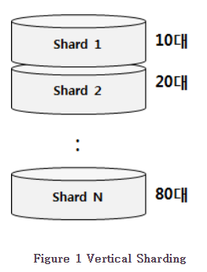
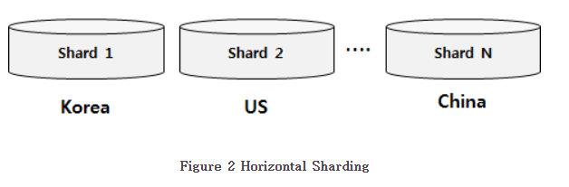

# Sharding

## 대용량 시스템을 위한 데이터베이스 아키텍처

- Sharding 은 데이터 베이스의 용량의 한계를 극복하기 위한 기술로 데이터를 여러 DB에 나누어 담는 방법
- 클러스터링 기술을 사용하더라도 데이터베이스는 물리적인 용량 한계를 갖음

> Vertical(수직적)
>
> - 연속된 데이터에 대해서 범위별로 데이터를 나누는 방법 ( EX. 연령대별 )

> Horizontal(수평적)
>
> - 연속된 키가 아닌 Category와 같은 종류에 따라 데이터를 수평적으로 분리하는 방법

> 데이터 편중(몰림) - meaningful

- 데이터를 분산 저장할 때 위와 같이 meaningful한 데이터를 사용할 수 있는데 이 경우에는 데이터의 `몰림 현상`이 발생할 수 있음
- 몰림 현상이 발생할 경우 하드웨어 스팩을 서버별로 다르게 배치하는 방법으로 해결 할 수 있음

> 데이터 균등분산 - non-meaningful

- 데이터 편중 현상을 예측하기 어려운 경우에는 meaningful 하지 않은 KEY를 사용해서 Sharding을 진행 
- AutoIncrement와 같은 키를 사용할 경우 Hash와 같은 방식을 통해 저장 위치를 선택

> Sharding 방식

- DBMS단에서 Sharding을 지원하는 방법
- OR Mapper와 같이 DB 접근용 프레임워크에서 Sharding을 제공하는 방법
- Application Code 자체에서 지원하는 방법

