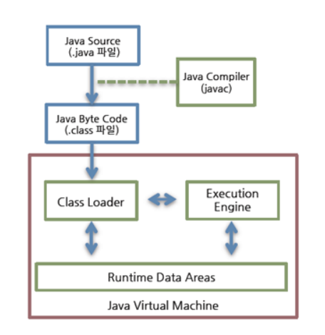
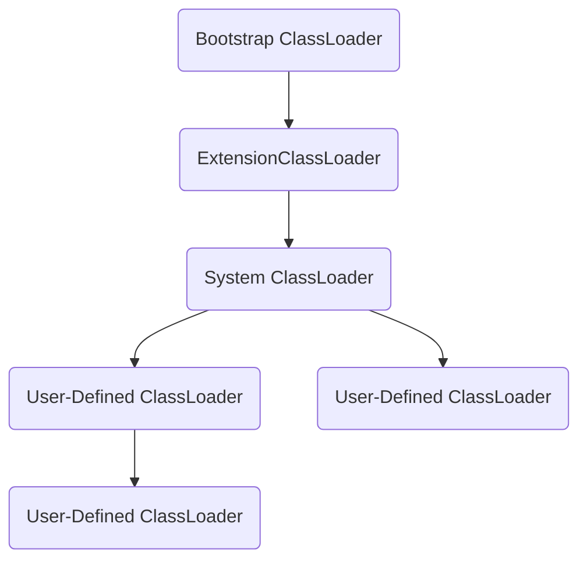
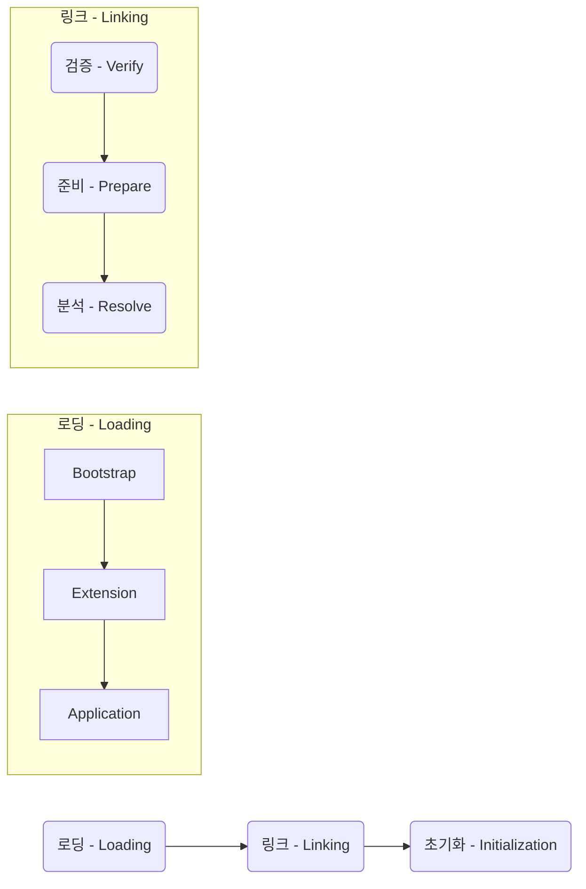
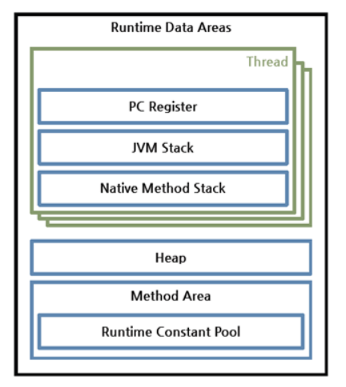
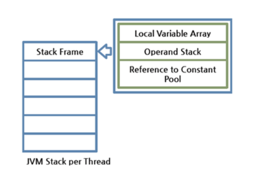
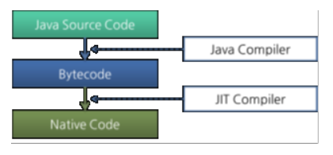
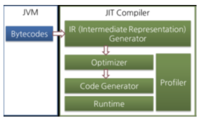
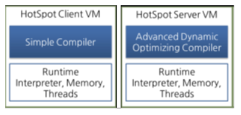

# JVM

## 구조

자바 바이트 코드가 JRE 위에서 동작

JRE에서 가장 중요한 요소는 자바 바이트코드를 해석하고 실행하는 JVM(Java Virtual Machine)입니다.

JRE는 `자바 API와 JVM`으로 구성, JVM 역할은 자바 애플리케이션을 클래스 로더를 통해 읽어 들여 자바 API와 함께 실행하는 것

- JRE

  1. JVM

  2. Java API

## JVM

프로그램을 실행하기 위해 물리적 머신과 유사한 머신을 소프트웨어로 구현한 것

WORA(Write Once Run Anywhere!)를 구현하기 위해 물리 머신과 별개의 가상 머진을 기반으로 동작하도록 설계

자바 바이트코드를 실행하고자 모든 하드웨어에 JVM을 동작시킴으로서 자바 실행 코드를 변경하지 않고 모든 종류의 하드웨어에서 동작

### JVM 특징

- `스택기반의 가상 머신`
  - 대표적인 컴퓨터 아키텍처인 인텔 x86 아키텍처나 ARM 아키텍처와 같은 하드웨어가 레지스터 기반으로 동작하는데 비해 
    JVM은 스택기반으로 동작
- `심볼릭 레퍼런스`
  - 기본 자료형(primitive data type)을 제외한 모든 타입(클래스와 인터페이스)의 명시적인 메모리 주소 기반의 레퍼런스가 아니라 
    심볼릭 레퍼런스를 통해 참조
  - 런타임 시점에 메모리 상에서 실제로 존재하는 물리적인 주소로 대체하는 Linking 작업
- `가비지 컬렉션`
  - 클래스 인스턴스는 사용자 코드에 의해 명시적으로 생성되고 가비지 컬렉션에 의해 자동으로 파괴
- `기본 자료형을 명확하게 정의하여 플랫폼 독립성 보장`
  - 다른 언어와 다르게 JVM은 기본 자료형을 명확하게 정의하여 호환성을 유지하고 플랫폼 독립성을 보장
  - C++은 플랫폼에 따라 int 크기가 다름
- `네트워크 바이트 오더(network byte order)`
  - 자바 클래스 파일은 네트워크 바이트 오더를 사용
  - 인텔 x86 아키텍처가 사용하는 리틀 엔디안이나 RISC 계열 아키텍처가 주로 사용하는 빈 엔디안 사이에서 플랫폼 독립성을 유지하려면 고정된 바이트 오더를 유지해야 하므로 네트워크 전송시에 사용하는 바이트 오더인 네트워크 바이트 오더를 사용
  - 네트워크 바이트 오더는 빅 엔디안

> JVM 명세(The Java Virtual Machine Specification)를 따르기만 하면 어떤 벤더든 JVM을 개발하여 제공할 수 있음
> 따라서 대표적인 오라클 핫스팟 JVM 외에도 IBM JVM을 비롯한 다양한 JVM이 존재

### JVM 구조

`클래스 로더(Class Loader)`가 컴파일된 자바 바이트 코드를 `런타임 데이터 영역(Runtime Data Areas)`에 로드하고 `실행 엔진(Execution Engine)`이 자바 바이트코드를 실행

#### 클래스 로더(Class Loader)

자바는 동적 로드, 즉 컴파일 타임이 아니라 런타임에 클래스르 처음으로 참조할 때 해당 클래스를 로드하고 링크하는 특징

동적 로드를 담당하는 부분이 JVM의 `클래스 로더`

> 네임스페이스(namespace)

각 클래스 로더는 로드된 클래스들을 보관하는 `네임스페이스(namespace)`를 갖음

클래스를 로드할 때 이미 로드된 클래스인지 확인하기 위해서 네임스페이스에 보관된 FQCN(Fully Qualified Class Name)을 기준으로 클래스를 찾음

FQCN이 같더라도 네임스페이스가 다르면 즉 다른 클래스 로더가 로드한 클래스면 다른 클래스로 간주 

- `계층 구조`
  - 클래스 로더끼리 부모-자식 관계를 이루어 계층구조로 생성
  - 최상위 클래스 로더는 부트스크랩 클래스 로더(BootStrap Class Loader)
- `위임 모델`
  - 계층 구조를 바탕으로 클래스 로더끼리 로드를 위임하는 구조로 동작
  - 클래스를 로드할 때 먼저 상위 클래스 로더를 확인하여 상위 클래스 로더에 있다면 해당 클래스를 사용, 없다면 로드를 용청 받은 클래스 로더가 클래스를 로드
- `가시성 제한`
  - 하위 클래스 로더는 상위 클래스 로더의 클래스를 찾을 수 있지만 상위 클래스 로더는 하위 클래스 로더의 클래스를 찾을 수 없음
- `언로드 불가`
  - 클래스 로더는 클래스를 로드할 수는 있지만 언로드 할 수는 없음
  - 언로드 대신, 현재 클래스 로더를 삭제하고 아예 새로운 클래스 로더를 생성하는 방법

> 클래스로드 위임모델

- `부스스트랩 클래스로더` 
  - JVM을 기동할 때 생성
  - Object 클래스들을 비롯 자바 API 로드
  - 다른 클래스 로드와 달리 자바가 아니라 네이티브 코드로 구현
- `익스텐션 클래스로더`
  - 기본 자바 API를 제외한 확장 클래스 로드
  - 다양한 보안 확장 기능 등을 여기에서 로드
- `시스템 클래스로더`
  - 부트스트랩 클래스로더와 익스텐션 클래스로더가 JVM 자체 구성 요소들을 로드하는 것이라면, 시스템 클래스로더는 애플리케이션의 클래스들을 로드
  - 사용자가 지정한 $CLASSPATH 내의 클래스들을 로드
- `사용자 정의 클래스로더`
  - 애플리케이션 사용자가 직접 코드 상에서 생성해서 사용하는 클래스 로더

> 클래스로더 단계

- `로드` 
  - 클래스를 파일에서 가져와서 적절한 바이너리 데이터를 만들고 JVM 메모리(메소드 영역)에 로드
  - 이  때 메소드 영역에 저장되는 데이터 (FQCN, 클래스, 인터페이스, 이넘, 메소드와 변수)
- `검증`
  - 읽어 들인 클래스가 자바 언어 명세 및 JVM 명세에 명시된 대로 잘 구성되어 있는지 검사
  - 클래스 로드의 전 과정 중에서 가장 까다로운 검사를 수행하는 과정으로 가장 복잡하고 시간이 많이 걸림
  - JVM TCK의 테스트 케이스 중에서 가장 많은 부분이 잘못된 클래스를 로드하여 정상적으로 검증 오류를 발생시키는지 테스트하는 부분
- `준비`
  - 클래스가 필요로 하는 메모리를 할당
  - 클래스에서 정의된 필드, 메서드, 인터페이스들을 나타내는 데이터 구조로 준비
- `분석`
  - 클래스의 상수 풀 내 모든 심볼릭 레퍼런스를 실제 레퍼런스로 변경
- `초기화`
  - 클래스 변수들을 적절한 값으로 초기화 
  - 즉, static initializer 들을 수행하고, static 필드들을 설정된 값으로 초기화

#### 런타임데이터영역(메모리영역)

런타임 데이터 영역은 JVM 이라는 프로그램이 운영체제 위에서 실행되면서 할당받는 메모리 영역

> 런타임 데이터 영역

- `스레드당 하나씩 생성`
  - `이중 PC 레지스터(PC Register)`
  - `JVM 스택 영역(JVM Stack Area)`
  - `네이티브 메서드 스택 영역(Native Method Stack Area)`
- `모든 스레드 공유`
  - `힙 영역(Heap Area)`
  - `메서드 영역(Method Area)`
    - `런타임 상수 풀(Runtime Constant Pool)`

> 자세히

- `PC 레지스터`
  - PC(Progeam Counter) 레지스터는 각 스레드마다 하나씩 존재 스레드가 시작될 때 생성
  - PC 레지스터는 현재 수행중인 JVM 명령의 주소를 갖음
- `JVM 스택`
  - JVM 스택은 각 스레드마다 하나씩 존재 스레드가 시작될 때 생성
  - 스택 프레임이라는 구조체를 저장하는 스택으로 JVM은 오직 JVM 스택에 스택 프레임을 추가(push)하고 제거(pop)하는 동작만 수행
  - 예외 발생 시 printStackTrace() 메서드로 보여주는 Stack Trace의 각 라인은 하나의 스택 프레임을 표현
  - 
    - `스택 프레임` 
      - JVM 내에서 메서드가 수행될 때 마다 하나의 스택 프레임이 생성되어 해당 스레드의 JVM 스택에 추가되고 메서드가 종료되면 스택 프레임에서 제거 
      - 각 스택 프레임은 지역 변수 배열, 피연산자 스택, 현재 실행중인 메서드가 속한 클래스의 런타임 상수 풀에 대한 레퍼런스를 갖음
      - 지역 변수 배열, 피연산자 스택의 크기는 컴파일 시에 결정되기 때문에 스택 프레임의 크기도 메서드에 따라 크기가 고정
    - `지역 변수 배열(Local Variable Array)`
      - 0부터 시작하는 인덱스를 가진 배열
      - 0은 메서드가 속한 클래스 인스턴스의 this 레퍼런스이며, 1부터는 메서드에 전달된 파라미터들이 저장
      - 메서드 파라미터 이후에는 메서드의 지역 변수들이 저장
    - `피연산자 스택(Operand Stack)`
      - 메서드의 실제 작업 공간
      - 각 메서드는 피연산자 스택과 지역 변수 배열 사이에서 데이터를 교환하고 다른 메서드 호출 결과를 추가하거나(push) 꺼낸다(pop).

- `네이티브 메서드 스택`
  - 자바외의 언어로 작성된 네이티브 코드를 위한 스택
  - 즉, JNI(Java Native Interface)를 통해 호출하는 C/C++ 등의 코드를 수행하기 위한 스택
  - 언어에 맞게 C스택이나 C++스택이 생성
    - `실행엔진`
    - `JNI(Java Native Interface)`
- `메서드 영역`
  - 메서드 영역은 스레드가 공유하는 영역으로 JVM이 시작될 때 생성
  - JVM이 읽어 들인 각각의 클래스와 인터페이스에 대한 런타임 상수 풀, 필드와 메서드 정보, static 변수, 메서드의 바이트코드 등을 보관
  - 메서드 영역은 JVM 벤더마다 다양한 형태로 구현할 수있으며, 
    오라클 핫스팟 JVM에서는 흔히 Permanet Area 혹은 Permanent Generation이라고 부름
  - 메서드 영역에 대한 가비지 컬렉션은 JVM 벤더의 선택 사항
  - `런타임 상수 풀`
    - 클래스 파일 포맷에서 constant_pool 테이블에 해당하는 영역
    - 메서드 영역에 포함되는 영역이긴 하지만 JVM 동작에서 가장 핵심적인 역할을 수행하는 곳이기 때문에 JVM 명세에서 따로 중요하게 기술
    - 각 클래스와 인터페이스의 상수뿐 아니라, 메서드와 필드에 대한 모든 레퍼런스까지 담고 있는 테이블
    - 즉, 어떤 메서드나 필드를 참조할 때 JVM은 런타임 상수 풀을 통해 해당 메서드나 필드의 실제 메모리상 주소를 찾아서 참조
- `힙`
  - 인스턴스 또는 객체를 저장하는 공간으로 가비지 컬렉션의 대상
  - JVM 성능등의 이슈에서 가장 많이 언급되는 공간
  - 힙 구성 방식이나 가비지 컬렉션 방법등은 JVM 벤더의 재량

#### 실행엔진(Execution Engine)

클래스로더를 통해 JVM 내의 런타임 데이터 영역에 배치된 바이트코드는 실행 엔진에 의해 실행 

실행 엔진은 자바 바이트 코드를 명령어 단위로 읽어서 실행, CPU가 기계 명령어를 하나씩 실행하는 것과 비슷

바이트코드의 각 명령어는 1바이트짜리 OpCode와 추가 피연산자로 이루어져 있으며, 

실행 엔진은 하나의 OpCode를 가져와서 피연산자와 함께 작업을 수행한 다음, 다음 OpCode를 수행하는 식으로 동작

##### 인터프리터(Interpreter)

- 바이트코드 명령어를 하나씩 읽어서 해석하고 실행
- 하나씩 해석하고 실행하기 때문에 바이트코드 하나하나 해석은 빠른 대신 인터프리팅 결과의 실행은 느림
- 흔히 얘기하는 인터프리터 언어의 단점을 그대로 가지는 것
- 즉, 바이트코드라는 언어는 기본적으로 인터프리터 방식으로 동작

##### JIT(Just-In-Time)

- 인터프리터의 단점을 보완하기 위해 도입된 JIT 컴파일러
- 인터프리터 방식으로 실행하다가 적절한 시점에 바이트코드를 전체 컴파일하여 네이티브코드로 변경하고 이후에는 해당 메서드를 더 이상 인터프리티하지 않고 네이티브 코드로 직접 실행하는 방식
- 네이티브 코드를 실행하는 것이 하나씩 인터프리팅하는 것보다 빠르고, 네이티브 코드는 캐시에 보관하기 때문에 한 번 컴파일된 코드는 계속 빠르게 수행

JIT 컴파일러가 컴파일 하는 과정은 바이트코드를 하나씩 인터프리팅하는 것보다 훨씬 오래 걸리므로, 만약 한 번만 실행되는 코드라면 컴파일하지 않고 인터프리팅하는 것이 훨씬 유리

따라서 JIT 컴파일러를 사용하는 JVM들은 내부적으로 해당 메서드가 얼마나 자주 수행되는지 체크하고 일정 정도를 넘을 때만 컴파일을 수행

실행 엔진이 어떻게 동작하는지 JVM 명세에 규정하고 있지 않으며, JVM 벤더들은 다양한 기법을 실행 엔진을 향상시키고 다양한 방식으로 JIT 컴파일러를 도입

JIT 컴파일러는 바이트코드를 일단 중간 단계의 표현인 IR(Intermediate Representation)으로 변환하여 최적화를 수행하고 그 다음에 네이티브 코드를 생성

> 오라클 핫스팟 VM

오라클 핫스팟 VM은 핫스팟 컴파일러라고 불리는 JIT 컴파일러를 사용

핫스팟이라 불리는 이유는 내부적으로 프로파일링을 통해 가장 컴파일이 필요한 부분, 즉 핫스팟을 찾은 다음 이 핫스팟을 네이티브 코드로 컴파일

핫스팟 VM은 한번 컴파일된 바이트코드라도 해당 메서드가 더 이상 자주 불리지 않는다면, 즉 핫스팟이 아니게 된다면 캐시에서 네이티브 코드를 덜어내고 다시 인터프리터 모드로 동작

핫스팟 VM은 서버 VM과 클라이언트 VM으로 나눠져 있고 각각 다른 JIT 컴파일러를 사용

클라이언트 VM과 서버 VM은 각각 오라클 핫스팟 VM을 실행할 때 입력하는 -client, -server 옵션으로 실행

클라이언트 VM과 서버 VM은 동일한 러타임을 사용하지만, 아래 그림과 같이 다른 JIT 컴파일러를 사용

서버 VM에서 사용하는 Advanced Dynamic Optimizing Compiler가 더 복잡하고 다양한 성능 최적화 기법을 사용하고 있음

> IBM JVM

IBM JVM은 JIT 컴파일러뿐만 아니라 IBM JDK 6부터 AOP(Ahead-Of-Time) 컴파일러라는 기능을 도입

이는 한번에 컴파일된 네이티브 코드를 여러 JVM이 공유 캐시를 통해 공유해서 사용하는 것을 의미

즉 AOT 컴파일러를 통해 이미 컴파일된 코드는 다른 JVM에서도 컴파일하지 않고 사용할 수 있게 하는 것

또한, 아예 AOT 컴파일러를 이용하여 JXE(Java EXecutable)라는 파일 포맷으로 프리컴파일된 코드를 작성하여 빠르게 싱행하는 방법도 제공

##### GC(GarbageCollection)

## 자바 바이트코드

WORA(Write Once Run Anywhere!)를 구현하기 위해 JVM은 사용자 언어인 자바와 기계어 사이의 중간 언어인 자바 바이트 코드를 사용

이 자바 바이크 코드가 자바 코드를 배포하는 가장 작은 단위

### 참고

https://d2.naver.com/helloworld/1230

https://www.inflearn.com/course/the-java-code-manipulation