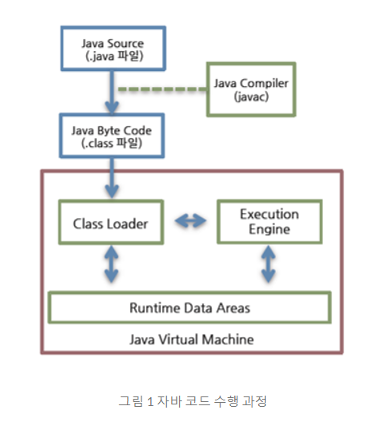
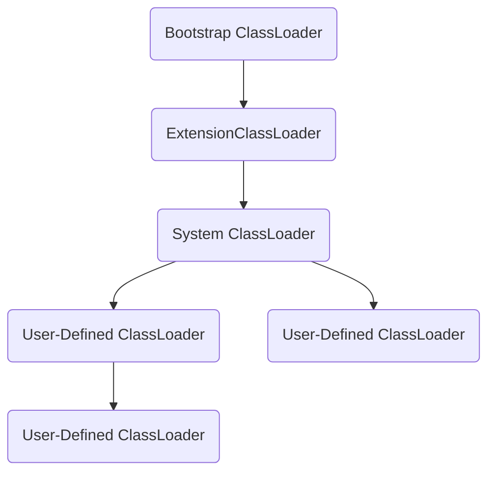

# JVM

## 구조

자바 바이트 코드가 JRE 위에서 동작

JRE에서 가장 중요한 요소는 자바 바이트코드를 해석하고 실행하는 JVM(Java Virtual Machine)입니다.

JRE는 `자바 API와 JVM`으로 구성, JVM 역할은 자바 애플리케이션을 클래스 로더를 통해 읽어 들여 자바 API와 함께 실행하는 것

- JRE

  1. JVM

  2. Java API

## JVM

프로그램을 실행하기 위해 물리적 머신과 유사한 머신을 소프트웨어로 구현한 것

WORA(Write Once Run Anywhere!)를 구현하기 위해 물리 머신과 별개의 가상 머진을 기반으로 동작하도록 설계

자바 바이트코드를 실행하고자 모든 하드웨어에 JVM을 동작시킴으로서 자바 실행 코드를 변경하지 않고 모든 종류의 하드웨어에서 동작

### JVM 특징

- `스택기반의 가상 머신`
  - 대표적인 컴퓨터 아키텍처인 인텔 x86 아키텍처나 ARM 아키텍처와 같은 하드웨어가 레지스터 기반으로 동작하는데 비해 
    JVM은 스택기반으로 동작
- `심볼릭 레퍼런스`
  - 기본 자료형(primitive data type)을 제외한 모든 타입(클래스와 인터페이스)의 명시적인 메모리 주소 기반의 레퍼런스가 아니라 
    심볼릭 레퍼런스를 통해 참조
  - 런타임 시점에 메모리 상에서 실제로 존재하는 물리적인 주소로 대체하는 Linking 작업
- `가비지 컬렉션`
  - 클래스 인스턴스는 사용자 코드에 의해 명시적으로 생성되고 가비지 컬렉션에 의해 자동으로 파괴
- 기본 자료형을 명확하게 정의하여 플랫폼 독립성 보장 
  - 다른 언어와 다르게 JVM은 기본 자료형을 명확하게 정의하여 호환성을 유지하고 플랫폼 독립성을 보장
  - C++은 플랫폼에 따라 int 크기가 다름
- `네트워크 바이트 오더(network byte order)`
  - 자바 클래스 파일은 네트워크 바이트 오더를 사용
  - 인텔 x86 아키텍처가 사용하는 리틀 엔디안이나 RISC 계열 아키텍처가 주로 사용하는 빈 엔디안 사이에서 플랫폼 독립성을 유지하려면 고정된 바이트 오더를 유지해야 하므로 네트워크 전송시에 사용하는 바이트 오더인 네트워크 바이트 오더를 사용
  - 네트워크 바이트 오더는 빅 엔디안

> JVM 명세(The Java Virtual Machine Specification)를 따르기만 하면 어떤 벤더든 JVM을 개발하여 제공할 수 있음
> 따라서 대표적인 오라클 핫스팟 JVM 외에도 IBM JVM을 비롯한 다양한 JVM이 존재

### JVM 구조

`클래스 로더(Class Loader)`가 컴파일된 자바 바이트 코드를 `런타임 데이터 영역(Runtime Data Areas)`에 로드하고 `실행 엔진(Execution Engine)`이 자바 바이트코드를 실행

#### 클래스 로더

자바는 동적 로드, 즉 컴파일 타임이 아니라 런타임에 클래스르 처음으로 참조할 때 해당 클래스를 로드하고 링크하는 특징

동적 로드를 담당하는 부분이 JVM의 `클래스 로더`

> 네임스페이스(namespace)

각 클래스 로더는 로드된 클래스들을 보관하는 `네임스페이스(namespace)`를 갖음

클래스를 로드할 때 이미 로드된 클래스인지 확인하기 위해서 네임스페이스에 보관된 FQCN(Fully Qualified Class Name)을 기준으로 클래스를 찾음

FQCN이 같더라도 네임스페이스가 다르면 즉 다른 클래스 로더가 로드한 클래스면 다른 클래스로 간주 

- `계층 구조`
  - 클래스 로더끼리 부모-자식 관계를 이루어 계층구조로 생성
  - 최상위 클래스 로더는 부트스크랩 클래스 로더(BootStrap Class Loader)
- `위임 모델`
  - 계층 구조를 바탕으로 클래스 로더끼리 로드를 위임하는 구조로 동작
  - 클래스를 로드할 때 먼저 상위 클래스 로더를 확인하여 상위 클래스 로더에 있다면 해당 클래스를 사용, 없다면 로드를 용청 받은 클래스 로더가 클래스를 로드
- `가시성 제한`
  - 하위 클래스 로더는 상위 클래스 로더의 클래스를 찾을 수 있지만 상위 클래스 로더는 하위 클래스 로더의 클래스를 찾을 수 없음
- `언로드 불가`
  - 클래스 로더는 클래스를 로드할 수는 있지만 언로드 할 수는 없음
  - 언로드 대신, 현재 클래스 로더를 삭제하고 아예 새로운 클래스 로더를 생성하는 방법

## 자바 바이트코드

WORA를 구현하기 위해 JVM은 사용자 언어인 자바와 기계어 사이의 중간 언어인 자바 바이트 코드를 사용

이 자바 바이크 코드가 자바 코드를 배포하는 가장 작은 단위

### 참고

https://d2.naver.com/helloworld/1230