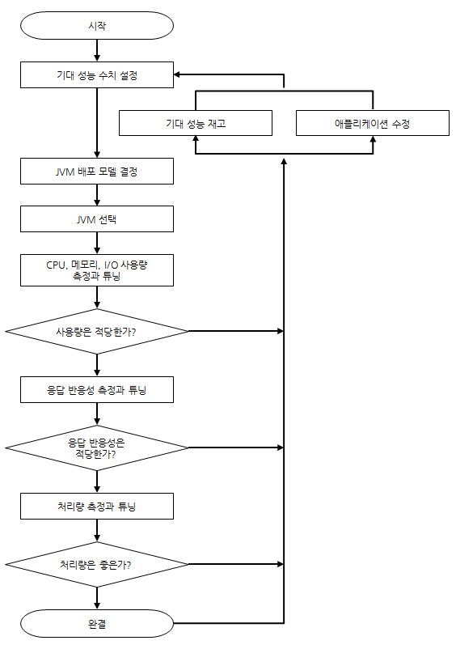

# Performance Tuning

- 어떻게 모니터링 하는가
- 어떻게 JVM 옵션을 주는가
- 코드 수정 필요 판단은 어떻게 하는가

## 성능 튜닝 과정

JVM 배포 모델이란 하나의 JVM에서 자바 애플리케이션을 동작시킬 것인지 

여러 JVM에서 자바 애플리케이션을 동작시킬 것인지 결정하는 것으로 가용성, 응답 반응성, 관리 편의성에 따라 변경될 수 있음

JVM이 여러 서버에서 동작하는 경우에도 한 서버에서 여러 개의 JVM을 동작하도록 하거나 서버마다 각각의 JVM을 동작하게 할 수 있음

> 서버의 코어 개수와 애플리케이션의 특성에 따른 다양성

서버의 코어 개수와 애플리케이션의 특성 등에 따라 결정되겠지만 응답 반응성 관점에서 양자를 비교할 때 

같은 애플리케이션일 경우 2GB의 힙을 사용하는 경우가 8GB 힙을 사용하는 것보다 풀 GC에 걸리는 시간이 짧아 응답 반응성에 유리

하지만 8GB 힙을 사용하면 2GB보다 풀 GB 발생 간격이 그 만큼 줄어들 것이고 

내부 캐시를 사용하는 애플리케이션이라면 히트율을 높여 응답 반을성을 높일 수 있음

## JVM 옵션

## 애플리케이션 성능 측정

###### 참고

https://d2.naver.com/helloworld/184615