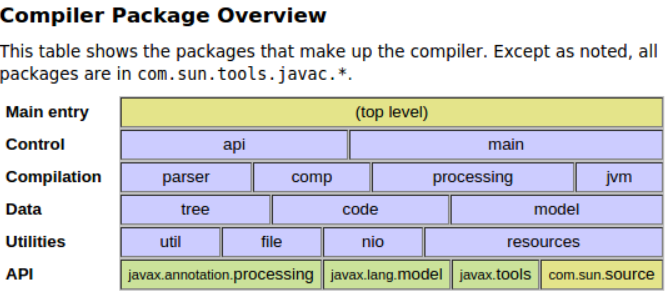

# Annotation Processing

> Annotation processing is actively used in many ubiquitous Java libraries, 
>
> for instance, to generate metaclasses in QueryDSL and JPA, to augment classes with boilerplate code in Lombok library.


> An important thing to note is **the limitation of the annotation processing API **
>
> **it can only be used to generate new files, not to change existing ones**. 


## Compile

> javac 

- 일반적으로 우리가 아는 .java 파일을 .class 파일로 바꾸는 컴파일러
- 컴파일러를 지원하는 환경


> 컴파일러 환경의 API 패키지

- `Lanuage Model API ( javax.lang.model package )`
- `Annotation Processing API ( javax.annotation.processing package )`
- `Compiler Tree API ( com.sun.source package )`


> 컴파일러 호출 API

- `Java Compiler API ( javax.tools package )`
  - `com.sun.tools.javac.main.Main` - CLI 환경에서 직접 호출
  - `java Compiler API` - java.tools 패키지 이용
  - `Compiler Tree API` - javax.tools.CompilationTask 를 com.sun.source.util.JavacTask 로 바꾸는 방법
    - 컴파일과정에서 생성된 SyntaxTree는 com.sun.source.tree.* 에서 public access 제공
    - com.sun.source.util.Trees 가 대표적 - 일반적인 Tree API와 유사한 API 제공





> Anotation Processing 

AP는 Enter, MemberEnter 스캔 이후에 시작

AP 중에 컴파일에 필요한 부가적인 타입을 생성

분석 메소드 시그니쳐도 실행

만약 AP 중 사용자가 파일을 새로 생성하면 컴파일은 재시작 


> 컴파일의 단계의 마지막으로 ".class" 생성에는 com.sun.tools.javac.jvm.* 이 이용된다.
>
> 흐름을 정리하면, 컴파일 하면 컴파일러는 AST를 생성시킨 후 "javac -processor"에 등록된 AnnotationProcessor를 호출한다.
>
> AnnotationProcessor에서는 컴파일러에서 제공된 Syntax Tree를 이용 하거나 직접 Visitor를 구현해서 트리를 탐색하며 필요한 데이터를 얻고
>
> com.sun.source.tree.* 패키지를 이용해서 필요한 코드를 추가 할 수 있다.


## API

AP(Annotation Processing, 이하 줄여서 AP)는 여러 번에 걸쳐서 실행됩니다 

각각의 수행은 소스파일의 애너테이션 검색 그리고 적합한 애너테이션 선택을 시작합니다.


이 과정에서 파일이 생성되면 생성 된 파일을 입력으로하여 다른 라운드가 시작됩니다. 

이 프로세스는 처리 단계 중에 새 파일이 생성되지 않을 때까지 계속됩니다.


## Setup


### Step1. Dependency

구글의 auto-service 라이브러리를 사용하여 나중에 설명할 프로세서 메타 데이터 파일을 생성 [auto-service](https://github.com/google/auto/tree/master/service)

> auto-service :: `java.util.ServiceLoader-Sytle` 의 서비스 제공자를위한 구성 / 메타 데이터 생성기
>
> - 만약 사용하지 않는다면 
>   `/src/main/resources/META-INF/services/javax.annotation.processing.Processor` 에 직접 processor 클래스 명시

```xml
<dependency>
    <groupId>com.google.auto.service</groupId>
    <artifactId>auto-service</artifactId>
    <version>${auto-service.version}</version>
    <scope>provided</scope>
</dependency>
```


### Step2. Processor

- @SupportedAnnotationTypes
- @SupportedSourceVersion
- @AutoService - 메타데이터생성
- process()
  - 구현해야할 방법은 처리 자체를 수행하는 프로세스 방법입니다
  - 일치하는 Annotation이 포함된 모든 소스파일에 대해 컴파일러에서 호출

```java
@SupportedAnnotationTypes("com.baeldung.annotation.processor.BuilderProperty")
@SupportedSourceVersion(SourceVersion.RELEASE_8)
@AutoService(Processor.class)
public class BuilderProcessor extends AbstractProcessor {
 
    @Override
    public boolean process(Set<? extends TypeElement> annotations, 
                           RoundEnvironment roundEnv) {
        return false;
    }
}
```


## Order ?

> After a lot of research and having talked to one of the Lombok developers, it turns out that because javac does class loading based on hashCode(), the order of annotation processors running in this scenario is essentially random, and what's worse, random between multiple runs. There currently does not seem to be a solution to this issue.
>
> I went with the lombok-maven plugin and delomboking the whole thing, which isn't perfect and somewhat hacky, but at least produces a working result. In hopes that it may aid future googlers coming here, I commited the working version to the repo.
>
> 많은 연구와 롬복 개발자 중 한 명과 이야기를 나눈 후 javac가 hashCode ()를 기반으로 클래스 로딩을 수행하기 때문에이 시나리오에서 실행되는 주석 프로세서의 순서는 본질적으로 무작위이며, 더 나쁜 것은 여러 실행합니다. 현재이 문제에 대한 해결책이없는 것 같습니다.
>
> 나는 lombok-maven 플러그인을 사용하여 모든 것을 delomboking했습니다. 완벽하고 해키는 아니지만 최소한 작업 결과를 얻습니다. 미래의 Google 직원이 여기에 도움이되기를 희망하면서 작업 버전을 리포지토리에 커밋했습니다.


> Ideally the order shouldn't matter. Annotation processors should only create files - whenever a file is created, another processing round starts and other processor have the chance again to do their thing with the new file. In this case the order doesn't really matter, so I don't think there is an official way to force an order of processors. The problem is that the Lombok processor manipulates existing files instead of creating new ones, which it is not supposed to do. Some compilers might have an option for ordering processors or use the order in which processors are loaded or appear in the command line arguments, but that will depend on the compiler's implementation.
>
> You could try looking at Daggers and Lombok's build process and see which processors are invoked there. Then explicitly set up those processors in your maven build in the correct order and test different compilers and see if any of them run them in this order.
>
> If necessary, you could split the compilation process and run Lombok with -proc:only first and after that another compilation step without Lombok and without overriding the manipulated files (if that is possible, I never tried that).
>
> 이상적으로 순서는 중요하지 않습니다. 어노테이션 프로세서는 파일 만 작성해야합니다. 파일이 작성 될 때마다 다른 처리 라운드가 시작되고 다른 프로세서는 다시 새 파일로 작업을 수행 할 수 있습니다. 이 경우 순서는 실제로 중요하지 않으므로 프로세서 순서를 강제하는 공식적인 방법은 없다고 생각합니다. 문제는 롬복 프로세서가 새로운 파일을 만드는 대신 기존 파일을 조작한다는 것입니다. 일부 컴파일러에는 프로세서를 주문하는 옵션이 있거나 프로세서가로드되거나 명령 행 인수에 나타나는 순서를 사용할 수 있지만 컴파일러의 구현에 따라 다릅니다.
>
> Daggers와 Lombok의 빌드 프로세스를 살펴보고 어떤 프로세서가 호출되는지 확인할 수 있습니다. 그런 다음 메이븐 빌드에서 해당 프로세서를 올바른 순서로 명시 적으로 설정하고 다른 컴파일러를 테스트하고 프로세서 가이 순서대로 실행되는지 확인하십시오.
>
> 필요한 경우 컴파일 프로세스를 분할하고 -proc : only로만 Lombok을 실행할 수 있으며 그 이후에는 Lombok이없고 조작 된 파일을 재정의하지 않고 다른 컴파일 단계를 수행 할 수 있습니다 (가능한 경우 절대 시도하지 않음)


[Post - Lombok은 어떻게 만들어 질까](https://free-strings.blogspot.com/2015/12/lombok.html)

[Post - AnnotationProcessing ](https://www.baeldung.com/java-annotation-processing-builder)