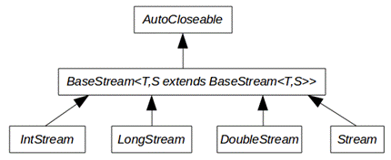

\#java \#stream \#intro

---

자바스트림에 대해서 알아봅시다.


###  왜 / 언제 사용하는지

###### #stream?

람다를 사용하여 가독성이 우수하다

병렬처리가 가능하다 ( 내부반복자를 사용한다 )

중간처리와 최종처리가 가능하다


### stream  구조

###### #structure?

BaseStream 인터페이스에 모든 스트림에서 사용할 수 있는 공통 메소드가 정의 (직접사용X)

- Stream : 객체요소
- IntStream, LongStream, DoubleStream : 기본자료형




### stream의 생성과 반복

###### \#stream() 

###### #forEach()

```java
List<String> list = Array.asList("A", "B", "C");
Stream<String> stream = list.stream();
stream.forEach(name -> System.out.println(name));                                 	
```


### stream 람다의 이용

###### \#stream() 

###### #forEach()

```java
List<Student> students = Arrays.asList(
	new Student("Tom", 11),
    new Student("Andy", 12),
    new Student("David", 13)
);

Stream<Student> stream = students.stream();
stream.forEach(student -> {
   	String name = student.getName();
    int age = student.getAge();
    System.out.println(name + " " + age);
});
```


### stream 내부반복자

###### \#parallelStream() 

###### #forEach()

```java
List<String> list = Arrays.asList("A", "B", "C");

Stream<String> stream = list.stream();
stream.forEach(ThreadPrinter::print);

Stream<String> parallelStream = list.parallelStream();
parallelStream.forEach(ThreadPrinter::print);
```

```java
class ThreadPrinter {
	public static void print (String str) {
		System.out.println(str + " " + Thread.currentThread().getName());
	}    
}
```


### stream 중간처리와 최종처리

###### \#stream() 

###### #mapToInt() 

###### #average() 

###### #getAsDouble()

```java
List<Student> students = Arrays.asList(
	new Student("Tom", 11),
    new Student("Andy", 12),
    new Student("David", 13)
);

double avgOfAge = students.stream()
    .mapToInt(Student::getAge)
    .average()
    .getAsDouble();
```

