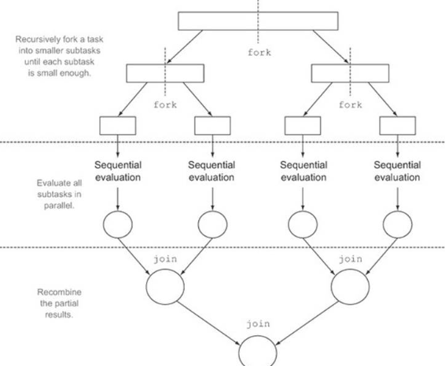

/#java #strema #parallel

---


## 병렬처리

### #Parallel?

- 멀티코어 CPU 환경에서 하나의 작업을 분할해서 각각의 코어가 병렬적 동작하는 것을 말함
- 병렬처리방식 - 동시성 vs 병렬성
  - 동시성 : 멀티 스테드가 번갈아가며 실행하는 과정
  - 병렬성 : 멀티 작업을 멀티 코어를 이용해 동시에 실행하는 과정
- 병렬성처리방식 - 데이터 병렬성 vs 작업 병렬성
  - 데이터 병렬성 : 전체 데이터를 쪼개어 병렬 처리
  - 작업 병렬성 : 서로 다른 작업을 병렬 처리


### #ForkJoin?

- 병렬 스트림 이용시 런타임과정에서 포크조인 프레임워크 동작
  - 포크단계 : 전체 데이터를 서브 데이터로 분리
  - 병렬처리 : 서브 데이터를 멀티 코어로 병렬 처리
  - 조인단계 : 서브 결과를 합해서 최종 결과 도출




### #parallelStream()

```java
MaleStudent maleStudent = totalList.parallelStream()
    .filter(s -> s.getZender() == Student.Zender.MALE)
    .collect(MaleStudent::new, MaleStudent::accumulate, MaleStudent::combine);
```

### #parallel()

```java
List list = Arrays.asList(1,2,3,4,5);
long start = System.nanoTime();
list.stream()
    .parallel()
    .forEach(n -> System.out.println(n));
long end = System.nanoTime();
System.out.println(end - start);
```

