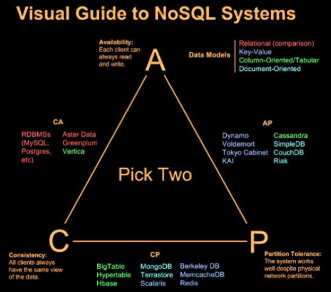

\#redis

## Redis

- Redis는 고성능 키-값 저장소로서, 문자열, 리스트, 해시, 셋, 정렬된 셋 형식의 데이터를 지원하는 NoSQL입니다.

### #차례

- `들어가며`
  - 빅데이터란 무엇인가
  - 빅데이터와 RDBMS의 한계 (스케일업과 스케일아웃)
  - 레디스란 무엇인가
- `빨리 시작해보기`
  - 설치하기
  - 기본명령어
  - 성능측정
  - redis-cli
- `NoSQL`
  - CAP 정리
  - NoSQL 분류
  - 언제 NoSQL을 사용하는가
- `레디스 시작`
  - 레디스와 데이터 구조
  - 레디스 데이터 구조와 명령어
  - 레디스 키  설계
- `레디스 클라이언트`
  - 클라이언트 종류
  - 레디스 프로토콜
  - 대량의 데이터 입력
- `레디스 내부구조`
  - 레디스 객체
  - 레디스 문자열
  - 레디스 공유객체
- `레디스 활용 사례`
  - 웹 애플리케이션 서버 로그 통합
  - 페이지 방문 횟수 저장
  - 장바구니 정보
  - 좋아요 처리
  - 실시간 순 방문자 집계
  - 최근 조회 상품 목록
- `확장과 분산 기법`
  - 복제
  - 샤딩
  - 샤딩과 복제 혼합
- `레디스 운영시 고려사항`
  - 임계점
  - 메모리 설정
  - 기타 고려사항
- `레디스 튜닝`
  - 환경 설정 파일
  - 서버 중지 없는 환경설정
  - 레디스 스냅샷
- `루아 스크립트`
  - 루아
  - 레디스와 루아
- `부록`
  - 빅오표기법
  - 레디스 명령어 목록

### #특징

- 영속성을 지원하는 인메모리 데이터 저장소
- 읽기 성능 증대를 위한 서버 측 복제 지원
- 쓰기 성능 증대를 위한 클라이언트 측 샤딩지원
- ANSI C로 작성, ANSI C 컴파일러가 동작하는 곳이면 어디든 설치 및 실행 가능
- 레디스 클라이언트는 대부분의 언어로 포팅
- 메모리 저장소임에도 문자열 , 리스트, 해시, 셋, 정렬된 셋과 같은 다양한 데이터형을 지원

## NoSQL

- 빅데이터를 처리하기 위한 분산 데이터 저장소의 통칭

### #특징

- 단편적인시각
  - 조인이 지원되지 않는 분산 데이터베이스
  - 데이터를 여러 서버에 분산하여 저장하며 스키마를 가질 수 없음
  - RDBMS의 특징을 제거하고 만들어진 다른 모든 데이터베이스
  - 기존 방식의 RDBMS의 한계를 극복한 새로 운 형태의 확장성을 특징으로 하는 데이터 저장소
- 공통적인정의
  - 대용량 웹 서비스를 위해 만들어진 데이터 저장소
  - RDBMS 모델을 지양하며 대량의 데이터를 저장하고 조회하는데 특화된 저장소
  - 스키마 없이 사용가능하거나 느슨한 스키마 제공

### #CAP

- `일관성 Consistency` ( 동일성 )
  - 다중 클라이언트에서 같은 시간에 조회하는 데이터는 항상 동일한 데이터임을 보증
  - NoSQL은 해당 부분을 희생할 수도 있음 (하지만, 최종일관성을 지켜짐)
    - 강한일관성 <-> 최종일관성
  - NoSQL은 쓰기정보를 메모리에 저장후 응답처리하고, 이 후에 디스크에 처리하게 됨
    - 다음 부분은 정전과 같은 부분에서 안정성에 문제를 야기할 수 있음
    - 메모리에 저장 전 WAL 파일에 미리 저장하여 정보 유실을 막기도 합니다.
- `가용성 Availability`
  - 모든 클라이언트의 읽기와 쓰기 요청에 대해서 항상 응답이 가능해야 함을 보증하는 것
  - 단일고장점 (SPOF, Single Point Of Failure)
    - 시스템을 구성하는 개별 요소중 하나의 요소가 망가졌을 때 시스템 전체를 멈추가 만드는 요소
- `분할 허용성 Partition Tolerance`
  - 지역적으로 분할된 네트워크 환경에서 동작하는 시스템에서 
    두 지역 간의 네트워크가 단절되거나 네트워크 데이터의 유실이 일어나더라도 각 지역내 시스템은 정상적으로 동작해야함

### #종류

- 키-값 모델
- 문서 모델
- 컬럼 모델
- 그래프 모델

