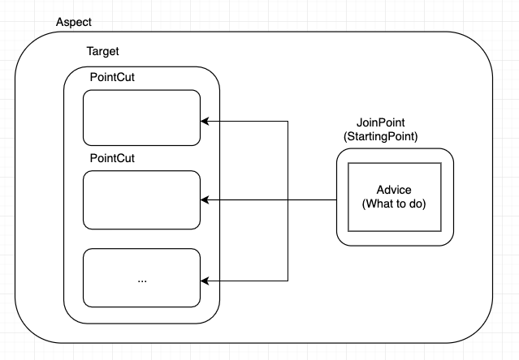
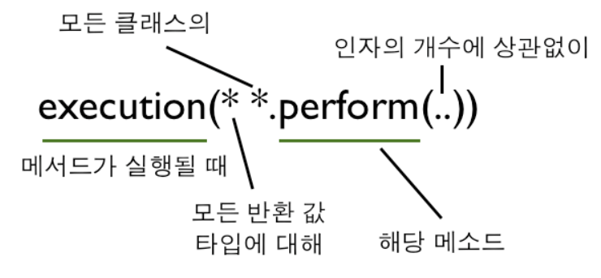
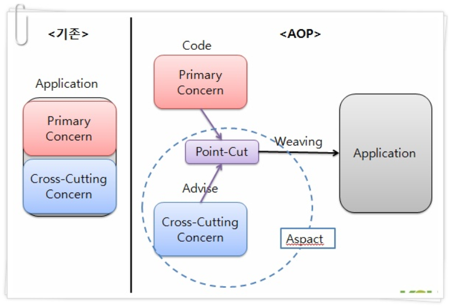

\#spring #AOP

---

## AOP

### #개념?

- Aspect Oriented Programming으로, 흩어져 있는 횡단관심사를 중심으로 설계 및 구현을 하는 방법
- 비즈니스로직을 제외한 다른 부분을 공통적으로 관리하기 때문에 로직에 집중이 가능

### #횡단관심사?

- 비즈니즈로직과는 거리가 있으나 여러 모듈에 걸쳐 반복적으로 호출되는 것
- 따라서 프로그램안에 여러 횡단관심사를 분리해서 한 곳으로 모아야 함 ( 횡단관심사의분리 )
- 보안 / 로깅 / 트랜젝션 / 모니터링 / 캐시처리 / 예외처리 등등

### #용어?



- `Aspect`
  - AOP의 단위가 되는 횡단관심사
- `JoinPoint`
  - 횡단관심사가 실행되는 지점
- `Advice` ( inside JoinPoint ) 
  - 특정 조인포인트에서 실행되는 코드, 횡단관심사의 구현부
  - What to do (할일들) 
- `PointCut`
  - 어드바이스를 적용할 곳을 선별하기 위한 표현식, 조인포인트의 그룹
  - 표현식을 이용한 조인포인트 선택기능은 AspectJ가 제공
- `Weaving`
  - 애플리케이션 코드의 적절한 지점에 애스팩트를 적용
- ``
  - AOP 처리에 의해 처리 흐름에 변환이 생길 부분


### #Advice

#### #유형

##### #Before 

- 조인포인트 전 실행
- 예외 시 발생안함

> Annotation기반

```java
@Aspect
@Component
public class MethodStartLoggingAspect {
  @Before("execution(* *..*ServiceImpl.*(..))")
  public void startLog(JoinPoint jp) {
    System.out.println("메서드시작 : " + jp.getSignature());
  }
}
```

> XML기반

```xml
<beans>
  <aop:config>
    <aop:aspect ref="loggingAspect">
      <aop:before pointcut="execution(* *..*ServiceImpl.*(..))" method="startLog" />
    </aop:aspect>
  </aop:config>
</beans>
```

##### #After Returning 

- 조인포인트가 정상적으로 종료 후 실행
- 예외 시 발생안함

```java
@Aspect
@Component
public class MethodNormalEnLoggingAspect {
    @AfterReturning("execution(* *..*ServiceImpl.*(..))")
    public void endLog(JoinPoint jp) {
      System.out.println("메소드정상종료 : " + jp.getSignature());
    }
}
```

##### #After Throwing

- 조인포인트에서 예외 발생시 실행
- 정상동작 시 발생안함
  - throwing 옵션에 매개변수를 입력

```java
@Aspect
@Component
public class MethodExceptionEndLoggingAspect {
  @AfterThrowing(value="execution(* *..*ServiceImpl.*(..))", throwing="e")
  public void endLog(JoinPoint jp, RuntimeException e) {
    System.out.println("메소드비정상종료 : " + jp.getSignature());
    e.printStackTrace();
  }
  
  @AfterThrowing(value="execution(* *..*ServiceImpl.*(..))", throwing="e")
  public void endLog(JoinPoint jp, RuntimeException e) {
    throw new ApplicationException(e);
  } 
}
```

##### #After

- 조인포인트에서 처리가 완료된 후 실행
- 예외 / 정상동작 모두 실행

```java
@Aspect
@Component
public class MethodEndLoggingAspect {
  @After("execution(* *..*ServiceImpl.*(..))")
  public void endLog(JoinPoint jp) {
    System.out.println("메서드종료 : " + jp.getSignature());
  }
}
```

##### #Around

- 조인포인트 전후 실행
- 앞선 모든 처리를 한 Advice로 관리 가능

```java
@Aspect
@Component
public class MethodLoggingAspect {
  @Around("execution(* *..*ServiceImpl.*(..))")
  public Object log(ProcedingJoinPoint jp) throw Throwable {
    System.out.println("메서드시작 : " + jp.getSignature());
    try {
      Object result = jp.preceed();
      System.out.println("메서드정상종료 : " + jp.getSignature() + ", 반환값 : " + result);
      return result;
    } catch(Exception e) {
      System.out.println("메서드비정상종료 : " + jp.getSignature());
      e.printStackTrace();
      throw e;
    }
  }
}
```

#### #Target정보

##### #객체이용(JoinPoint)

- 실제로 사용하기 전 형변환이 필요
  - ClassCastException 발생가능
  - target, this, args 등을 활용 객체나 인수를 어드바이스 메서드에 파라미터로 바인딩

###### #getTarget()

- 프락시 전 원본 객체정보

###### #getThis()

- 프락시 객체

###### #getArgs()

- 인수정보

```java
@Around("execution* *..*ServiceImpl.*(..)")
public Object log(JoinPoint jp) throws Throwable {
  // 프락시 전 원본 객체정보
  Object targetObject = jp.getTarget();
  // 프락시 객체
  Object thisObject = jp.getThis();
  // 인수
  Object[] args = jp.getArgs();
}
```

##### #지시자이용

- 형변환이 필요없음 (타입안전)
  - 타입이 맞지 않으면 어드바이스 대상에서 제외

```java
@Around("execution(* com.example.CalcService.*(com.example.CalcInput)) && target(service) && args(input)")
public Object log(CalcService service, CalcInput input) throws Throwable {

}
```


### #PointCut

#### #execution



- `*`
  - 임의의 문자열
  - 패키지를 표현할 땐 1개의 계층
  - 매개변수를 표현할 땐 1개의 인수
- `..`
  - 패키지를 표현할 땐 0개 이상의 계층
  - 매개변수를 표현할 땐 0개 이상의 인수
- `+`
  - 클래스명 뒤에 붙여, 해당 클래스 / 서브클래스 / 구현클래스 모두를 의미

```bash
execution(* com.example.user.UserService.*(..))
# 클래스에 임의의 메서드를 대상

execution(* com.example.user.UserService.find*(..))
# 클래스에서 이름이 find로 시작하는 메소드 대상

execution(String com.example.user.UserService.*(..))
# 클래스에서 반환되는 값의 타입이 String인 메소드 대상

execution(* com.example.user.UserService.*(String, ..))
# 클래스에서 첫번째 매개변수의 타입이 String인 메서드 대상

execution(* *..*ServiceImpl.*(..))
# ServiceImpl로 끝나는 모든 클래스의 모든 메서드 대상

execution(* com.example.service.*.*(..))
# service 패키지에 임의의 클래스에 속한 임의의 메서드를 대상

execution(* com.example.service..*.*(..))
# service 패키지나 그 서브패키지 중에서 임의의 클래스에 속한 임의의 메서드

execution(* com.example.*.user.*.*(..))
# user 패키지 상위에 패키지가 1개 더 있는 user패키지에서 임의의 클래스에 속한 임의의 메서드를 대상

execution(* com.example.user.UserService.*(*))
# user 패키지에 UserService 클래스의 메서드중에서 매개변수의 갯수가 1개인 메서드를 대상
```

#### #within

- 타입정보를 활용해 조인포인트를 선택
- 클래스명 패턴만 사용

```bash
within(com.example.service..*)
# service 패키지나 그 서브패키지 중에서 임의의 클래스에 속한 임의의 메서드를 대상

within(com.example.user.UserServiceImpl)
# user 패키지에 UserServiceImpl 클래스의 메서드를 대상

within(com.example.password.PasswordEncoder+)
# password 패키지에 PasswordEncoder 인터페이스를 구현한 클래스의 메서드를 대상
```

#### #EndSoOn

```bash
bean(*Service)
# DI 컨테이너에 관리되는 빈 가운데 이름이 Service로 끝나는 빈의 메서드를 대상

@annotation(com.example.annotation.TraceLog)
# @TraceLog 애너데이션이 붙은 메서드 대상

@within(com.example.annotation.TraceLog)
# @TraceLog 애너테이션이 붙은 클래스의 메서드를 대상
```

#### #NamedPointCut

- 포인트컷에 이름을 붙이고 재사용하는 방법
- 메서드의 반환값은 `void`
- 논리연산사 사용가능 `&&, ||, !`

> 정의

```java
@Aspect
@Component
public class NamedPointCuts {
  @Pointcut("within(com.example.web..*)")
  public void inWebLayer() {}

  @Pointcut("within(com.example.domain..*)")
  public void isDomainLayer(){}

  @Pointcut("execution(public * *(..))")
  public void anyPublicOperation() {}
}
```

> 활용

```java
@Aspect
@Component
public class MethodLoggingAspect {
    @Around("isDomainLayer()")
  	public Object log(ProcedingJoinPoint jp) throws Throwable {

  	}
  
    // 논리연산자 사례
	// @Around("isDomainLayer()" && "inWebLayer()")
    // @Around("isDomainLayer()" || "inWebLayer()")
    // @Around(!"isDomainLayer()")
}
```


### #Weaving

- 컴파일시 Weaving
  - AspectJ 구현시
- 클래스로딩시 Weaving
  - AspectJ 구현시
- 런타임시 Weaving
  - Spring-APO 구현시
  - 프락시 생성하여 AOP 적용 - 프락시를 통한 객체 접근


## Spring AOP

- Spring AOP는 Spring에 내장
  - DI 컨테이너에서 관리하는 빈들을 타겟으로 어드바이스를 적용하는 기능
  - 조인포인트에 어드바이스를 적용하는 방법은 프락시 객체를 만들어서 대체하는 방법
  - 어드바이스가 적용된 이후, DI 컨테이너에서 빈을 꺼낼 시 프락시 형태의 어드바이스 반환

- 스프링의 AOP에는 AspectJ (AOP 프레임워크) 포함
  - AspectJ 
    - Aspect / Advice 를 정의하기 위한 애너테이션이나 포인트컷 언어제공
    - Weaving 메커니즘을 제공
      - XML 스키마기반에서 POJO 클래스를 이용한 AOP 구현
      - Annotation기반에서 AspectJ에서 정의한 @Aspect를 이용한 AOP 구현
      - 스프링 API를 이용한 AOP 구현

### #Dependency

> pom.xml

```xml 
<dependency>
  <groupId>org.springframework</groupId>
  <artifactId>spring-context</actifactId>
</dependency>
<dependency>
  <groupId>org.springframework</groupId>
  <artifactId>spring-aop</actifactId>
</dependency>
<dependency>
  <groupId>org.aspectj</groupId>
  <artifactId>aspectjweaver</actifactId>
</dependency>
```

### #Aspect

- Primary(Core) Concern 
  - 비즈니스로직 구현부
- Cross-Cutting Cercern
  - 횡단관심사 구현부



```java
// 1. aspect
@Aspect
@Component
public class MethodStartLoggingAspect {
    
  // 2. advice
  @Before("execution(* *..*ServiceImpl.*(..))") // 3.pointcut
  // 6.weaving : 3.pointcut -> 4.joinpoint(5.target)
  public void startLog(JoinPoint jp) {
    System.out.println("메서드시작 : " + jp.getSignature());
  }
}
```

### #AOP Active

> 자바기반

```java
@Configuration
@Component("com.example")
@EnableAspectJAutoProxy
public class AppConfig {

}
```

> XML기반

```xml
<beans>
  <context:component-scan base-package="com.example" />
  <aop:aspectj-autoproxy />
</beans>
```

### #기능

#### #@Transactional

```java
@Transactional
public Reservation reverve(Reservation reservation) {

}
```

#### #@PreAuthize

```java
@PreAuthrize("hasRole('ADMIN')")
public User create(User user) {
    // 사용자 등록 처리 ( ADMIN 역할을 가진 사용자만 실행 가능 )
}
```

#### #@Cacheable

- 메서드의 실행결과를 캐시로 관리
- 캐시가 등록되어 있지 않다면 메서드를 실행하고, 반환값 처리전에 반환값과 키를 캐시에 등록

```java
@Cacheable("user")
public User findOne(String email) {

}
```

#### #@Async

- 반환값으로 `CompletableFuture `타입이나 `DeferredResult `타입의 값 반환
- AOP 방식으로 별도의 스레드에서 실행

```java
@Cacheable("user")
public User findOne(String email) {

}
```

#### #@Retryable

- 메서드가 정상처리되지 않은 경우 만족할때까지 재처리
- 신뢰성 보장이 어려운 외부시스템과 연계에서 사용

```java
@Retryable(maxAttempts = 3)
public String callWebApi() {

}
```


