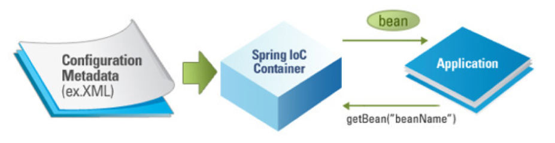

\spring #DI #bean

---

# DI 용어정리

### #용어?

- DI (Dependency Injection, 의존성주입)
  - 객체를 외부에서 생성해서 주입
- IoC (Inversion of Contril, 제어의역전)
  - 작은 부품부터 큰 부품으로, 제품을 만드는 순서의 역전
- DI 컨테이너 (=IoC 컨테이너)
  - 외부에서 생성한 객체들(부품)을 담고 있는 컨테이너
- Bean (=POJO)
  - DI 컨테이너의 컴포넌트 
  - 기본 생성자와 멤버필드에 접근할 수 있는 getter/setter 메소드를 가진 한 객체
- ApplicationContext
  -  DI 컨테이너 역할
  - 객체를 관리해주는 스프링의 중심 인터페이스
- AppConfig
  - DI 컨테이너의 설정파일
- BeanFactory



### #장점?

- 인스턴스의 스코프 제어
- 인스턴스의 생명주기 제어
- AOP 방식 활용 가능
- 의존하는 컴포넌트간의 결합도를 낮춤


## ApplicationContext

### #ApplicationContext

- 사용목적
  - 단독 애플리케이션에서 스프링을 사용할때 (?)
  - JUnit으로 테스트를 구동할때
  - Web 환경에선 WebApplicationContext 사용

```java
ApplicationContext context = new AnnotationConfigApplicationContext(AppConfig.class);
ApplicationContext context = new AnnotationConfigApplicationContext("com.example.app");
ApplicationContext context = new ClassPathXmlAppplicationContext("META-INF/spring/applicationContext.xml");
ApplicationContext context = new FileSystemXmlApplication("./spring/applicationContext.xml");
```

### #getBean()

```java
UserService userService = context.getBean(UserService.class);
UserService userService = context.getBean("userService", UserService.class);
UserService userService = (UserService) context.getBean(userService);
```


## Bean Define

- Annotation 기반 생성방식을 권장합니다.

> 자바기반

```java
@Configuration
public class AppConfig {

  @Bean
  UserRepository userRepository() {
    return new UserRepository();
  }

  @Bean
  PasswordEncoder passwordEncoder() {
    return new PasswordEncoder();
  }

  @Bean
  UserService UserService() {
    return new UserServiceImpl(userRepository(), passwordEncoder());
  }
    
}
```

> Annotation기반

```java
@Component
public class UserRepositoryImpl implements UserRepository {

}
```

```java
@Component
public class BCryptPasswordEncoder implements PasswordEncoder {
 
}
```

```java
@Component
public class UserServiceImpl implements UserService {
  @Autowired
  public UserServiceImpl(UserRepository userRepository, PasswordEncoder passwordEncoder) {
      
  }
}
```

> XML기반

```xml
<beans skip...>
  <bean id="userRepository" class="com.example.demo.UserRepositoryImpl" />
  <bean id="passwordEncoder" class="com.example.demo.BCryptPasswordEncoder" />
  <bean id="userService" class="com.example.demo.UserServiceImpl">
    <constructor-arg ref="userRepository" />
    <constructor-arg ref="passwordEncoder" />
  </bean>
</beans>
```


## Bean Setting

### #Naming

> 자바기반

- dafault : CamelCase의 형태로 기본이름을 가짐
- custom : @Component("name")

```java
@Component("userService")
public class UserServiceImpl implements UserService {
    
}
```

### #@DependsOn

> 생성 우선순위 처리

```java
@Configuration
class ConfA {
  @Bean(name="hello")
  public String hello() {
    return "hello";
  }
}

@Configuration
@DependsOn(value={"hello"})
class ConfB {
  @Bean
  public String byebye() {
    return "byebye";
  }
}
```


## Bean Injection

- Constructor -> Field -> Setter 순으로 진행

### #Constructor-Injection

> Annotation기반

- Spring 4.3부터 단일 생성자의 경우 @Autowired가 필요없습니다.

```java
@Component
public class UserServiceImpl implements UserService {
  private UserRepository userRepository;
  private PasswordEncoder passwordEncoder;
    
  @Autowired
  public UserServiceImpl(UserRepository userRepository, PasswordEncoder passwordEncoder) {
    this.userRepository = userRepository;
    this.passwordEncoder = passwordEncoder;
  }
}
```

> XML기반

```xml 
<!-- index 사용 -->
<bean id="userService" class="com.example.demo.UserServiceImpl">
  <constructor-arg index="0" ref="userRepository" />
  <constructor-arg index="1" ref="passwordEncoder" />
</bean>

<!-- praam 사용 -->
<bean id="userService" class="com.example.demo.UserServiceImpl">
  <constructor-arg name="userRepository" ref="userRepository" />
  <constructor-arg name="passwordEncoder" ref="passwordEncoder" />
</bean>
```

### #Setter-Injection

```java
public class UserServiceImpl implements UserService {
    
    private UserRepository userRepository;
    private PasswordEncoder passwordEncoder;

    public UserServiceImpl() {

    }

    public void setUserRepository(UserRepository userRepository) {
        this.userRepository = userRepository;
    }

    public void setPasswordEncoder(PasswordEncoder passwordEncoder) {
        this.passwordEncoder = passwordEncoder;
    }
    
}
```

> 자바기반

```java
@Bean
UserService userService() {
  UserServiceImpl userService = new UserRepositoryImpl();
  userService.setUserRepository(userRepository());
  userService.setPasswordEncoder(passwordEncoder());
}
```

> Annotation기반

```java
@Component
public class UserServiceImpl implements UserService {
  private UserRepository userRepository;
  private PasswordEncoder passwordEncoder;

  @Autowired
  public void setUserRepository(UserRepository userRepository) {
    this.userRepository = userRepository;
  }

  @Autowired
  public void setPasswordEncoder(PasswordEncoder passwordEncoder) {
    this.passwordEncoder = passwordEncoder;
  } 
}
```

> XML기반

```xml
<bean id="userService" class="com.example.demo.UserService">
  <property name="userRepository" ref="userRepository" />
  <property name="passwordEncoder" ref="passwordEncoder" />
</bean>
```

### #Field-Injection

- DI 컨테이너의 사용을 전제합니다. 

```java
@Component
public class UserServiceImpl implements UserService {
  @Autowired
  UserRepository userRepository;
    
  @Autowired
  PasswordEncoder passwordEncoder;
}
```


## Bean Autowired

- DI 컨테이너에서 빈을 자동으로 주입하는 방식 (Annotation기반)

### #@Autowired

- DI 컨테이너에 해당 Bean이 반드시 있다는 가정
- "NoSuchBeanDefinitionExcepion" 발생시킬 수 있음

### #required #Optional

```java
@Component
public class UserServiceImpl implements UserService {
  @Autowired(required = false)
  PasswordEncoder PasswordEncoder;
}
```

```java
@Autowired
Optional<PasswordEncoder> passwordEncoder;

public void createUser(User user, String rawPassword) {
  String encodedPassword = passwordEncoder.map(x -> x.encode(rawPassword)).orElse(rawPassword);
}
```

### #@Qualifier

- @Autowired가 빈의 이름만으로 구분하지 못하는 상황에서 사용

#### #직접매칭

```java
@Configuaration
@Component
public class AppConfig {
    
    @Bean // bean-name : passwordEncoder
    PasswordEncoder sha256PasswordEncoder() {
        return new Sha256PasswordEncoder();
    }

    @Bean // bean-name : passwordEncoder
    PasswordEncoder bcryptPasswordEncoder() {
        return new BCryptPasswordEncoder();
    }
}
```

```java
@Component
public class UserServiceImpl implements UserService {
  @Autowired
  @Qualifier("sha256PasswordEncoder")
  PasswordEncoder passwordEncoder;
}
```

#### #이름속성

```java
@Configuaration
@Component
public class AppConfig {
    
    @Bean(name="lighjtweight")
    PasswordEncoder sha256PasswordEncoder() {
        return new Sha256PasswordEncoder();
    }

    @Bean // bean-name : passwordEncoder
    PasswordEncoder bcryptPasswordEncoder() {
        return new BCryptPasswordEncoder();
    }
}
```

```java
@Component
public class UserServiceImpl implements UserService {
  @Autowired
  @Qualifier("lighjtweight")
  PasswordEncoder passwordEncoder;
}
```

#### #@Qualifier구현

```java
@Target({ElementType.FIELD, ElementType.PARAMETER, ElementType.METHOD})
@Retention(RetentionPolicy.RUNTIME)
@Documented
@Inherited
@Qualifier
public @interface Lightweight {}
```

```java
@Configuaration
@ComponentScan
public class AppConfig {
  @Bean
  @Lightweight
  PasswordEncoder sha256PasswordEncoder() {
    return new Sha256PasswordEncoder();
  }

  @Bean
  @Primary
  PasswordEncoder bcryptPasswordEncoder() {
    return new BCryptPasswordEncoder();
  }
}
```

```java
@Autowired
@Lightweight
PasswordEncoder passwordEncoder;
```

### #@Primary

- default bean을 설정합니다

```java
@Configuaration
@Component
public class AppConfig {

  @Bean
  PasswordEncoder sha256PasswordEncoder() {
    return new Sha256PasswordEncoder();
  }

  @Bean
  @Primary
  PasswordEncoder bcryptPasswordEncoder() {
    return new BCryptPasswordEncoder();
  }
}
```

### #@Resource

- 빈의 이름 및 필드명이 중복될 때, 빈의 이름으로 인젝션하는 방법

```java
@Component
public class UserServiceImpl implements UserService {
  @Resource(name="sha256PasswordEncoder")
  PasswordEncoder passwordEncoder;
}
```

- 필드 이름과 같은 이름의 빈이 선택

```java
@Component
public class UserServiceImpl implements UserService {
  @Resource
  PasswordEncoder sha256PasswordEncoder;
}
```

- Setter-Injection에서 사용하는 예

```java
@Component
public class UserServiceImpl implements UserService {
  private PasswordEncoder passwordEncoder;

  @Resource
  public void setSha256PasswordEncoder(PasswordEncoder passwordEncoder) {
    this.passwordEncoder = passwordEncoder;
  }
}
```

### #Collection-Autowired

#### #컨테이너주입

```java
public interface IF<T> {
}

@Component
public class IntIF1 implements IF<Integer> {
}

@Component
public class IntIF2 implements IF<Integer> {
}

@Component
public class StringIF implements IF<String> {
}
```

```java
@Autowired
List<IF> ifList; // [IntIF1, IntIF2, StringIF]

@Autowired
Map<String, IF> ifMap; //  { intIF1 : IntIF1, intIF2 : IntIF2, stringIF : StringIF }
```

```java
@Autowired
List<IF<Integer>> ifList; // [IntIF1, IntIF2]

@Autowired
Map<String, IF<Integer>> ifMap; // {intIF1 : IntIF1, intIF2 : IntIF2} 
```

#### #직접정의

```java
@Bean
List<IF> ifList() {
  return Arrays.asList(new IntIF1(), new IntIF2(), new StringIF());
}

@Bean
Map<String, IF> ifMap() {
  Map<String, IF> map = new HashMap<>();
  map.put("intIF1", new IntIF1());
  map.put("intIF2", new IntIF2());
  map.put("stringIF", new StringIF());
  return map;
}
```

```java
@Autowired // Autowired 가능
@Qualifier("ifList")
List<IF> ifList;

@Autowired // Autowired 불가
@Qualifier("ifMap")
Map<String, IF> ifMap;

@Resource // Autowired 가능
List<IF> ifList;

@Resource // Autowired 가능
Map<String, IF> ifMap;
```


## Bean Scope

### #종류?

- singleton (default)
  - DI 컨테이너를 실행할 때, 하나의 인스턴스가 만들어지고 해당 인스턴스를 공유
- prototype
  - DI 컨테이너에 빈을 요청할 때마다 새로운 인스턴스를 생성
  - 멀티 스레드 환경에서 스레드 안전이 필요한 빈에서 활용
- request
  - HTTP 요청마다 새로운 인스턴스 생성
  - 웹 애플리케이션에서 사용
- session
  - HTTP 세션이 만들어질 때마다 새로운 인스턴스 생성
  - 웹 애플리케이션에서 사용
- global session
  - 포틀릿(portlet) 환경에서 글로벌 HTTP 세션이 만들어질 때마다 새로운 인스턴스 생성
  - 포틀릿 사용 웹 애플리케이션에서 사용
    - portlet ?
      - 재사용이 가능한 웹구성요소로서 포탈 사용자들에게 관련정보를 표시해주는데 사용
      - [EX] 전자우편, 날씨정보, 토론방, 뉴스 등등
- application
  - 서블릿 컨텍슽가 만들어질 때마다 새로운 인스턴스 생성
  - 웹 애플리케이션에서 사용
- custom
  - 스코프 이름을 정하고 직접 정의한 규칙에 따라 새로운 인스턴스 생성

### #설정?

> 자바기반

```java
@Bean
@Scope("prototype")
UserService userService() {
  return new UserServiceImpl();
}
```

> Annotation기반

```java
@Component
@Scope("prototype")
public class UserServiceImpl implements UserService {
    
}
```

> XML기반

```xml
<bean id="userService" class="com.example.demo.UserServiceImpl" scope="prototype" />
```


### #의존관계?

- DI 컨테이너에서 빈간의 의존관계 형성
  - 하나의 빈이 또 다른 빈에 의존한다면, DI 컨테이너에 의해 주입된 빈은 주입받는 빈의 스코프를 따름

> "prototype" 인스턴스가 새로 생성되기 때문에 스레드안전

```java
@Bean
@Scope("prototype")
PasswordEncoder passwordEncoder() {
    return new ThreadUnsafePasswordEncoder();
}
```

> UserService Bean이 "singleton"이기 때문에 PasswordEncoder Bean도 "singleton"으로 변환됩니다.

```java
@Component
public class UserServiceImpl implements UserService {
    @Autowired
    PasswordEncoder passwordEncoder; // prototype -> singleton
    
    public void registrer(User user, String rwaPassword) {
        String encodedPassword = passwordEncoder.encode(rawPassword);
    }
}
```


#### #@Lookup

- 의존관계를 따르지 않게 처리하는 방법

##### #사용전

```java
@Component
public class UserServiceImpl implements UserService {
  
  @Autowired
  ApplicationContext context;

  public void register(User user, String rawPassword) {
    PasswordEncoder passwordEncoder = passwordEncoder();
    String encodedPassword = passwordEncoder.encode(rawPassword);
  }

  PasswordEncoder passwordEncoder() {
    return this.context.getBean(PasswordEncoder.class); // "prototype" 처리
  }
}
```

##### #사용후

- @Lookup
  - DI 컨테이너가 UserServiceImpl의 서브클래스를 동적으로 생성
  - passwordEncoder를 DI 컨테이너가 직접만든 룩업메서드로 "오버라이드"
    - 오버라이드 : private / final 을 사용할 수 없음 & 매개변수를 가질 수 없음 

> 자바기반

- 오버라이드 불가함으로 사용할 수 없음

> Annotation기반

```java
@Component
public class UserServiceImpl implements UserService {

  public void register(User user, String rawPassword) {
    PasswordEncoder passwordEncoder = passwordEncoder();
    String encodedPassword = passwordEncoder.encode(rawPassword);
  }

  @Lookup
  PasswordEncoder passwordEncoder() {
    return null;  // 반환값은 null이여도 상관 없음
  }
}
```

> XML기반

```xml 
<bean id="passwordEncoder" class="com.example.demo.ThreadUnsafePasswordEncoder" scope="prototype" />
<bean id="userService" class="com.example.demo.UserServiceImpl" >
  <loopup-method name="passwordEncoder" bean="passwordEncoder" />
</bean>
```


#### #ScopedProxyMode

##### #용어?

- 과정
  - \> 기존 빈을 프락시로 매핑
    - \> 프락시에 다른 빈을 주입
      - \> 주입받은 빈에서 프락시 메소드 호출
        - \> 프락시 내부적으로 DI 컨테이너 빈을 룩업
          - \> 룩업된 빈의 메소드 실행
- 사례
  - request 스코프나 session 스코프와 같이 수명이 짧은 빈을 singleton 스코프같은 수명이 긴 빈에 주입할 때 사용

##### #속성?

- ScopedProxyMode.INTERFACES
  - JDK 동적 프락시를 사용한 인터페이스 기반 프락시
- ScopedProxyMode.TARGET_CLASS
  - 스프링에 내장된 CGLIB를 사용한 서브클래스 기반 프락시

##### #ScopedProxyMode.INTERFACES

> 자바기반

```java
@Bean
@Scope(value="request", proxyMode=ScopedProxyMode.INTERFACES)
PasswordEncoder passwordEncoder() {
    return new ThreadUnsafePasswordEncoder();
}
```

> Annotation기반

```java
@Component
@Scope(value="request", proxyMode=ScopedProxyMode.INTERFACES)
public class ThreadUnsafePasswordEncoder implements PasswordEncoder {

}
```

> XML기반

```xml 
<benas ...>
  <bean id="passwordEncoder" class="com.example.demo.ThreadUnsafePasswordEncoder" scope="request">
    <aop:scoped-proxy proxy-target-class="false" />
  </bean>

  <bean id="userService" class="com.example.demo.UserServiceImpl" >
    <property name="passwordEncoder" ref="passwordEncoder" />
  </bean>
</beans>
```

- ScopedProxy가 활성화 된 상태임으로 passwordEncoder에 프락시 주입
  - encode() 호출마다 request 스코프의 PasswordEncoder 인스턴스가 생성

```java
@Component
public class UserServiceImpl implements UserService {
    @AUtowired
    PasswordEncoder passwordEncoder; // PasswordEncoder 프락시 주입
    
    public void register(User user, String rawPassword) {
        PasswordEncoder passwordEncoder = passwordEncoder();
        String encodedPassword = passwordEncoder.encode(rawPassword); // 인스턴스 생성 시점
    }
}
```

##### #ScopedProxyMode.TARGET_CLASS

```java
public class PasswordEncoderProxy extends ThreadUnsafePasswordEncoder {
    @Autowired
    Application context;
    
    @Override
    public String encode(String rawPassword) {
        PasswordEncoder passwordEncoder = context.getBean("passwordEncoder", PasswordEncoder.class);
        return passwordEncoder.encode(rawPassword);
    }
}
```


### #CustomScope

- Scope 인터페이스를 구현

- CustomScopeConfigurer 클래스에 자신이 만든 스코프를 스코프명과 함께 설정

> @Scope("thread") 구현

```java
@Bean
static CustomScopeConfigurer customScopeConfigurer() {
  CustomScopeConfigurer configurer = new CustomScopeConfigurer();
  configurer.addScope("thread", new SimpleThreadScope()); // SimpleThreadScope - 샘플로 제공
  return configurer;
}
```


## Bean LifeCycle

- 빈 초기화단계 (initialization)
- 빈 사용단계 (activation)
- 빈 종료단계 (destruction)


### #initialization

- 빈 설정 읽기 및 보완 
  - 빈이 정의된 설정 정보를 모두 수집
  - Bean Factory Post Processor (BFPP)를 사용하여 빈의 정보를 보완
    - BeanFactoryPostProcessor 인터페이스를 구현한 클래스에 의해 수행

> BeanFactoryPostProcessor 인터페이스

```java
public interface BeanFactoryPostProcessor {
    void postProcessBeanFactory(ConfigurableListableBeanFactory beanFactory);
}
```

- 빈 생성 및 의존관계 해결
  - Constructor-Injection / Field-Injection / Setter-Injection (순서대로진행)
- 빈 생성 후 초기화 작업 
  - 의존성 주입이 끝난 필드 값을 초기화에 활용이 가능
  - Bean Post Processor (BPP) 인터페이스를 활용하여 처리
  - 종류
    - 자바 기반 : @Bean의 initMethod 속성에 지정한 메소드
    - Annotation기반 : @PostConstruct
    - XML 기반 : \<bean>의 init-method 속성에 지정한 메소드
    - InitializingBean 인터페이스 기반 : afterPropertiesSet 메소드

> BeanPostProcessor 인터페이스의 전/후처리

```java
public interface BeanPostProcessor {
    // 전처리
    Object postProcessBeforeInitialization(Object bean, String beanName);
    // 후처리
    Object postProcessAfterInitialization(Object bean, String beanName);
}
```

> initMethod (자바기반)

```java
@Bean(initMethod="populateCache")
UserService userService() {
    return new UserServiceImpl();
}
```

> @PostConstruct (Annotation기반)

- 매게변수와 반환값이 없어야함

```java
@Component
public class UserServiceImpl implements UserService {
    @PostConstruct
    public void populateCache() {
        
    }
}
```

> init-method (XML기반)

```xml
<bean id="userService" class="com.example.demo.UserServiceImpl" init-method="populateCache">
```

> InitializingBean (인터페이스기반)

```java
@Component
public class UserServiceImpl implements UserService, InitializingBean {
    @Override
    public void afterPropertiesSet() {
        
    }
}
```


### #activation

- Constructor-Injection
- Setter-Injection
- Field-Injection


### #destruction

- Bean 파괴전 전처리(Pre Destory)를 제공

- 종류
  - 자바기반 : @Bean의 destroyMethod 속성에 지정된 메소드
  - Annotation기반 : @PreDestroy 
  -  XML기반 : \<bean> 요소의 destroy-method 속성에 지정된 메소드
  - DisposableBean 인터페이스 기반 : destroy 메소드

> destroyMethod (자바기반)

```java
@Bean(destoryMethod="clearCache")
UserService userService() {
	return new UserServiceImpl();
}
```

> @PreDestroy (Annotation기반)

```java
@Component
public class UserServiceImpl implements UserService {
	@PreDestroy
	void clearCache() {
	
	}
}
```

> destroy-method (XML기반)

```xml
<bean id="userService" class="com.example.demo.UserServiceImpl" destroy-method="clearCache">
```

> DisposableBean (인터페이스기반)

```java
@Component
public class UserServiceImpl implements UserService, DisposableBean {
	@Override
	void destroy() {
		// 캐시 삭제
	}
}
```


### #DI 컨테이너 종료

- ConfigurableApplicationContext  인터페이스
  - ApplicationConext 인터페이스의 확장 서브 인터페이스
  - DI 컨테이너는 ConfigurableApplicationContext의 구현체
  - 해당 인터페이스의 "close()" 메소드가 컨테이너를 종료시킴

> 기본처리

```java
ConfigurableApplicationContext context = new AnnotationConfigApplicationContext(AppConfig.class);
context.close();
```

> Closeable 인터페이스 활용처리

```java
try(ConfigurableApplicationContext context = new AnnotationConfigApplicationContext(AppConfig.class)) {

};
```

> JVM 종료시에 함께 종료되도록 훅처리

```java
ConfigurableApplicationContext context = new AnnotationConfigApplicationContext(AppConfig.class);
context.registerShutdownHook();
```


## Bean Import

### #@Import

> 자바기반

```java
@Configuration
@Import({DomainConfig.class, InfrastructureConfig.class})
public class AppConfig {
  // DomainConfig.class와 InfrastructureConfig.class에 정의한 빈 주입
}

@Configuration
public class DomainConfig {
  @Bean
  UserService userService() {

  }
}  

@Configuration
public class InfrastructureConfig {
  @Bean
  DataSource dataSource() {

  }
}
```

### #\<import>

> XML기반

```xml 
<!-- app-config.xml -->
<beans>
  <import resource="classpath:conf/domain-config.xml" />
  <import resource="classpath:conf/infra-config.xml" />
</beans>

<!-- domain-config.xml -->
<beans>
  <bean id="userService" class="..." />
</beans>

<!-- infra-config.xml -->
<beans>
  <bean id="dataSource" class="..." />
</beans>
```


## Bean Profiles

### #@Profile

- 정의
  - 환경에 맞게 선택적으로 Bean을 사용할 수 있게 그룹화하는 작업
  - 클래스레벨과 메소드레벨에 모두 사용할 수 있음
- 종류
  - 단건 : @Profile("dev")
  - 복수 : @Profile({"dev", "test"})
  - 제외 : @Profile("!dev") 


### #클래스레벨

> 자바기반

```java
@Configuration
@Profile("dev")
public class DevConfig {

}

@Configuration
@Profile("test")
public class TestConfig {

}

@Configuration
@Profile("prod")
public class ProductionConfig {

}
```

> XML기반

```xml
<beans profile="dev">

</beans>
```

### #메소드레벨

> 자바기반

```java
@Configuration
public class AppConfig {

    @Bean(name="dataSource")
    @Profile("dev")
    DataSource dataSourceForDev() {

    }

    @Bean(name="dataSource")
    @Profile("test")
    DataSource dataSourceForTest() {

    }

    @Bean(name="dataSource")
    @Profile("prod")
    DataSource dataSourceForDev() {

    }
}
```

> Annotation기반

```java
@Component
@Profile("dev")
public class DummyUserRepository implements UserRepository {

}
```

> XML기반

```xml
<beans>
  <beans profile="dev">
    <bean id=""/>
  </beans>
  <beans profile="test">
    <bean id=""/>
  </beans>
  <beans profile="prod">
    <bean id=""/>
  </beans>
</beans>
```


### #Profile 선언

- `spring.profiles.active`가 따로 지정되어 있지 않다면 기본값인 `spring.profiles.default`를 사용
- `spring.profiles.active`가 설정되어 있으면 'spring.profiles.default'를 덮어씌움

> 자바 명령어

```bash
-Dspring.profiles.active=production
```

> 환경변수 

```bash
export SPRING_PROFILES_ACTIVE=production
```

> web.xml

```xml
<web-app>
    <context-param>
      <param-name>spring.profiles.active</param-name>
      <param-value>production</param-name>
    </context-param>
</web-app>
```

> application.yml

```yaml
spring:
  profiles:
    active: local
```

> tomcat

- tomcat/bin -> setenv.sh 파일에 작성합니다.

```bash
JAVA_OPTS="$JAVA_OPTS -Dspring.profiles.active={profile_name}" #LINUX & OSX
set JAVA_OPTS=%JAVA_OPTS% -Dspring.profiles.active={profile_name} # WINDOW
```

