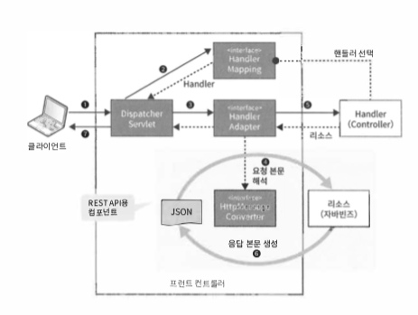

\#spring #RESTful

## #REST_API

- Representational State Transfer
- 데이터 전송 아키택처
- 클라이언트에게 제공할 정보를 `리소스` 형태로 추출
- 추출된 리소스에 접근하기 위한 수단으로 API 제공


### #ROA

- Resource Oriented Architecture
  - ROA는 Restful 웹애플리케이션을 구축하기 위한 아키택처 정의

- 특징
  - 웹 리소스로 Public한 공개범위
  - URI를 통한 식별 (Uniform Resource Identifier)
  - HTTP Method를 통한 리소스 조작
  - HTTP 상태코드 사용
  - 적절한 포맷 (xml, json ..)
  - 클라이언트와 서버간 무상태 통신
  - 연관된 리소스 링크 포함 (HATEOAS - Hypermedia as the Engine of Application State)
  - 버전을 관리하며 하위호환성을 유지


#### #웹리소스로공개

- 클라이언트에 제공할 정보는 웹리소스로 공개
- HTTP 프로토콜을 이용해서 접근

#### #URI식별

- 웹에 공개할 리소스에 그 리소스를 고유하게 식별할 수 있는 URI(Uriform Resource Identifier)를 할당

- 네트워크에 연결되어 있다면 어디서든 같은 리소스에 접근

- `NamingRule`

  - 명사를 많이 사용하며, 단수보단 복수명사를 많이 사용합니다.
  - 되도록이면 추상적인 이름보다 구체적인 이름을 사용합니다.

  

#### #HTTPMethod

- CRUD 조작을 ( GET, POST, PUT, DELETE, PATCH )와 같은 메서드로 구분

  - `GET` : URI에 지정된 리소스를 가져옴
  - `POST` : 리소스를 생성하고 생성된 리소스에 접근하는 URI 반환
  - `PUT` : URI에 지정한 리소스를 갱신, 없다면 생성
  - `DLEETE` : URI에 지정한 리소스를 삭제
  - `PATCH` : URI에 지정한 리소스를 갱신, 없다면 실패해야합니다.
  - `HEAD` , `OPTIONS` .. 

- `PUT vs PATCH`

  - > `PATCH` 요청은 한 위치에서 리소스의 일부를 변경하는 데 사용됩니다. 
    > 즉, 리소스를 패치 (해당 속성 변경)합니다. 
    > 자원에 대한 사소한 업데이트를하는 데 사용되며 멱등 원일 필요는 없습니다.
    >
    > `PATCH`는 멱등원(Idempotent)이 아니므로 실패한 요청은 네트워크에서 자동으로 재 시도되지 않습니다. 
    > 또한 존재하지 않는 URL에 대한 PATCH 요청이있는 경우 PUT과 달리 새 리소스를 만들지 않고 실패해야합니다. 
    > `PUT`은 페이로드를 사용하여 새 리소스를 만듭니다. 

#### #적절한포맷

- json
- xml

#### #HTTP상태코드

- 클라이언트에 응답할때 HTTP 상태 코드를 설정
- 서버측의 처리결과를 알려주기 위한 것
  - 1xx : 요청을 접수하고 처리를 계속하고 있음
  - 2xx : 요청을 접수하고 처리가 완료됬음
  - 3xx : 요청을 완료하기 위해 추가적인 처리(리다이렉트 등등)가 필요
  - 4xx : 요청에 결함이 있어 처리를 중단
  - 5xx : 요청에 대해 서버가 제대로 처리하지 못함
- HTTP의 상태코드는 어떤 경우에 어떤 코드가 사용되는지가 `RFC(Request for Comments)`문서에 정의

[참조] <https://ko.wikipedia.org/wiki/HTTP_%EC%83%81%ED%83%9C_%EC%BD%94%EB%93%9C>

#### #무상태통신

- 서버는 클라이언트의 요청 데이터만으로 처리
- 서버와 HTTP세션과 같은 공유 메모리를 사용하지 않고 요청 데이터만으로 리소스 조작
- 무상태(stateless)통신을 구현할때 애플리케이션 상태를 클라이언트 측의 애플리케이션에서 관리

#### #HATEOAS

- 리소스에는 관련된 다른 리소스나 서브 리소스에 대한 하이퍼미디어링크(URI)를 포함합니다.
- 이것은 관련된 리소스끼리 서로 링크를 가짐으로 링크만 따라가면 연관된 모든 리소스에 접근할 수 있게 만드는 것입니다.
- 클라이언트와 서버간의 결합도를 낮춥니다.
  - 즉, 다음 하이퍼링크를 클라이언트가 직접 구현하지 않아도 됩니다. 

```json
{
  "login" : "spring-project",
  "id" : 1234,
  "_links" : {
    "self" : {
      "href" : "http://localhost:8080/users/spring-projects"
    },
    "users" : {
      "href" : "http://localhoost:8080/users"
    }
  }
}
```


## #프레임워크아키텍처





- REST API는 스프링 MVC를 활용해서 구현
  - 응답 본문을 생성하기 위한 뷰를 사용하지 않음
  - 요청 본문 해석과 응답 본문 생성은 `HttpMessageConverter`라는 컴포넌트에서 처리
  - `DispatcherServlet -> HandlerAdapter -> HttpMessageConverter(JSON <-> POJO)`

### #HttpMessageConverter

- org.springframework.http.converter.HttpMessageConverter
- 요청본문을 자바 객체로 변환하고 자바 객체를 응답 본문으로 변환
- `RestTemplate(클래스)`는 HttpMessageConverter를 사용해 자바객체를 요청본문으로 응답본문을 자바객체로 변환


### #HttpMessageConverter구현클래스

- `ByteArrayHttpMessageConverter`
  - 본문(임의의 미디어 타입) <-> 바이트배열 변환용 클래스
- `StringHttpMessageConverter`
  - 본문(텍스트 형식의 미디어 타입) <-> String 변환용 클래스
- `ResourceHttpMessageConverter`
  - 본문(임의의 미디어 타입) <-> org.springframework.core.io.Resource.구현클래스 변환용 클래스
- `AllEncompassingFormHttpMessageConverter`
  - 본문(폼 형식 또는 멀티파트 형식의 미디어 타입) <-> org.springframework.util.MultiValueMap 변환용 클래스
  - 멀티파트 형식을 사용할 때, MultiValueMap에서 본문으로의 변환은 할 수 있으나, 그 반대 변환은 지원하지 않음
- `MappingJackson2HttpMessageConverter`
  - FasterXML Jackson Databind를 이용한 본문(JSON 형식의 미디어 타입) <-> 임의의 자바빈즈 변환용 클래스
- `MappingJackson2HttpMessageConverter`
  - Google Gson을 이용한 본문(JSON 형식의 미디어 타입) <-> 임의의 자바빈즈 변환용 클래스
- `Jaxb2RootElementHttpMessageConverter`
  - 자바표준의 JAXB2를 사용한 본문(XML형식의 미디어 타입) <-> 임의의 자바빈즈 변환용 클래스

> 리소스 클래스

```json
{
    "login" : "spring-project",
    "id" : 1234,
    "name" : "Spring",
    "blog" : "http://spring.io/projects"
}
```

```java
public class UserResource implements Serializable {
  private static final long serialVersionUID = -3106927618180228823L;
  private String login;
  private Integer id;
  private String name;
  private String blog;
}
```


### #HttpMessageConverter설정

> HttpMessageConverter 적용

- `@EnableWebMvc` 를 사용하면 `HttpMessageConverter` 가 자동으로 적용됩니다.

> HttpMessageConverter 커스텀

- `WebMvcConfigurerAdapter` 의 `extendMessageConverters` 메서드를 오버라이드합니다.
  - 메서드의 매개변수에는 기본 HttpMessageConverter가 저장된 리스트가 전달
- 인수로 받은 리스트의 첫번째 요소에 임의의 `HttpMessageConverter` 를 추가

```java
@EnableWebMvc
@Configuration
public class WebMvcConfig extends WebMvcConfigurerAdapter {
  @Bean
  public MappingJackson2HttpMessageConverter mappingJackson2HttpMessageConverter() {
    return new MappingJackson2HttpMessageConverter(
      Jackson20bjectMapperBuilder
      .json()
      .indentOutput(true)
      .build());
  }

  @Override
  public void extendMessageConverters(List〈HttpMessageConverter〈?〉〉 converters) {
    converters.add(0, mappingJackson2HttpMessageConverter()); 
  }
}
```

### #HiddenHttpMethodFilter

- ServletContainer설정
  - REST제공시에 HTTP메서드로 사용하지만 웹브라우저와 같은 REST클라이언트에서 GET/POST만 지원하는 경우가 있음
  - 이런 클라이언트에는 `HiddenHttpMethodFilter` 를 사용할 수 있음

  - 물리적인 통신에서 POST 메서드를 사용하더라도 서블릿 컨테이너 내부에서는 요청 파라미터를 받아 HTTP 메서드로 인식
  - 만약 클라이언트에서 `_method=put`이라는 요청 파라미터를 보냈다면 서블릿 컨테이너는 PUT메서드로 처리하는 것처럼 흉내가 가능

```xml 
〈filter〉
	〈filter-name〉HiddenHttpMethodFilter〈/filter-name>
	〈filter-class〉org.springframework.web.filter.HiddenHttpMethodFilter〈/filter-class〉 
〈/filter〉
〈filter-mapping〉 
	〈filter-name〉HiddenHttpMethodFilter〈/filter-name〉 
	〈url-pattern〉*〈furl-pattern〉
〈/filter-mapping〉
```