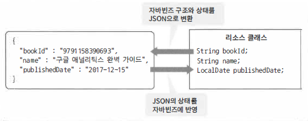

## Resource

- 리소스 클래스는 JSON 이나 XML 형식의 데이터를 자바빈즈로 표현한 클래스
- 스프링 MVC는 리소스 클래스를 통해서 서버오 클라이언트 사이의 리소스 상태를 연계하는 역할을 합니다.

 

> 요청된 JSON

```java
{
  "bookId" : "bookId",
  "name" : "moon",
  "publishedDate" : "2018-08-20",
  "authors" : [ "tom", "bob", "jany" ],
  "publisher" : {
    "name" : "MoonsCoding",
    "tel" : "02-1234-5678"
  }
}
```

> 변환된 Resource
>
> - JSON과 연동할 POJO 클래스를 만든다. 클래스명에 특별한 제한은 없으나 접미사 `Resource`로 명명하는 것을추천
> - JSON 필드명과 같은 프로퍼티명을 만든다.
>   - 만약, 이름이 다를경우 `@JsonProperty` 를 이용해서 이름을 매핑합니다. 
> - 여러개를 다뤄야할때는 `List`를 사용
> - 프로퍼티 타입에 적절한 

```java
public class BookResource implements Serializable {
    private static final long serialVersionUID = -9115030674240690591L;
    private String bookId;
    private String name;
    private List<String> authors;
    @DateTimeFormat(pattern="yyyy-MM-dd")
    private LocalDate publishedDate;
    private BookPublisher publisher;

    public static class BookPublisher implements Serializable {
        private static final long serialVersionUID = -8119817744873562082L;
        private String name;
        private String tel;
    }
}
```


### Jackson

- 포맷제어에 이용한는 서드파티 라이브러리
  - JSON 들여쓰기 설정
  - 언더스코어('\_')로 구분되는 JSON 필드를 다루는 법
  - Java SE8에서 추가된 Date and Time API 클래스를 지원
  - 날짜/시간 타입의 포맷을 지정

> 애너테이션 종류

- @JsonProperty
- @JsonIgnore
- @JsonInclude
- @JsonIgnoreProperties
- @JsonPropertyOrder
- @JsonSerialize
- @JsonDeserialize

> 기능

- Jackson2ObjectMapperBuilder
- Jackson2ObjectMapperFactoryBean

> Jackson2ObjectMapperBuilder 예

```Java
@Bean
ObjectMapper objectMapper() {
  return Jackson2ObjectMapperBuilder.json()
    // 옵션설정
    .build();
}
```

> JSON 들여쓰기 처리방법

```java
@Bean
ObjectMapper objectMapper() {
  return Jackson2ObjectMapperBuilder.json()
    .indentOutput(true)
    .build();
}
```

> Date and Time 클래스 지원

```xml
<dependency>
    <groupId>com.fasterxml.jackson.datatype</groupId>
    <artifactId>jackson-datatype-jsr310</artifactId>
  </dependency>
```

> Date and Time 포맷지정방법

```java
@Bean
ObjectMapper objectMapper() {
  return Jackson2ObjectMapperBuilder.json()
    .indentOutput(true)
    .dateFormat(new StdDateFormat())
    .build();
}
```

- ISO 8601 날짜/시간형식(yyyy-MM-dd)로 처리
- StdDateFormat 포맷 종류
  - LocalDate : yyyy-MM-dd
  - LocalDateTime : yyyy-MM-dd'T'HH:mm:ss:SSS
  - ZonedDateTime : yyyy-MM-dd'T'HH:mm:ss:SSS'Z'
  - LocalTime HH:mm:ss.SSS

### Jackson 활용

> Json -> POJO

```java
// Json File에서 읽기
MyValue valueA = mapper.readValue(new File("data.json"), MyValue.class);

//  URL 에서 읽기
MyValue valueaB = mapper.readValue(new URL("http://some.com/api/entry.json"), MyValue.class);

// String 으로 읽기
MyValue valueC = mapper.readValue("{\"name\":\"Bob\", \"age\":13}", MyValue.class);
```

> POJO -> Json

```java
ObjectMapper mapper = new ObjectMapper();

MyValue  myResultObject = new MyValue();
myResultObject.name = "MyName";
myResultObject.age= 11;

// result.json 파일로 저장
mapper.writeValue(new File("result.json"), myResultObject);

// byte[] 로 저장
byte[] jsonBytes = mapper.writeValueAsBytes(myResultObject);

// string 으로 저장
String jsonString = mapper.writeValueAsString(myResultObject);
```