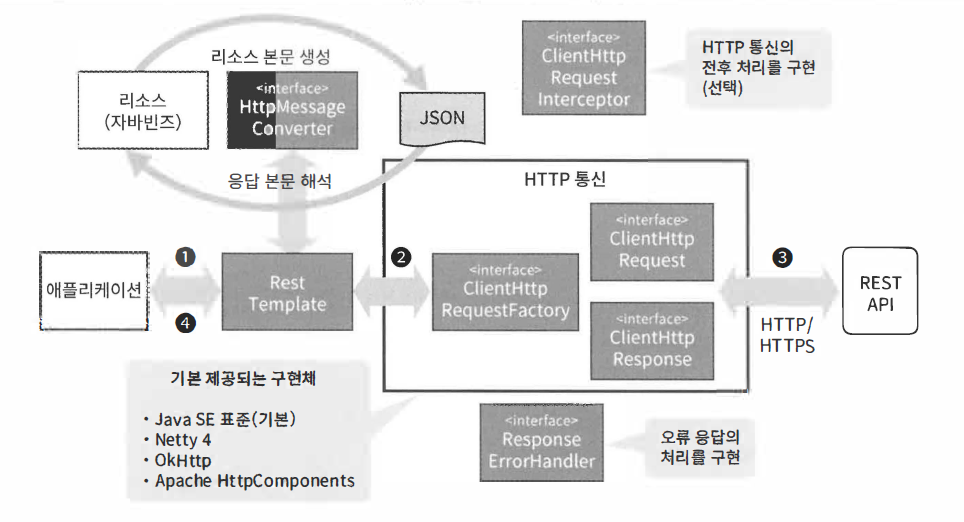

\#spring #REST #RestTemplate

## REST API 호출방법

- 서드파티의 HTTP 클라이언트 라이브러리를 사용
- JDK 1.1부터 추가된 java.net.HttpURLConnection 클래스사용


### #RestTemplate

- RestTemplate은 REST API 호출시에 사용할 메서드를 제공합니다.


> RestTemplate 구현예제

- 요청 URI 조립
- HTTP 요청 전송
- HTTP 응답 수신
- 응답 본문을 자바 객체로 변환

```java
RestTemplate restTemplate = new RestTemplate();

GitHubUser resource = restTemplate.getForObject(
	"https://api.github.com/users/{username}", GitHubUser.class, "spring-projects");

System.out.println(resource .getLogin());
```


> RestTemplate 아키텍처

- 애플리케이션은 RetTemplate의 메서드 호출후 REST API 호출을 의뢰
- RestTemplate은 HttpMessageConverter를 사용해서 자바 객체를 메시지(JSON 등등)로 변환
- ClientHttpRequestFactory에서 가져온 ClientHttpRequest에게 메시지 전송
- ClientHttpRequest는 JAVA SE 표준 클래스나 서드파티 라이브러리의 클래스를 사용해서 HTTP 프로토콜로 메시지를 전송
- RestTempalate은 REST APU로 부터 응답받은 메시지를 HttpMessageConverter를 사용해서 자바 객체로 변환하고 애플리케이션에 반환




> RestTemplate 구성컴포넌트

- 엔터프라이즈 애플리케이션을 개발할 때는 아래와 같이 커스텀할 일이 발생할 수 있기 때문에 다음을 알아두는 것이 좋습니다.
  - 독자적인 메시지형식을 지원
  - 공통 처리를 추가
  -  오류 처리 과정을 확장

- 종류
  - org.springframework