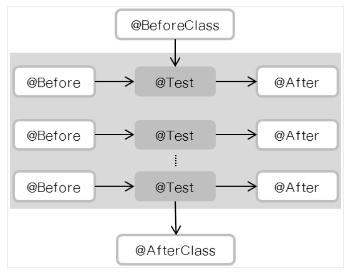

## JUnit API

| Method                                 | Desc                            |
| -------------------------------------- | ------------------------------- |
| assertArrayEquals(a,b)                 | 배열 a, b 가 일치함을 확인      |
| assertEquals(a, b)                     | 객체 a, b 가 일치함을 확인      |
| assertSame(a, b) / assertNotSame(a, b) | 객체 a, b 가 같은 객체임을 확인 |
| assertTrue(a) / assertFalse(a)         | a 가 True / Flase 인지 확인     |
| assertNotNull(a)                       | a 객체가 Null이 아님을 확인     |

http://junit.sourceforge.net/javadoc/org/junit/Assert.html


### JUnit Flow

- setUp()
  - 테스트 대상 클래스의 실행전에 가장 먼저 setUp() 실행
  - 네트워크 연결 / DB 연결에 활용
- tearDown() 
  - 가장 마지막에 수행되면 setUp() 반대 개념
  - 네크워크 종료 / DB 연결 종료에 활용
- setUp() / tearDown() 은 테스트 진행전에 반복적으로 실행



## JUnit Annotation


### @Test

- Test 메소드임을 의미


### @BeforeClass, @AfterClass

- @BeforeClass
  - 해당 테스트가 시작 전에 딱 한번만 수행

- @AfterClass
  - 해당 테스트가 끝나고 딱 한번만 수행

``` java
public class Example { 

    @BeforeClass
    public static void onlyOnce() {

    }

    @AfterClass public static void logout() {

    }

}
```

### @Ignore 

- TestCase를 무시


## Order

https://www.baeldung.com/junit-5-test-order


> Junit4 
>
> If you're still using JUnit 4, the APIs for ordering tests are slightly different.
>
> Let's go through the options to achieve this in previous versions as well.

### @FixMethodOrder

- `@FixMethodOrder(MethodSorters.DEFAULT)`
  - 이 기본 전략은 해시 코드를 사용하여 테스트 방법을 비교합니다. 해시 충돌의 경우 사전 사전 순서
  - 일일히 hashCode를 찾아보지 않는 이상 실행 순서 예측 어려움
- `@FixMethodOrder(MethodSorters.JVM)`
  - 또 다른 순서 전략은 MethodSorters.JVM입니다.이 전략은 고유 한 JVM 순서를 사용하며 각 실행마다 다를 수 있습니다.
  - getDeclaredMethods()에서 가져온 method 순서대로 실행
  - JVM은 getDeclaredMethods()는 시스템의 리소스 상황에 따라 다른 순서로 결과를 보냄(보장할 수 없음) 
- `@FixMethodOrder(MethodSorters.NAME_ASCENDING)`
  - 마지막으로이 전략은 사전 형 순서로 테스트를 실행하는 데 사용할 수 있습니다.


> Junit5

### @Order 

> Spring AOP에서 동일한 target 클래스에 결합되는 Aspect의 우선순위는 `Ordered` 인터페이스를 구현하거나 `@Order `애노테이션으로 지정

```java
@TestMethodOrder(OrderAnnotation.class)
public class OrderAnnotationUnitTest {
    
    @Test
    @Order(1)    
    public void firstTest() {
        output.append("a");
    }
     
    @Test
    @Order(2)    
    public void secondTest() {
        output.append("b");
    }
    
}
```


## JUnit Exception

- JUnit4 부터 에너테이션으로 처리 가능

```java
@Rule
public ExpectedException expectedExcetption = ExpectedException.none();

@Test
public void testBadlyFormattedName() throws Exception {
    expectedExcetption.expect(UserCustomException.class);
    expectedExcetption.expectMessage("customized exception");
    App app = new App();
    app.occurExceptionWithMessage();
}
```


## Private Field & Method

- Don't test private methods.
- Give the methods package access.
- Use a nested test class.
- Use reflection.


https://nesoy.github.io/articles/2017-02/JUnit

https://blog.outsider.ne.kr/659