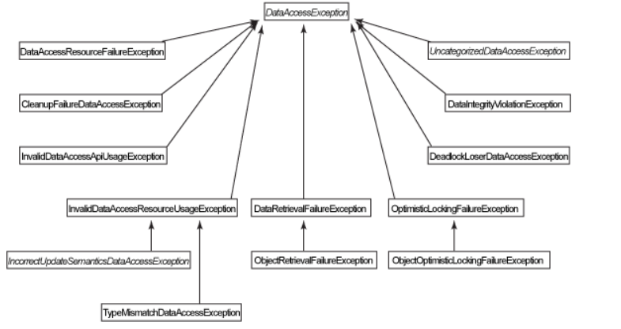

\#spring #datasource

---

## DataSource

- `DataSource` 애플리케이션이 데이터베이스에 접근하기 위한 추상화된 연결방식
- 커넥션을 제공


### #설정

> pom.xml

```xml 
<dependency>
  <groupId>org.springframework</groupId>
  <artifactId>spring-jdbc</artifactId>
</dependency>
```

> property

```bash
database.driverClassName=org.postgresql.Driver
database.url=jdbc:postgresql://localhost/sample
database.username=demo
database.password=pass
cp.maxTotal=96
cp.maxIdle=16
cp.minIdle=0
cp.maxWaitMillis=60000
```

#### #모듈제공 데이터소스

- `Common DBCP`나 `Tomcat JDBC Connection Pool`과 같이 서드파티가 제공하는 데이터소스
- `DriverManagerDataSource`같이 스프링이 테스트 용도로 제공하는 데이터소스를 빈으로 등록
- `Commons DBCP`와 같은 커넥션풀을 데이터소스로 사용하는 경우

```java
@Configuration
@PropertySource("classpath:jdbc.properties")
public class PoolingDataSourceConfig {
  @Bean(destroyMethod="close")
  public DataSource dataSource(
      @Value("${database.driverClassName}") String driverClassName,
      @Value("${database.url}") String url,
      @Value("${database.username}") String username,
      @Value("${database.password}") String password,
      @Value("${cp.maxTotal}") String maxTotal,
      @Value("${cp.maxIdle}") String maxIdle,
      @Value("${cp.minIdle}") String minIdle,
      @Value("${cp.maxWaitMillis}") String maxWaitMillis) {
    BasicDataSource dataSource = new BasicDataSource();
    dataSource.setDriverClassName(driverClassName);
    dataSource.setUrl(url);
    dataSource.setUsername(username);
    dataSource.setPassword(password);
    dataSource.setDefaultAutoCommit(false);
    dataSource.setMaxTotal(maxTotal);
    dataSource.setMaxIdle(maxIdle);
    dataSource.setMinIdle(minIdle);
    dataSource.setMaxWaitMillis(maxWaitMillis);
    return dataSource;
  }
}
```

#### #서버제공 데이터소스

- `JNDI(Java Naming and Directory Interface)`를 통해 가져와서 사용
- `jdbc/mydb` JNDI명의 커넥션풀이 있다는 가정

```java
@Configuration
public class JndiDataSourceConfig {
  @Bean
  public DataSource dataSource() {
    JndiTemplate jndiTemplate = new JndiTemplate();
    return jndiTemplate.lookup("java.comp/env/jdbc/mydb", DataSource.class);
  }
}
```

#### #내장 데이터소스

- `HSQLDB, H2, Apache Derby` 등등 프로토타입을 위해 사용
- 애플리케이션 구동시 DB가 새로 구축되므로 `DDL, DML`이 추가적으로 필요

```java
@Configuration
public class DataSourceEmbeddedConfig {
    @Bean
    public DataSource dataSource() {
        return new EmbeddedDatabaseBuilder()
            .setType(EmbeddedDatabaseType.H2)
            .setScriptEncoding("UTF-8")
            .addScript("META-INF/sql/schema.sql", "META-INF/sql/insert-init-data.sql")
            .build();
    }
}
```


### #Exception

#### #DataAccessException

- 스프링의 데이터접근 예외처리는 `DataAccessException`를 부모 클래스로 하는 계층 구조





> 비검사예외

- `DataAccessException`은 `RuntimeException`의 자식클래스로 구현
- 비검사예외처리가 가능


#### #DataIntegrityViolationException

> 구현을 은폐한 데이터 접근 예외

- 데이터 접근 방법의 차이와 데이터베이스의 의 차이로 발생하는 데이터 접근 예외는 모두 각자 개별적으로 정의한 예외를 반환
- `DataIntegrityViolationException`은 일관된 예외처리가 가능


#### #예외처리

- 데이터접근예외는 비검사예외로 구현되어 예외처리가 필요하다면 예외가 발생할 곳에 `try-catch`문을 사용

```java
public Room getRoomForUpdate(String roomId) {
    Room room = null;
    try {
        room = roomDao.getRoomForUpdate(roomId);
    } catch(DataRetrievalFailureException e) {
        throw new NotFoundRoomIdException("roomId=" + roomId, e);
    }
    return room;
}
```


#### #변환규칙커스텀

- 데이터베이스 오류 코드 및 데이터 접근 예외에 관련된 내용은 `spring-jdbc-xxx.jar`에 포함된 `sql-error-codes.xml`을 사용
- 클래스패스 바로 아래 `sql-error-codes.xml`을 두고 그 내용을 재정의하면 기본 설정된 내용을 커스텀 가능

> H2 오류코드정의 (org/springframework/jdbc/support/sql-error-codes.xml)

```xml
<bean id="H2" class="org.springframework.jdbc.support.SQLErrorCodes">
    <property name="badSqlGrammarCodes">
        <value>42000,42001,42101,42102,42111,42112,42121,42122,42132</value>
    </property>
    <property name="duplicateKeyCodes">
        <value>23001,23505</value>
    </property>
    <property name="dataIntegrityViolationCodes">
        <value>22001,22003,22012,22018,22025,23000,23002,23003,23502,23503,23506,23507,23513</value>
    </property>
    <property name="dataAccessResourceFailureCodes">
        <value>90046,90100,90117,90121,90126</value>
    </property>
    <property name="cannotAcquireLockCodes">
        <value>50200</value>
    </property>
</bean>
```

> 커스텀 오류코드정의 (클래스패스 바로 아래)

```xml
<bean id="H2" class="org.springframework.jdbc.support.SQLErrorCodes">
    <property name="badSqlGrammarCodes">
        <value>42000,42001,42101,42102,42111,42112,42121,42122,42132</value>
    </property>
    <!--<property name="duplicateKeyCodes">
        <value>23001,23505</value>
    </property>-->
    <property name="dataIntegrityViolationCodes">
        <value>23001,23505,22001,22003,22012,22018,22025,23000,23002,23003,23502,23503,23506,23507,23513</value>
    </property>
    <property name="dataAccessResourceFailureCodes">
        <value>90046,90100,90117,90121,90126</value>
    </property>
    <property name="cannotAcquireLockCodes">
        <value>50200</value>
    </property>
</bean>
```

