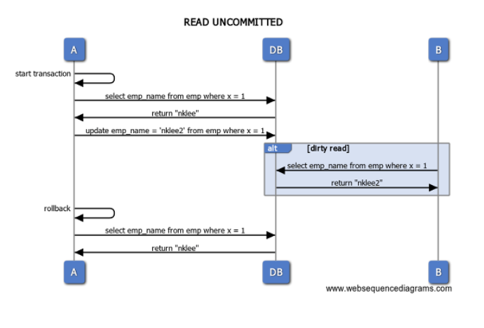

\#spring #transaction

---

## Transaction

- 선언적 방법
- 프로그램적인 방법(직접 commit & rollback 선언)


### #PlatformTransactionManager

- 트랜잭션 처리에 필요한 API 제공
- 개발자가 API를 호출하는 것으로 트랜잭션 조작

> 구현클래스

- `DataSourceTransactionManager`
  - JDBC & MyBatis 사용시
- `HibernateTransactionManger`
  - Hibernate 사용시
- `JpaTransactionManager`
  - JPA 사용시
- `JtaTransactionManager`
  - JTA에서 트랜잭션을 관리시
- `WebLogicJtaTransactionManager`
  - 애플리케이션 서버인 웹로직(WebLogic)이 JTA에서 트랜잭션을 관리시
- `WebSphereUowTransactionManager`
  - 애플리케이션 서버인 웹스피어(WebSphere)의 JTA에서 트랜잭션을 관리시


### #로컬트랜잭션

- `DataSourceTransactionManager`
- 단일 데이터저장소에 대한 트랜잭션 (일반적으로 자주사용)
- `transactionManager`라는 아이디값이 Default로 설정 (명시하여 변경가능)

> 빈정의 

```xml
<bean id="transactionManager" class="org.springframework.jdbc.datasource.DataSourceTransactionManager">
  <property name="dataSource" ref="dataSource" />
</bean>

<!-- @Trasaction 이용하는경우 -->
<tx:annotation-driven />
<!-- <tx:annotation-driven transaction-manager="txManager" /> -->
```


### #글로벌트랜잭션

- 여러 데이터 저장소에 걸쳐 적용되는 트랜잭션
- `JTA(Java Transaction API)`라는 JavaEE 사양으로 표준화
- 애플리케이션 서버가 JTA의 구현클래스 제공 `JtaTransactionManager`

> 빈정의

```xml
<tx:jta-transaction-manager />
```


### #선언적트랜잭션

- 미리 선언된 룰에 따라 트랜잭션 제어
- 트랜잭션 `시작과 커밋, 롤백`등 일반적이 처리를 비즈니스 로직안에 기술하지 않음


#### #@Transactional

- 빈의 public 메서드에 추가
- 대상 메서드의 시작/종료에 맞춰 트랜잭션을 `시작과 커밋`을 진행
- 예외가 발생하면 자동으로 `롤백` 처리


#### #Option

- `value` ( = `transactionManager` )
  - 트랜잭션 관리자의 `qualifier`지정 
  - Default : 생략
  - [EX] @Transactional("tx1")
- `propagation`
  - 전파방식
- `isolation`
  - 격리수준
- `timeout`
  - 트랜잭션 제한시간 지정 
  - Default : -1
- `readOnly`
  - 읽기전용 플래그를 지정
  - Default : false
- `rollbackFor`
  - 지정한 예외 발생시 롤백
  - 예외 클래스명을 여러개 나열 가능 ( `,`로 구분 )
  - 따로 지정하지 않으면 `RuntimeException`과 같은 비검사 예외가 발생시 트랜잭션 롤백
- `rollbackForClassName`
  - 지정한 예외가 발생시 롤백
  - 예외 클래스명을 여러개 나열 가능 ( `,`로 구분 )
- `noRollbackFor`
  - 지정한 예외가 발생해도 트랜잭션 롤백하지 않음
  - 예외 클래스명을 여러개 나열 가능 ( `,`로 구분 )
- `noRollForClassName`
  - 지정한 예외가 발생해도 트랜잭션 롤백하지 않음
  - 예외 클래스명을 여러개 나열 가능 ( `,`로 구분 )


#### #활용

- `@Transactional`은 클래스와 메서드에 부여가능 ( 적용범위 차이 )
  - @Transactional 클래스는 메서드 전체가 트랜잭션 적용대상
  - @Transactional(readOnly = true)를 통해 개별적으로 트랜잭션 재정의

> 설정

```java
@Configuration
@EnableTransactionManagement
public class TransactionManagerConfig {
  @Autowired
  DataSource dataSource;

  @Bean
  public PlatformTransactionManager transactionManager() {
    return new DataSourceTransactionManager(dataSource);
  }
}
```

> 사용

```java
public interface RoomService {
  Room getRoom(String roomId);
  void insertRoom(Room room);
}

@Transactional
@Service("roomService")
public class RoomServiceImpl implements RoomService {
    @Autowired
    JdbcRoomDao jdbcRoomDao;

    @Transactional(readOnly = true)
    @Override
    public Room getRoom(String roomId) {
        return jdbcRoomDao.getRoomById(roomId);
    }

    @Override
    public void insertRoom(Room room) {
        jdbcRoomDao.insertRoom(room);
        List<Equipment> equipmentList = room.getEquipmentList();
        for(Equipment item : equipmentList) {
            jdbcRoomDao.insertEquipment(item);
        }
    }
}
```


### #명시적트랜잭션

- 메서드 단위보다 더 작은 단위로 트랜잭션을 처리할 경우


#### #PlatformTransactionManager

- `TransactionDefinition` & `TransactionStatus`
  - 트랙잭션의 시작과 커밋 그리고 롤백을 명시적을 처리

```java
@Service
public class RoomServiceImpl implements RoomService {
    
    @Autowired
    PlatformTransactionManager txManager;
    
    @Autowired
    JdbcRoomDao roomDao;

    @Override
    public void insertRoom(Room room) {
        DefaultTransactionDefinition def = new DefaultTransactionDefinition();
        def.setName("InsertRoomWitEquipmentTx");
        def.setReadOnly(false);
        def.setPropagationBehavior(TransactionDefinition.PROPAGATION_REQUIRED);
        TransactionStatus status = txManager.getTransaction(def);
        try {
            roomDao.insertRoom(room);
            List<Equipment> equipmentList = room.getEquipmentList();
            for(Equipment item : equipmentList) {
                roomDao.insertEquipment(item);
            }
        } catch(Exception e) {
            txManager.rollback(status);
            throw new DataAccessException("error occurred by insert room" e) {};
        }
        txManager.commit(status);
    }
}
```


#### #TransactionTemplate

- 앞선 PlatformTransactionManager 보다 구조적인 트랜잭션 제어가 가능
- `TransactionCallback`인터페이스가 제공하는 메소드에 구현
- `TransactionTemplate`의 `execute()` 에 인수로 전달
  - 반환값이 있건 없건 모두 수행
    - 반환값이 있으면 
      - `TransactionCallback` 객체를 인수로 가짐
      - `doInTransaction` 구현하여 필수처리로직 구현
    - 반환값이 없으면 
      - `TransactionCallbackWithoutResult` 객체를 인수로 가짐
      - `doInTransactionWithoutResult` 구현하여 필수처리로직 구현
- `JdbcTemplate`과 같은 방식을 사용하기 때문에 필수처리로직만 구현

> 설정

```java
@Configuration
public class AppConfig {

    @Bean
    public TransactionTemplate transactionTemplate(PlatformTransactionManager transactionManager) {
        TransactionTemplate transactionTemplate = new TransactionTemplate(transactionManager);
        transactionTemplate.setIsolationLevel(TransactionDefinition.ISOLATION_READ_COMMITED);
        transactionTemplate.setTimeout(30);
        return transactionTemplate;
    }
}
```

> 활용

```java
@Service
public class RoomServiceImpl implements RoomService {
    
    @Autowired
    TransactionTemplate transactionTemplate;

    @Autowired
    JdbcRoomDao roomDao;

    @Override
    public void insertRoom(final Room room) {
        // 반환값없음 - TransactionCallbackWithoutResult & doInTransactionWithoutResult
        transactionTemplate.execute(new TransactionCallbackWithoutResult() {
            @Override
            protected void doInTransactionWithoutResult(TransactionStatus status) {
                roomDao.insertRoom(room);
                List<Equipment> equipmentList = room.getEquipmentList();
                for(Equipment item : equipmentList)
                    roomDao.insertEquipment(item);
            }
        })
    }
}
```


### #Isolation(격리수준)

- 참조하는 데이터나 변경한 데이터를 다른 트랜잭션으로 부터 어떻게 격리할지 결정
- 격리수준은 여러 트랜잭션의 동시실행과 데이터의 일관성과 관련이 있음
  - `@Transactional`의 `isolation` 옵션으로 설정
  - `TransactionDefinition` & `TransactionTemplate`의 `setIsolational()` 로 설정


> 스프링지원 Isolation의 종류

- `DEFAULT`
  -  사용하는 DB의 기본 격리수준
- `READ_UNCOMMITTED`
  - 더티리드(Dirty Read), 반복되지않은읽기(Unrepeatable Read), 팬텀읽기(Phantom Read)가 발생
  - 커밋되지 않은 변경데이터를 다른 트랜잭션에서 참조하는 것을 허용
  - [문제] 만약 데이터가 롤백된 경우 다음 트랜잭션에서 무효한 데이터를 조회



- `READ_COMMITED`
  - 더티리드(Dirty Read)는 방지하고, 반복되지않은읽기(Unrepeatable Read), 팬텀읽기(Phantom Read)는 발생
  - 커밋되지 않은 변경데이터를 다른 트랜잭션에서 참조하는 것을 금지


- `REPEATABLE_READ`
  - 더티리드(Dirty Read), 반복되지않은읽기(Unrepeatable Read)는 방지하고, 팬텀읽기(Phantom Read)는 발생
  - 다른 트랜잭션의 영향을 받지 않음
  - 항상 일관성 있는 데이터 읽기를 보장하는 레벨


- `SERIALIZABLE` (직렬화기능)
  - 더티리드(Dirty Read), 반복되지않은읽기(Unrepeatable Read), 팬텀읽기(Phantom Read) 모두 방지
  - 트랜잭션이 완료될 때까지 select 문장이 사용하는 모든 데이터에 `Shared Lock`이 설정되므로, 
    다른 트랜잭션은 해당 영역에 대해서 데이터 처리가 불가
  - 가장 높은 격리 수준 ( 성능의 저하를 야기할 수 있음 )


### #Propagation(전파방식)

- 트랜잭션의 경계에서 트랜잭션에 참여하는 방법을 결정
- 트랜잭션 경계가 중첩됬다면 전파방식 고려가 필요
  - `@Transactional`의 `propagation` 옵션으로 설정
  - `TransactionDefinition`과 `TransactionTemplate`의 `setPropagationBehavior()`로 설정


> 스프링지원 Propagation의 종류

- `REQUIRED` 
  - 앞서 만들어진 트랜잭션이 존재하면, 해당 트랜잭션 관리 범위에 포함
  - 존재하지 않으면 트랜잭션 생성
- `REQUIRED_NEW` 
  - 반드시 새로운 트랜잭션 생성
  - 앞서 트랜잭션이 연결중이라면, 보류상태가 되어 끝나기를 대기
- `MANDATORY` 
  - 앞서 만들어진 트랜잭션 범위에 포함
  - 만들어진 트랜잭션이 없다면 예외발생
- `SUPPORTS`
  - 앞서 만들어진 트랜잭션범위에 포함
  - 없다면 트랜잭션 관리를 하지 않음
- `NOT_SUPPORTED` 
  - 트랜잭션 관리하지 않음
  - 만들어진 트랜잭션이 있다면 이전 트랜잭션이 끝나는 것을 기다림
- `NEVER`
  - 트랜잭션 관리하지 않음
  - 만들어진 트랜잭션이 있다면 예외발생

- `NESTED`
  - `REQUIRED` 와 같이 동작하며 중첩된 트랜잭션처럼 취급
  - `REQUIRED` 와 차이
    - 트랜잭션안의 트랜잭션을 만든다는 것에 차이점
    - `NESTED`구간에서 롤백이 발생하면 구간안의 처리내용은 모두 롤백
    - `NESTED`구간밖에서 롤백이 발생하면 구각안의 처리내용은 롤백되지 않음
    - 단, 부모의 트랜잭션에서 롤백시 `NESTED`구간의 트랜잭션은 모두 롤백


### #Exception

