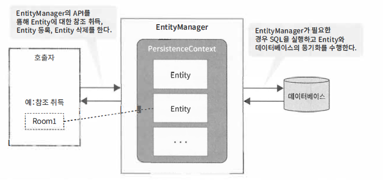
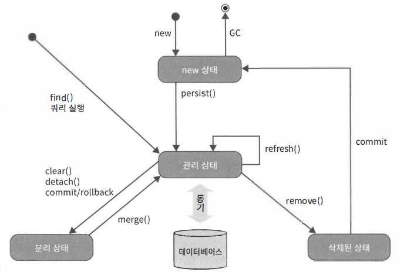

\@#spring #JPA

## ORM & JPA

- `ORM` ?

> Object Relational Mapping
> 관계형 DB에 데이터를 읽고 쓰는 처리를 객체에 데이터를 읽고 쓰는 방식으로 구현하는 기술

- `JPA` ?

> Java Persistence API
> 자바 표준 ORM
> JDBC에서 사용하던 SQL을 없애며, DB칼럼과 자바객체와의 매핑이 가능

- JDBC vs JPA

```java
public Room getRoomById(String roomId) {
  String sql = "SELECT room_id, room_name, capacity FROM room WHERE room_id = ? ";
  RowMapper<Room> rowMapper = new BeanPropertyRowMapper<Room>(Room.class);
  return getJdbcTemplate().queryForObject(sql, rowMapper, roomId);
}
```

```java
@PersistenceContext
EntityManager entityManager;

public Room getRoomById(String roomId) {
  return entityManager.find(Room.class, roomId);
}	
```


### #Entity

- DB에서 영속적으로 저장된 데이터를 자바객체로 매핑
- 메모리상에 자바객체의 인스턴스 형태로 존재
- `EntityManager`에 의해서 DB데이터와 동기화
- JPA가 제공하는 Annotation 사용

```java
@Entity
@Table(name="room")
public class Room implements Serializable {
    @Id
    @GeneratedValue
    @Column(name = "room_id")
    private Integer roomId;

    @Column(name="room_name")
    private String roomName;

    @Column(name = "capacity")
    private Integer capacity;
}
```

- `@Entity`
  - 해당클래스가 Entity로써 역할함을 알려줌
- `@Table`
  - 테이블명을 지정
  - 생략한 경우 클래스명을 UPPERCASE 처리한 테이블로 매핑
- `@Id`
  - 기본키
- `@EmbeddedId`
  - 기본키가 복합키인 경우
- `@GeneratedValeu`
  - 기본키 생성을 JPA에게 위임
  - strategy 속성에 `GeneationType`을 지정해서 생성방법지점
    - 기본값은 `GeneationType.AUTO`
    - DB의 최적키 생성방법이 자동으로 선택
- `@Column`
  - 매핑되는 컬럼명 지정
  - 생략하는 경우 프로퍼티명을 UPPERCASE 처리한 컬럼이름으로 매핑


### #EntityManager

- DB와 동기화 담당
- 영속성 컨텍스트 ( Persistence Context )라는 Entity를 관리하기 위한 영역
- DB의 데이터 접근시에 반드시 EntityManager를 통해 영속성 컨텍스트의 Entity를 취득하거나 새로운 것을 등록해야 합니다. 
- EntityManager가 Entity변경을 추적하 수 있어 적절한 타이밍에 DB 동기화




`영속성 컨텍스트`란 ?

> 내부의 캐시를 가지고 있으며 영속상태의 `엔티티`가 이곳에 저장됩니다.
> 결국 내부적인 캐시관리가 되기 때문에 쓰기지연이 발생할 수 있지만, 성능향상에는 유리합니다. 

- 과정
  - 조회할 데이터가 영속성 컨텍스트에 존재하는지 확인
  - 데이터가 없으면 쿼리 생성
  - 쿼리를 DB에 전송
  - 결과값을 영속성 컨텍스트가 전달받음
  - 전달 받은 데이터를 엔티티로 저장
  - 엔티티 인스턴스를 리턴


### #API

- `find`
  - T find(java.lang.Class entityClass, java.lang.Object primary Key)
    - 기본키를 지정해서 Entity를 검색하고 반환
    - 영속성 컨텍스트에 해당하는 Entity가 존재하지 않는 경우, DB SQL을 발행해 해당 데이터를 취득하고 Entity를 생성해서 반환
- `persist`
  - void persist(java.lang.Object entity)
    - 애플리케이션에서 생성한 인스턴스를 Entity로 영속성 컨텍스트에서 관리
    - SQL(INSERT)이 즉시 발행되지 않고 영속성 컨텍스트에 축적
- `merge`
  - T merge(T entity)
    - 영속성 컨텍스트에서 관리되고 있지만 분리 상태가 된 Entity를 영속성 컨텍스트에서 다시 관리
    - 관리상태의 경우 차이점을 추적할 수 없기 때문에 DB에 반영하기 위한 SQL(UPDATE)이 즉시 발행되지 않고 영속성 컨텍스트에 축적
- `remove`
  - void remove(java.lang.Object entity)
    - Entity 영속성 컨텍스트 및 DB 에서 삭제
    - SQL(DELETE)이 즉시 발행되지 않고 영속성 컨텍스트에 축적
- `flush`
  - void flush()
  - 영속성 컨텍스트에 축적된 모든 Entity의 변경정보를 DB에 강제적으로 동기화
  - 일반적으로 DB에 반영하는 작업은 트랜잭션을 커맷할 때 하지만 커밋 이전에 반영할 필요가 있는 경우에 사용
- `refresh`
  - void refresh(java.lang.Object entity)
    - Entity의 상태를 DB의 데이터로 강제 변경 (쓰기지연해제)
    - DB에 반영되지 않은 Entity에 대해 변경된 사항은 덮어씀
- `createQuery`
  - TypedQuery createQuery(java.lang.String sqlString, java.lang.Class resultClass)
    - 기본키 이외의 것으로 DB를 접근하는 경우 JPA용 쿼리를 실행해 Entity를 취득하거나 변경
    - 퀴리를 작성하기 위한 API중 하나로 비슷한 API가 여러개있음
- `detach`
  - void detach(java.lang.Object entity)
    - Entity를 영속성 컨텍스트에서 삭제하고 분리상태로 만듬
    - 이 Entity에 대해 변경된 모든 사항은 merge() 실행하지 않는한 DB에 반영불가
- `clear`
  - void clear()
    - 영속성 컨텍스트에서 관리되는 모든 Entity를 분리상태로 만듬
- `contains`
  - boolean contains(java.lang.Object entity)
    - Entity가 영속성 컨텍스트에서 관리되는지 반환


### #Entity상태

- `new 상태`
  - 새로운 Entity 인스턴스 생성, 영속성 컨텍스트에 등록되지 않은 상태
  - Entity는 단지 자바 객체이며 EntityManager와 상관관계가 없음
- `관리 상태`
  - 영속성 컨텍스트에 Entity가 등록된 상태
  - EntityManager에 의해 DB의 동기화가 활성화
- `분리 상태`
  - 관리 상태였던 Entity가 영속성 컨텍스트에서 분리된 상태
  - new 상태과 같이 DB에 동기화 되지 않지만 관리 상태로 되돌릴 수단 제공
- `삭제 상태`
  - DB에서 삭제 예정인 상태
  - EntityManagerRK DB의 데이터를 삭제하고 종료될 때까지 지속



### #연관관계

- RDBMS에서 연관된 테이블 간의 관계를 정의
- 종류
  - 단방향 일대일
  - 양방향 일대일
  - 단방향 일대다
  - 단방향 다대일
  - 양방향 일대다/다대일
  - 단방향 다대다
  - 양방향 다대다

> 다대일

- `@ManyToOne`

```java
@Entity
@Table(name="equipment")
public class Equipment implements Serializable {

    @Id
    @GeneratedValue
    @Column(name = "equipment_id")
    private Integer equipmentId;

    @Column(name = "equipment_name")
    private String equipmentName;

    @ManyToOne
    @Column(name = "room_id")
    private Room room;

    @Column(name = "equipment_count")
    private Integer equipmentCount;

    @Column(name = "equipment_remarks")
    private String equipmentRemarks;

}
```

> 일대다

- `@OneToMany`	
  - mappedBy - 관계를 맺고 있는 프로퍼티명
  - cascade - 자신에 대한 조작 관련 Entity에 전파

```java
@Entity
@Table(name="room")
public class Room implements Serializable {

    @Id
    @GeneratedValue
    @Column(name = "room_id")
    private Integer roomId;

    @Column(name="room_name")
    private String roomName;

    @Column(name = "capacity")
    private Integer capacity;

    @OneToMany(mappedBy = "room", cascade = CascadeType.ALL)
    private List<Equipment> equipments;

}
```

> 연관관계 Entity 조회하기

```java
@PersistenceContext
EntityManager entityManager;

@Transactional(readOnly = true)
public List<Equipment> getEquipmentsInRoom(Integer roomId) {
    Room room = entityManager.find(Room.class, roomId);
    return room.getEquipments();
}

@Transactional(readOnly = true)
public Room getRoomOfEquipment(Integer equipmentId) {
    Equipment equipment = entityManager.find(Equipment.class, equipmentId);
    return equipment.getRoom();
}
```

> 패치방법

```java
@OneToMany(mappedBy = "room", cascade = CascadeType.ALL, fetch = FetchType.EAGER)
private List<Equipment> equipment;
```

- SQL을 실행해서 데이터를 가져오는 과정을 JPA에서 패치
- `@OneToOne, @ManyToOne`은 `Eager 패치`를 사용, 그 밖에는 `Lazy 패치`를 사용


### #JPQL

- `Java Persistence Query Language`
  - JPA 는기본키를 지정해 DB를 조작하는 방법외에 기본키를 사용하지 않는 처리 방법을 제공
  - JDBC와 같이 쿼리를 사용해서 데이터를 조작, 빌드시에 `EntityManager`에 추가


> 퀴리기술방법

- `JPQL(Java Persistence Query Language)`
  - SQL처럼 JPA의 독자적인 쿼리 언어를 사용, Entity를 가져오거나 값을 변경
  - Entity나 Entity의 컬렉션, 그리고 Entity의 프로퍼티명으로 표현한다는 점이 다름
- `Criteria Query (JPA 2.0에서 추가)`
  - JPQL과 개념은 비슷하나 좀 더 객체지향적으로 기술
  - JPQL은 문자열로 기술 타입검사를 컴파일 시점에 할 수 없어 타입 불일치 같은 오류가 잠재적으로 발생
  - 문자열이 아니라 Builder 패턴의 CriteriaQuery 객체를 이용해 자바코드처럼 퀴리를 기술
  - 컴파일 시점에 타입 검사를 할 수 있어 쿼리 작성 과정에서 발생하는 실수를 방지
- `Native Query`
  - SQL 직접기술해서 Entity를 취득하거나 갱신하는 방법
  - 성능등 다양한 이유로 데이터베이스 제품에 의존적인 최적화된 기능일 필요할 때 사용

> JPQL 활용

```java
@PersistenceContext
EntityManager entityManager;

@Transactional(readOnly = true)
public List<Room> getRoomsByName(String roomName) {
    String jpql = "SELECT r FROM Room r WHERE r.roomName = :roomName";
    TypedQuery<Room> query = entityManager.createQuery(jpql, Room.class);
    query.setParameter("roomName", roomName);
    return query.getResultList();
}
```

- SQL로 대체하면 테이블 이름을 사용하게 되는데 JPQL에서 이것들을 Entity명이나 그것의 프로퍼티명을 대체
- EntityManager에서 제공되는 API를 사용해서 문자열의 JPQL의 TypedQuery로 컴파일
- JPQL에 설정한 바인드 `변수(':변수명'형식)`에 바인드 값을 설정


### #CRUD


#### #JPA 활용

```java
@Service
public class RoomServiceImpl implements RoomService {

    @PersistenceContext
    EntityManager entityManager;

    @Transactional(readOnly = true)
    public Room getRoom(Integer id) {
        Room room = entityManager.find(Room.class, id);
        if(room == null) {
            // 검색대상이 없을때
        }
        return room;
    }

    @Transactional
    public Room createRoom(String roomName, Integer capacity) {
        Room room = new Room();
        room.setRoomName(roomName);
        room.setCapacity(capacity);
        entityManager.persist(room);
        return room;
    }

    @Transactional
    public Room updateRoomName(Integer id, String roomName) {
        Room room = getRoom(id);
        room.setRoomName(roomName);
        return room;
    }

    @Transactional
    public void deleteRoom(Integer id) {
        Room room = getRoom(id);
        entityManager.remove(room);
    }
}
```


#### #JPQL 활용

> Read ( .getResultList() )

```java
@Service
public class RoomServiceImpl implements RoomService {

    @PersistenceContext
    EntityManager entityManager;

    @Transactional(readOnly = true)
    public List<Room> getRoomsByFetch(String roomName) {
        String jpql = "SELECT DISTINCT r FROM Room r " +
                "LEFT JOIN FETCH r.equipments " +
                "WHERE r.roomName = :roomName";
        TypedQuery<Room> query = entityManager.createQuery(jpql, Room.class);
        query.setParameter("roomName", roomName);
        return query.getResultList();
    }
}
```

> Update ( .executeUpdate() ) 

```java
@Service
public class RoomServiceImpl implements RoomService {

    @PersistenceContext
    EntityManager entityManager;

    @Transactional
    public Integer updateCapacityAll(Integer capacity) {
        String jpql = "UPDATE Room r SET r.capacity = :capacity";
        Query query = entityManager.createQuery(jpql);
        query.setParameter("capacity", capacity);
        return query.executeUpdate();
    }
}
```


### #베타제어

- <언제 왜 사용하는지>
  - 웹어플리케이션은 동시에 여러 트랜잭션이 실행되는 것이 일반적이기 때문에 갱신처리에 배타제어를 고려해야 합니다.
  - 엔티티를 잠금처리하면 다른 곳에서 데이터를 제어할 수 없습니다.

- <종류>
  - 낙관적 잠금 (optimistic lock)
  - 비관적 잠금 (pessimistic locl)

#### #낙관적잠금

- `@Version` 
  - Entity가 서로 구분되도록 반드시 버저닝 처리
  - 사용가능타입
    - Integer
    - Timestamp
  - 버저닝을 위해 JPA 내부에서 이 프로퍼티가 갱신되기 때문에 애플리케이션이 직접 갱신 금지

```java
@Entity
@Table(name="room")
public class Room implements Serializable {

    @Version
    @Column(name = "version")
    private Integer version;

}
```

- 낙관적 잠금 활성화
  - `EntitiyManager.lock()` 외 `EntityManager.find()`인수에 `LockModeType`을 지정해서 락을 활성화가능
  - 쿼리에 대해 락을 활성화하는 경우 `TypedQuery.LockMode()`사용
  - 활성화하는 쿼리는 데이터를 조회하는 쿼리로 제한
  - <다른 트랜잭션에 의해 같은 행에 갱신이 완료된 경우>
    - DB에 갱신정보를 반영하려고 한 시점에서 예상한 버전과 다른 버전이 감지
    - `OptimisticLockException `발생
  - <트랜잭션이 종료될 때, 낙관적 잠금에 실패한 경우>
    -  `OptimisticLockException` 래핑한 `RollbackException`발생

```java
@Service
public class RoomServiceImpl implements RoomService {

    @PersistenceContext
    EntityManager entityManager;

    @Transactional
    public void updateRoomWithOptimisticLock(Integer id, String roomName, Integer capacity) {
        Room room = entityManager.find(Room.class, id);
        entityManager.lock(room, LockModeType.OPTIMISTIC);
        // 갱신처리 (생략)
        // 낙관적 잠금이 실패시에 트랜잭션이 종료되는 시점에 OptimisticLockException 발생
    }
}
```

#### #비관적잠금

- 비관적 잠금 활성화
  - `EntityManager.find()`나 `EntityManager.createQuery()` 비관적 잠금을 확보
  - <비관적 잠금 처리에 실패한 경우>
    - `PessimisticLockException` 발생
  - <비관적 잠금 처리에서 타임아웃이 발생한 경우>
    - `LockTimeoutException` 발생
    - JPA는 예외에 한해 트랙잭션 롤백처리를 하지 않기 때문에 
      예외를 포착한 후에 트랜잭션을 계속 이어나감
    - 비관적 잠금은 낙관적 잠금과 달리 Entity 버저닝은 불필요하지만, 버저닝하는 옵션도 제공

```java
@Service
public class RoomServiceImpl implements RoomService {

    @PersistenceContext
    EntityManager entityManager;

    @Transactional
    public void updateRoomWithPessimisticLock(Integer id, String roomName, Integer capacity) {
        Room room = entityManager.find(Room.class, id);
        try {
            entityManager.lock(room, LockModeType.PESSIMISTIC_READ);
        } catch (PessimisticLockException e) {
            // 락을 거는 과정에서 실패한 경우
            // ..
        } catch (LockTimeoutException e) {
            // 락을 거는 과정에서 시간이 초과한 경우 ( 트랜잭션 자체는 롤백되지 않음 )
            // ..
        }
        // 갱신처리 (생략)
    }
}
```

- 비관적 잠금 종류
  - 공유 잠금`LockModeType.PESSIMITIC_READ`
    - 읽기 잠금을 취득하고 다른 트랜잭션에서 변경하거나 삭제하는 것을 방지
    - 잠금된 엔티티가 실제로 변경삭제될때까지는 다른 트랜잭션이 공유잠금을 취득하거나 읽음
  - 베타적 잠금 `LockModeType.PESSIMITIC_WRITE`
    - 쓰기 잠금을 취득하고 다른 트랜잭션에서 읽거나 변경, 삭제하는 것을 방지
    - 다른 트랜잭션은 공유 잠금, 베타적 잠금을 취득할 수 없음
  - 베타적 잠금 (버전갱신) `LockModeType.PESSIMITIC_FORCE_INCREMENT`
    - `LockModeType.PESSIMITIC_WRIT` 와 마찬가지로 쓰기 잠금을 취득
    - 동시에 Entity 버저닝 프로퍼티가 증가


### #Inheritance

- 관계매핑의 3가지 방법
  - `조인전략`  : 각각의 테이블로 만들어 조회할 때 조인을 사용
  - `단일 테이블 전략` : 테이블을 하나만 사용해서 통합
  - `구현클래스마다 테이블 전략` : 서브타입마다 하나의 테이블을 생성

#### #조인전략

- `@Inheritance(strategy = InheritanceType.JOINED)`
  - 상속매핑은 부모 클래스에 Inheritance를 사용
  - 매핑전략은 조인전략임으로 InheritanceType.JOINED를 사용
- `@DiscriminatorColumn(name = "DTYPE")`
  - 부모클래스에 구분컬럼
  - 이 컬럼으로 저장된 자식테이블을 구분
  - 기본값은 `DTYPE`
- `@DiscriminatorValue("A")`
  - Entity 저장시에 구분칼럼에 입력할 값을 저장

```java
@Entity
@Inheritance(strategy = InheritanceType.JOINED)
@DiscriminatorColumn(name = "DTYPE")
@Data
public abstract class Item {
  @Id
  @GeneratedValue
  private Long id;
  private String name;
  private int price;
}

@Entity
@DiscriminatorValue("A")
@Data
public class Album extends Item {
  private String artist;
}

@Entity
@Data
@DiscriminatorValue("B")
@PrimaryKeyJoinColumn(name = "BOOK_ID")
public class Book extends Item {
  private String author;
  private String isbn;
}

@Entity
@DiscriminatorValue("M")
@Data
public class Movie extends Item {
  private String director;
  private String actor;
}
```

#### #단일테이블전략

