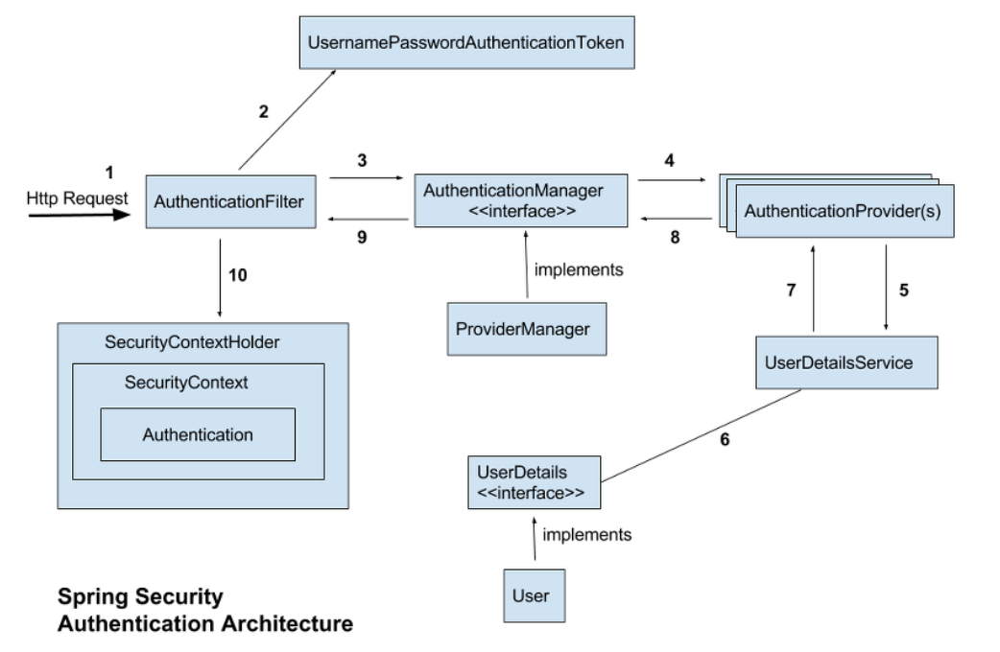

- <https://sjh836.tistory.com/165> 참조링크
- 스프링 시큐리티는 스프링 기반의 어플리케이션의 보안(인증과 권한)을 담당하는 프레임워크
- 용어 정리
  - 접근주체 (principal) : 보호된 대상에 접근하는 유저
  - 인증(authenticate) : 현재 유저가 누구인지 확인 / 애플리케이션의 작업을 수행할 수 있는 주체임을 증명
  - 인가 
  - 권한

- 구조
  - spring security (전통적인) 세션 쿠키방식으로 인증
    - 유저로그인시도
    - autherticationFilter 에서 다음과 같이 user DB까지 타고타고
    - db 에 있는 유저라면 UserDetails 로 꺼내어 유저 Session 생성
    - spring security 의 인메모리 세션 저장소인 `SecurityContextHolder`에 저장
    - 유저에게 session ID와 함께 응답 내려줌
    - 이 후 요청에서는 요청 쿠키에서 `JESSIONID`를 까봐서 검증 유효한지 체크

- 지원하는여러필터

  - SecurityContextPersistenceFilter 
    - SecurityContextRepository 에서 SecurityContext를 가져오거나 저장하는 역할

  - LogoutFilter 
    - 설정된 로그아웃 URL로 오는 요청을 감시, 해당 유저를 로그아웃
  - (UsernamePassword)AuthenticationFilter
    - (아이디비번을사용하는form기반인증) 설정된 로그인 URL로 요청을 감시하며, 유저 인증처리
  - DefaultLoginPageGeneratingFilter 
    - 인증을 위한 로그인폼 URL 감시
  - BasicAuthenticationFilter
    - HTTP 기본 인증 헤더를 감시
  - RequestCacheAwareFilter
    - 로그인 성공 후 원래 요청 정보를 재구성하기 위해 사용
  - SecurityContextHolderAwareRequestFilter
    - HttpServletRequestWrapper 를 상속한 SecurityContextHolderAwareRequestWapper  클래스로 HttpServletRequest  정보 감쌈
    - SecurityContextHolderAwareRequestWrapper 클래스는 필터 체인상의 다음 필터들에게 부가정보를 제공
  - AnonymousAuthenticationFilter
    - 이 필터가 호출되는 시점까지 사용자 정보가 인증되지 않았다면 인증토큰에 사용자가 익명 사용자로 나타남
  - SessionManagementFilter
    - 이 필터는 인증된 사용자와 관련된 모든 세션을 추적
  - ExceptionTranslationFilter
    - 이 필터는 보호된 요청을 처리하는 중에 발생하 수 있는 예외를 위임하거나 전달하는 역할
  - FilterSecurityInterceptor
    - 이 필터는 AccessDecisionManager 로 권한부여 처리를 위임함으로 접근 제어 결정을 쉽게처리

