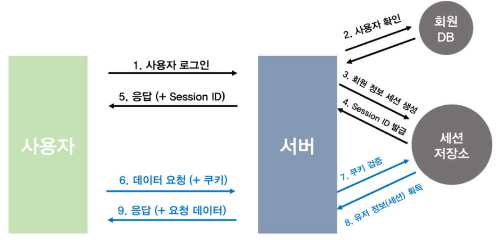
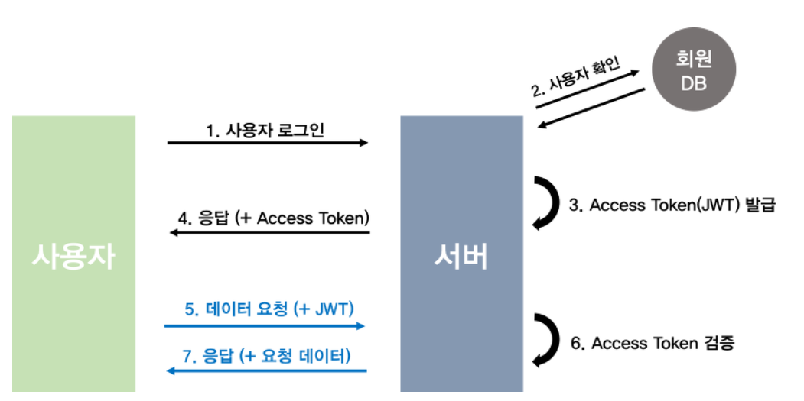
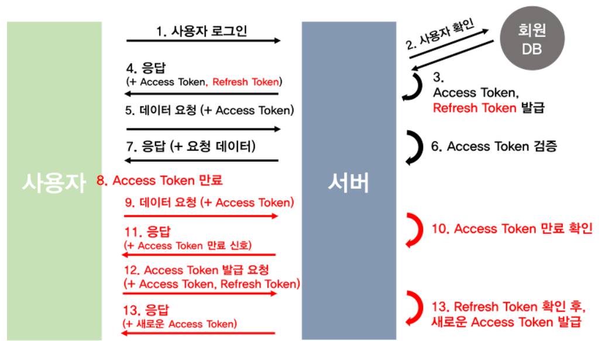
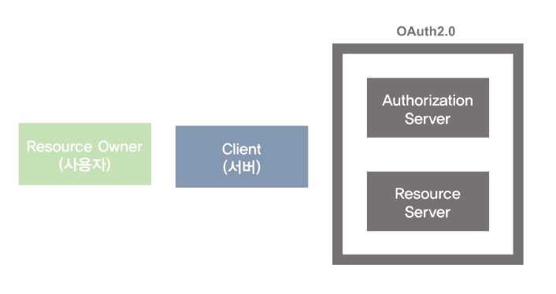
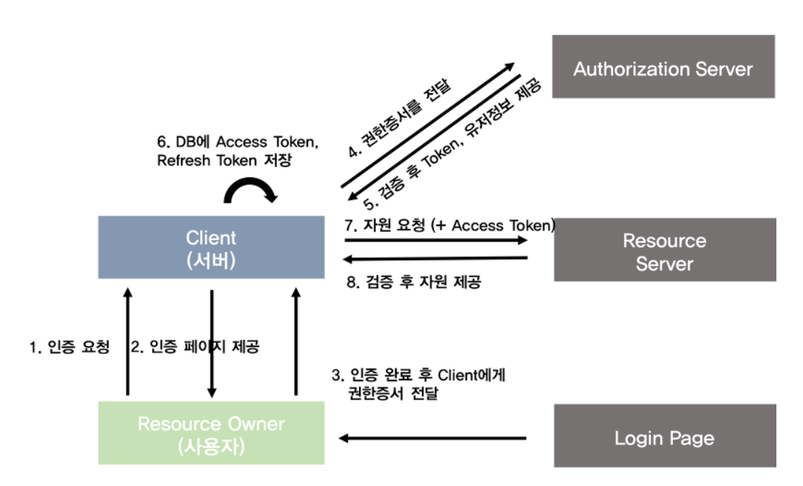

# Spring Security 방식

## 요청해더

1. 인증테스트에 편리
2. 보안에 매우 취약

## Sesscion + Cookie

> 방식

1. 사용자가 로그인
2. 서버는 정보르 확인하고 SessionID를 전달
3. 사용자가 재접근할때 마다 SessionID를 쿠키에 같이 전달

> 문제

- 쿠키를 탈취하여 다른 이용자가 도용한 쿠키를 이용하여 요청을 보내는 것 (하이재킹)

> 해결

- HTTPS를 사용해 요청 자체를 탈취해도 안의 정보를 읽기 힘들게 처리
- 세션에 유효시간처리

## 토큰기반

### JWT

JWT는 세션/쿠기와 함께 모바일과 웹의 인증을 책임지는 대표주자

JWT는 Json Web Token의 약자 인증에 필요한 정보들을 암호화시킨 토큰을 뜻함

위의 세션/쿠키 방식과 유사하게 사용자는 Access Token(JWT토큰)을 HTTP 해더에 실어 서버로 보냄

> 문제

1. 이미 발급된 JWT에 대해 돌이킬 수 없음
   세션/쿠키의 경우 만의 쿠키가 악의적으로 이용될 시에, 해당 세션을 지워버리면 됩니다
   하지만 JWT는 한번 발급되면 유효기간이 완료될때까지 계속 사용이 가능
   따라서 악의적인 사용자는 유효기간이 지나기 전에 정보에 접근이 가능

2. Payload 정보가 제한적
   Payload는 따로 암호화 되지 않아 디코딩하면 누구나 정보를 확인가능
   따라서 중요한 정보는 Payload에 넣을 수 없음

3. JWT 길이
   인증에 필요한 요청이 많아 질 수록 서버의 자원낭비가 발생

   

> 해결

기존 Access Token의 유효기간을 짧게하며 Refresh Token이라는 새로운 토큰을 발급

Aceess Token을 탈취당해도 상대적으로 피해를 줄일 수 있습니다

### RefreshToken

> 방식

사용자의 로그인 요청 & 사용자 확인

AccessToken, RefreshToken 발급 (일반적으로 RefreshToken을 DB 회원정보에 저장)

AceessToken <-> API정보제공

AccessToken이 만료됬다면 ? 권한없음을 반환

AccessToen, RefreshToken을 함께 서버로 보냅니다 (AccessToken에 대해서 재발급요청을 하게되는 것이지요)

RefreshToken을 확인 후에 검증된 유저라면 새로운 AccessToken을 발급합니다

## OAuth2.0

<https://tansfil.tistory.com/60?category=255594>

### OAuth

OAuth는 외부서비스의 인증 및 권한부여를 관리하는 범용적 프로토콜

- 권한 : OAuth는 인증뿐 아니라 권한도 관리, 사용자의 권한에 따라 접근할 수 있는 데이터가 다르도록 설정
- 프로토콜 : 특정한 프로그램을 지칭하는게 아닌 일종의 규격 - Facebook, Goolgle, Naver 등은 OAuth라는 규격에 맞춰 인증 및 권한을 대행관리
- 외부서비스 : 우리가 만들고 있는 서비스를 이야기, 외부서비스를 위한 서비스인 OAuth는 우리 서비스의 인증 및 권한여부를 관리대향

> 사용자 <-> 서버 인증절차였던 Session + Cookie, Token 기반 인증 방식을 완전히 대체하는 것이 아님
>
> 즉, SNS 로그인 기능을 넣어도 결국은 위의 방식을 활용해서 인증을 거쳐야 합니다.

> 2.0

- 모바일 어플리케이션 사용 용이
- 반드시 HTTPS를 사용하기에 보안이 강화
- Access Token의 만료기간 생성

> 인증방식

- Authorization Code Grant
- Implicit Grant
- Resource Owner Password Credentials Grant
- Client Credentials Grant

각 인증 방식에는 장단점이 존재

> 구조

- Resource Owner : User 일반사용자
- Client : 우리가 관리하는 서버 
- Authorizatio Server : 권한을 관리하는 서버 (AccessToken, RefresToken을 발급 및 재발급)
- Resource Server : OAuth2.0을 관리하는 서버(Google, Facebook, Naver 등등)의 자원을 관리하는 서버
  주의할 점은 우리가 만드는 서버의 자원을 관리하는 곳이 아닙니다. OAuth2.0 관리 서버의 자체 API를 의미

> 순서

3. Resource Owner는 해당 Request를 통해 인증을 진행 
   인증을 완료했다는 신호로 Autherization Grant를 URL에 실어 Client에게 보냄
4. Client는 해당 권한증서(Autherization Grant)를 Authorization Server에 보냄
5. Authorization Server는 권한증서를 확인 후, 
   유저가 맞다면 Client에게 Access Token, Refresh Token 
   그리고 유저의 프로필 정보(ID 포함)등을 발급합니다.
6. Client는 해당 Access Token을 DB에 저장하거나 Resource Owner에게 넘김
7. Resource Owner(사용자)가 Resource Server에 자원이 필요하면 
   Client는 Access Token을 담아 Resource Server에 요청
8. Resource Server는 AccessToken이 유효한지 확인후에 Client에게 자원을 보냄
9. 만일 AccessToken이 만료됐거나 위조되었다면,
   Client는 Authorization Server에 RefreshToken을 보내 AccessToken을 재발급
10. 그 후에 다시 Resource Server에게 자원을 요청
11. 만일 Refresh Token도 만료되었을 경우 ,
    Resource Owner는 새로운 Authorization Grant를 Client에게 넘겨야합니다
    (즉. 다시로그인이 필요합니다)

> 장단점

회원가입이라는 귀찮은 절차를 없애고, 빠른 회원가입이 가능합니다.

접근하고 싶은 정보들은 사용자들이 미리 권한 내용을 확인하고 허락하기에 쉽게 접근이 가능