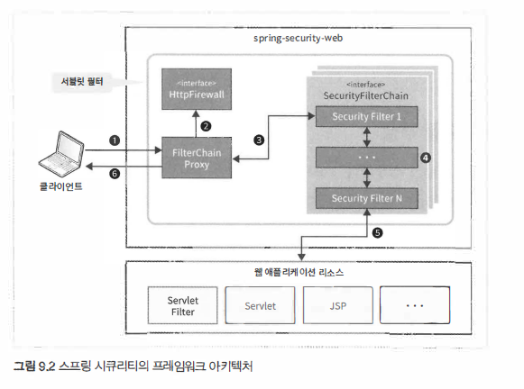

# Spring Security 구성

- 클라가 서버에 요청을 보냄
- 스프링시큐리티 FilterChainProxty 클래스 (서블릿필터)가 요청을 받아 
  HttpFirewall 인터페이스의 메서드를 호출하여
  HttpServletRequest 와 HttpServletResponse 에 대한 방화벽 기능을 수행
- FilterChainProxy 클래스는 SecurityFilterChain 에 설정돼 있는 보안 필터 클래스에 처리를 위힘
  이 필터는 실제로 서블릿 필터 형태로 만들어져 있음
- SecurityFilterChain 에 여러 보안 필터가 연쇄적으로 연결된 형태로 설정돼 있으며, 
  앞의 보안 필터가정상적으로 처리되면 뒤이은 보안 필터가 호출되는 방식
- 마지막 보안필터의 처리가 정상적으로 종료시에 
  뒤이어 남은 서블릿 필터나 서블릿이 실행되어 웹 애플리케이션의 리소스에 접근
- FilterChainProxy 클래스는 웹 애플리케이션에서 반환한 리소스를 클라에 전달

## FilterChainProxy

프레임워크의 진입점 역할을 하는 서블릿 필터 클래스

프레임워크에서 처리되는 전체 흐름을 제어하고 부안 기능과 같은 추가 기능을 필터에 위임하는 방식으로 동작

## HttpFirewall

HttpServletRequest, HttpServletResponse 에 대한 방화벽 기능을 추가하기 위한 인터페이스

기본적으로 DefaultHttpFirewall 클래스 사용

디렉터리 탐색 공격이나 인가되지 않은 요청을 차단

## SecurityFilterChain

SecurityFilterChain 인터페이스 FilterChainProxy 가 받은 요청에 적용할 보안 필터 목록을 관리하기 위한 인터페이스

기본적으로 DefaultSecurityFilterChain 클래스가 사용되고 요청 패턴별로 보안필터목록을 관리