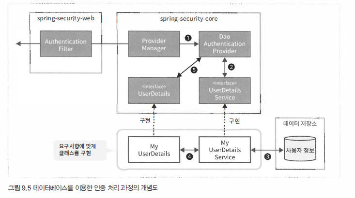

# Spring Security 인증

인증처리는 애플리케이션을 이용하는 사용자의 정당성을 확인하기 위한기능

- 가장 일반적인 인증방법은 애플리케이션을 사용할 수 있는 사용자 정보를 데이터 저장소에 등록하고 
  이용자가 입력한 인증 정보 (사용자명과 패스워드명등)와 대조하는 방법
- 이용자로부터 인증 정보를 입력받는 방식에도 여러가지가 있어 HTML 입력폼이용방식
- RFC에서 정해진 HTTP 표준 인증 방식 (Basic 인증이나 Digest 인증 등등)을 이용하는 간단한 방법
- OpenID 인증이나 싱글 사인온 인증과 같은 인증 방식을 이용하기도 합니다.


## 매커니즘

- `AuthenticationManager`
  - 인증처리를 수행하기 위한 인터페이스
  - 스프링 시큐리티에서 제공하는 기본 구현 (ProviderManager)에서는 실제 인증처리를 AuthenticationProvider에 위임
  - 반환되는 인증 결과를 처리하는 구조
- `AuthenticationProvider`
  - 인증처리기능을 구현하기 위한 인터페이스
  - 사용자의 자격정보와 상태정보를 확인하기 위해 DaoAuthenticationProvider를 사용하는 것을 전제로 설명
  - 스프링 시큐리티는 인증 방식별 그에 맞는 다양한 구현 클래스 제공


## 폼인증

>  TODO


## 데이터베이스인증



- 스프링 시큐리티는 클라이언트로 부터 인증 의로를 받아 `DaoAuthenticationProvider` 에 인증 처리를 위임
- `DaoAuthenticationProvider`는 `UserDetailService`에게 사용자 정보를 가져오게함
- `UserDetailService` 구현 클래스는 데이터 저장소에서 사용자 정보를 가져옴
- `UserDetailService` 구현 클래스는 데이터 저장소에서 가져온 사용자 정보를 사용해 `UserDetails`를 만듬
- `DaoAuthenticationProvider`는 `UserDetailsService`에서 반환된 `UserDetails`와 
  클라이언트가 제공한 인증 정보를 대조해서 이용자가 정당한 사용 권한을 가지고 있는지 확인
  만약 정당한 권한을 가진 사용자가 아니라면 인증 오류를 발생


### 구현

> UserDetails.java

```java
public interface UserDetails extends Serializable {
    String getUsername();
    String getPassword();
    boolean isEnabled();
    boolean isAccountNonLocked();
    boolean isAccountNonExpired();
    boolean isCredentialsNonExpired();
    Collection<? extends GrantedAuthority> getAuthorities();
}
```


> AccountUserDetails.java (UserDetails 구현클래스)

- Account - Database 객체
- AccountUserDetails - Database 객체를 `Spring Security`로 인증하기 위해서 Wrapping 한 객체

```java
public class AccountUserDetails implement UserDetails {
    private final Account account;
    private final Collection<GrantedAuthority> authorities;
    
    public AccountUserDetails(Account account, Collection<GrantedAuthority> authorities) {
        this.account = account;
        this.authorities = authorities;
    }
    
    public String getPassword() {
        return account.getPassword();
    }
    
    public boolean isEnabled() {
        return account.isEnabled();
    }
    
    public Collection<GrantedAuthority> getAuthorities() {
        return authorities;            
    }
    
    // ..
}
```


> UserDetailService.java

```java
@Service
public class AccountUserDetailService implements UserDetailService {
    
    @Autowired
    AccountRepository accountRepository;
        
    @Transactional(readOnly = true)
    public UserDetails loadUserByUsername(String username) throws UsernameNotFoundException {
        Account account = Optional
            .ofNullable(accountRepository.findOne(username))
            .orElseThrow(()-> new UsernameNotFoundException("user not found")) ;
        return new AccountUserDetails(account, getAuthorities(account));
    }
    
    private Collection<GrantedAuthority> getAuthorities(Account account) {
        if(account.isAdmin()) {
            return AuthorityUtils.createAuthorityList("ROLE_USER", "ROLE_ADMIN");
        } else {
            return AuthorityUtils.createAuthorityList("ROLE_USER");
        }
    }
}
```


> WebSecurityConfig.java

```java
@EnableWebSecurity
public class WebSecurityConfig extends WebSecurityConfigurerAdapter {
    @Autowired
    UserDetailsService userDetailsService;
    
    @Bean
    PasswordEncoder passwordEncoder() {
        return new BCryptPassworkEncoder();
    }
    
    @Autowired
    void configureAuthenticationManager(AuthenticationManagerBuilder auth) throws Exception {
   		auth.userDetailsService(suerDetailsService)
            .passwordEncoder(passwordEncoder());
    }
}
```


### 패스워드해시화

패스워드를 데이버베이스에 저장할 때는 패스워드를 평문 그대로 저장하지 않고 해시화 한 값으로 저장하는 것이 일반적

스프링 시큐리티는 패스워드를 해시화하기 위해서 인터페이스와 구현클래스를 제공

- BCryptPasswordEncoder 
- StandardPasswordEncoder
- NoOpPasswordEncoder 


## 인증 이벤트 처리

